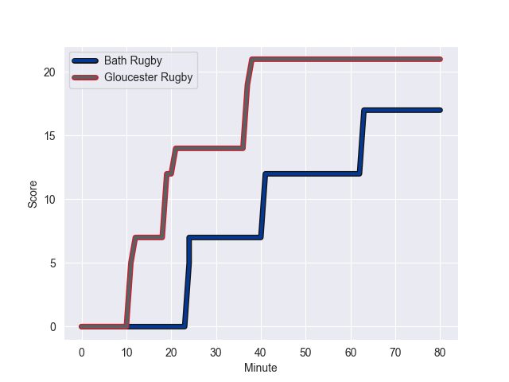
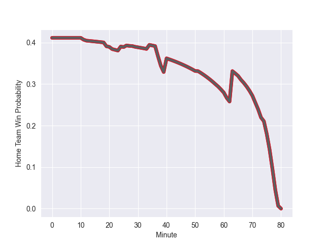

---  
layout: page  
title: Gloucester Rugby at Bath Rugby; 21.0-17.0  
date: 2022-10-08 10:00:00 18:00:00 -0500  
categories: match review  
---
# Prediction: Gloucester Rugby by 10.5

Gloucester Rugby by 15.5 on a neutral field
## Scores over Time

## Win Probability over Time

# Pre-Match Prediction: Gloucester Rugby by 10.3

Gloucester Rugby by 15.3 on a neutral pitch

|   Away Minutes | Away Player         |   Away elo |   Away Percentile |   Number |   Home Percentile |   Home elo | Home Player           |   Home Minutes |
|---------------:|:--------------------|-----------:|------------------:|---------:|------------------:|-----------:|:----------------------|---------------:|
|             58 | Val Rapava-Ruskin   |      94.43 |                90 |        1 |                11 |      74    | Juan Schoeman         |             74 |
|             58 | Santiago Socino     |      88.82 |                83 |        2 |                86 |      90.78 | Tom Dunn              |             63 |
|             61 | Fraser Balmain      |      71.85 |                 7 |        3 |                 6 |      71.58 | Will Stuart           |             63 |
|             80 | Freddie Clarke      |      91.34 |                84 |        4 |                99 |     118.25 | Dave Attwood          |             80 |
|             74 | Matias Alemanno     |      99.95 |                93 |        5 |                82 |      90.48 | Quinn Roux            |             71 |
|             80 | Ruan Ackermann      |     100.51 |                93 |        6 |                13 |      76.43 | Tom Ellis             |             80 |
|             80 | Lewis Ludlow        |      97.95 |                92 |        7 |                52 |      81.11 | Miles Reid            |             80 |
|             36 | Albert Tuisue       |      94.98 |                88 |        8 |                44 |      75.86 | Nahum Merigan         |             67 |
|             58 | Ben Meehan          |      94.69 |                88 |        9 |                 7 |      71.85 | Louis Schreuder       |             51 |
|             80 | Adam Hastings       |     109.43 |                95 |       10 |                82 |      91.74 | Piers Francis         |             39 |
|             80 | Santiago Carreras   |     107.25 |                94 |       11 |                82 |      90.42 | Gabriel Hamer-Webb    |             80 |
|             74 | Mark Atkinson       |      93.26 |                84 |       12 |                51 |      82.2  | Cameron Redpath       |             77 |
|             80 | Giorgi Kveseladze   |     103.25 |                94 |       13 |                21 |      76.88 | Ollie Lawrence        |             80 |
|             80 | Louis Rees-Zammit   |      88.87 |                79 |       14 |                80 |      89.21 | Joe Cokanasiga        |             80 |
|             66 | Lloyd Evans         |      95.74 |                88 |       15 |                88 |      95.7  | Matt Gallagher        |             80 |
|             22 | Jack Singleton      |     106.65 |                98 |       16 |                13 |      74.9  | Niall Annett          |             17 |
|             19 | Ciaran Knight       |      80.75 |               nan |       17 |                42 |      77.14 | Arthur Cordwell       |              6 |
|             22 | Jamal Ford-Robinson |      72.7  |                 9 |       18 |                61 |      82.31 | Aranos Coetzee        |             17 |
|              6 | Cameron Jordan      |      77.61 |               nan |       19 |                69 |      84.96 | Ewan Richards         |              9 |
|             44 | Jordy Reid          |      74.89 |                13 |       20 |                24 |      76.11 | Richard de Carpentier |             13 |
|             22 | Charlie Chapman     |      97.46 |                90 |       21 |                33 |      78.96 | Max Green             |             29 |
|              6 | Jack Reeves         |      82.42 |                58 |       22 |                 4 |      69.31 | Orlando Bailey        |             41 |
|             14 | Jonny May           |     100.3  |                91 |       23 |                26 |      77.78 | Will Butt             |              3 |

