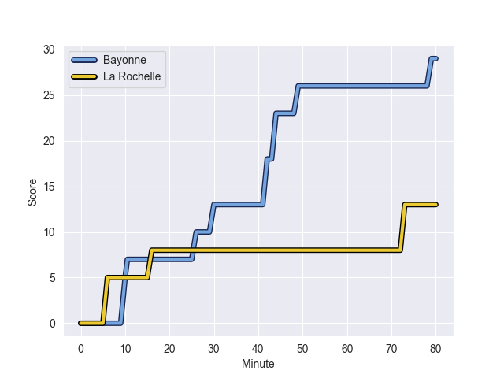
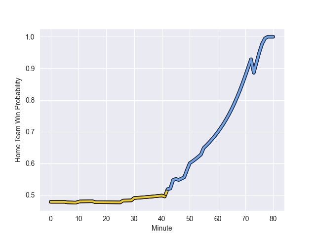

---  
layout: page  
title: La Rochelle at Bayonne; 13-29  
date: 2022-10-08 17:00:00 18:00:00 -0500  
categories: match review  
---
# La Rochelle (1368.16) at Bayonne (1323.92); 13-29

# Prediction: Bayonne by 0.6

La Rochelle by 4.4 on a neutral field
## Scores over Time

## Win Probability over Time

# Pre-Match Prediction: La Rochelle by 0.1

La Rochelle by 4.9 on a neutral pitch

|   Away Minutes | Away Player         |   Away elo |   Away Percentile |   Number |   Home Percentile |   Home elo | Home Player             |   Home Minutes |
|---------------:|:--------------------|-----------:|------------------:|---------:|------------------:|-----------:|:------------------------|---------------:|
|             46 | Leo Aouf            |      81.17 |                50 |        1 |                62 |      82.79 | Swan Cormenier          |             63 |
|             46 | Quentin Lespiaucq   |      80.43 |                59 |        2 |                77 |      86.74 | Facundo Bosch           |             64 |
|             55 | Uini Atonio         |     106.38 |                97 |        3 |                33 |      79.27 | Pascal Cotet            |             71 |
|             55 | Romain Sazy         |      84.54 |                67 |        4 |                85 |      92.29 | Manuel Leindekar        |             80 |
|             80 | Will Skelton        |      91.32 |                84 |        5 |                78 |      89.6  | Thomas Ceyte            |             66 |
|             55 | Ultan Dillane       |      87.2  |                73 |        6 |                35 |      78.56 | Baptiste Heguy          |             80 |
|             80 | Gregory Alldritt    |     101.25 |                95 |        7 |                44 |      79.81 | Pierre Huguet           |             58 |
|             80 | Gregory Alldritt    |     101.25 |                92 |        7 |                44 |      79.81 | Pierre Huguet           |             58 |
|             80 | Yoan Tanga          |      81.58 |                56 |        8 |                77 |      88.73 | Uzair Cassiem           |             80 |
|             50 | Tawera Kerr-Barlow  |     104.86 |                96 |        9 |                85 |      91.85 | Maxime Machenaud        |             71 |
|             80 | Mitch Inman         |      89.92 |                80 |       10 |                98 |     116.88 | Camille Lopez           |             79 |
|             80 | Arthur Retiere      |      79.23 |                40 |       11 |                68 |      84.48 | Remy Baget              |             80 |
|             77 | Jules Favre         |     104.53 |                95 |       12 |                96 |     105.71 | Thomas Combezou         |             41 |
|             80 | Dillyn Leyds        |      98.63 |                90 |       13 |                58 |      83.45 | Sireli Maqala           |             80 |
|             80 | Dillyn Leyds        |      98.63 |                94 |       13 |                58 |      83.45 | Sireli Maqala           |             80 |
|             50 | Marc Andreu         |      95.63 |                89 |       14 |                51 |      81.24 | Victor Hannoun          |             80 |
|             80 | Dillyn Leyds        |      98.63 |                94 |       15 |                84 |      93.42 | Gaetan Germain          |             80 |
|             80 | Dillyn Leyds        |      98.63 |                90 |       15 |                84 |      93.42 | Gaetan Germain          |             80 |
|             34 | Pierre Bourgarit    |      80.84 |                52 |       16 |                82 |      92.1  | Guillaume Martocq       |             39 |
|             34 | Reda Wardi          |      90.42 |                86 |       17 |                 9 |      72.74 | Mateaki Kafatolu        |             22 |
|             30 | Martin Alonso Munoz |      81.88 |                47 |       18 |                64 |      84.18 | Quentin Bethune         |             17 |
|             30 | Thomas Berjon       |      80.23 |                46 |       19 |                90 |      94.34 | Torsten van Jaarsveld   |             16 |
|             25 | Remi Picquette      |      83.45 |                68 |       20 |                 4 |      66.9  | Kote Mikautadze         |             14 |
|             25 | Joel Sclavi         |      79.78 |                40 |       21 |                64 |      83.36 | Pieter Scholtz          |              9 |
|             25 | Remi Bourdeau       |      95.4  |                89 |       22 |                84 |      91.52 | Guillaume Rouet Piffard |              9 |
|              3 | Jules Le Bail       |      83.98 |                66 |       23 |                 4 |      69.06 | Jason Robertson         |              1 |

