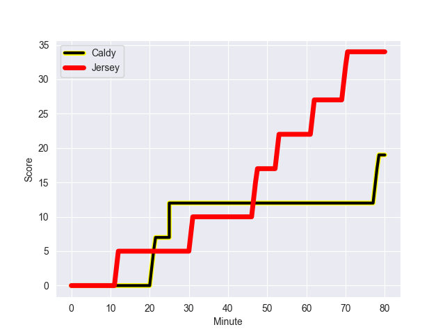
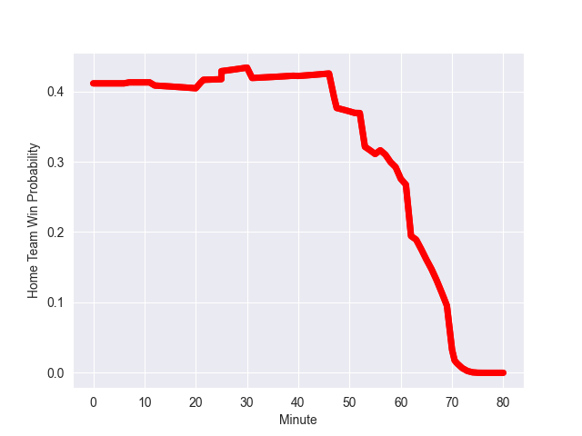

---  
layout: page  
title: Jersey at Caldy; 32-19  
date: 2022-10-08 16:00:00 18:00:00 -0500  
categories: match review  
---
# Jersey (1298.24) at Caldy (1142.24)

# Prediction: Jersey by 10.6

Jersey by 15.6 on a neutral field
## Scores over Time

## Win Probability over Time

# Pre-Match Prediction: Jersey by 12.3

Jersey by 17.3 on a neutral pitch

|   Away Minutes | Away Player                 |   Away elo |   Away Percentile |   Number |   Home Percentile |   Home elo | Home Player         |   Home Minutes |
|---------------:|:----------------------------|-----------:|------------------:|---------:|------------------:|-----------:|:--------------------|---------------:|
|             40 | Greg McGrath                |      78.66 |               nan |        1 |                25 |      77.38 | Adam Aigbokhae      |             58 |
|             67 | Antonio TJ Harris           |      85.18 |                73 |        2 |                17 |      75.78 | Oliver Hearn        |             70 |
|             63 | Adam Nicol                  |      79.91 |               nan |        3 |                 0 |      60.69 | Andrew Darlington   |             52 |
|             60 | Tom Everard                 |      82.02 |                55 |        4 |                53 |      81.84 | Sam Dickinson       |             58 |
|             80 | Sean O'Connor               |      94.33 |                88 |        5 |               nan |      78.18 | Martin Gerrard      |             80 |
|             80 | Macauley Cook               |     113.32 |                98 |        6 |                15 |      75.24 | Harrison Crowe      |             80 |
|             66 | Max Argyle                  |      93.12 |                88 |        7 |                15 |      75.22 | Callum Ridgway      |              7 |
|             80 | James Dun                   |      72.37 |                 9 |        8 |                19 |      74.75 | Josiah Dickinson    |             80 |
|             56 | James Mitchell              |      87.36 |                76 |        9 |               nan |      79.06 | Anerin (Nye) Thomas |             80 |
|             80 | Tom Pittman                 |      85.99 |                69 |       10 |                16 |      75.51 | Ezra Hinchcliffe    |             80 |
|             80 | Will Brown                  |      93.7  |                87 |       11 |                14 |      74.75 | Dan Bibby           |             63 |
|             80 | Jordan Holgate              |      81.46 |                48 |       12 |                29 |      78.06 | Michael Barlow      |             80 |
|             52 | Charlie Powell              |      87.17 |                72 |       13 |                16 |      74.86 | Michael Cartmill    |             80 |
|             40 | Tomi Lewis                  |      81.41 |                53 |       14 |                12 |      74.11 | Nick Royle          |             80 |
|             80 | Brendan Owen                |      87.42 |                69 |       15 |               nan |      78.3  | Elliott Gourlay     |             60 |
|             40 | Samuel Alexander Grahamslaw |      81.65 |                54 |       16 |               nan |      79.04 | Thomas Parry        |             73 |
|             40 | Ryan Hutler                 |      80.21 |                46 |       17 |                39 |      78.04 | Ryan Higginson      |             28 |
|             28 | Dan Barnes                  |      89.48 |                79 |       18 |                20 |      75.15 | Thomas Sanders      |             22 |
|             24 | Jonny Law                   |      80    |               nan |       19 |                30 |      77.83 | Nathan Rushton      |             22 |
|             20 | James Scott                 |      75.87 |                22 |       20 |                17 |      75.69 | Rhys Hayes          |             20 |
|             17 | Monty Weatherby             |      81.33 |               nan |       21 |                28 |      76.9  | Benjamin Jones      |             17 |
|             14 | Josh Gray                   |      82.44 |                55 |       22 |               nan |      79.58 | Thomas Clarke       |             10 |
|             13 | James Hadfield              |      75.52 |                14 |       23 |                 0 |       0.38 | Solomone Kata       |             80 |

