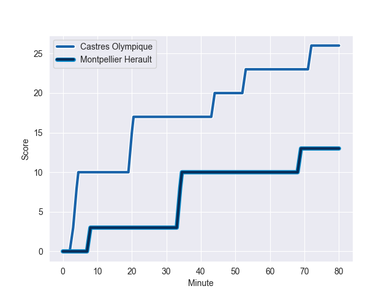
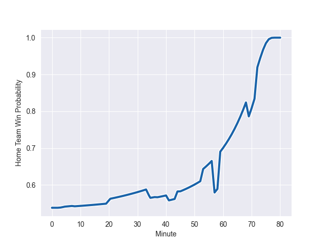

---  
layout: page  
title: Montpellier Herault at Castres Olympique; 13-26  
date: 2022-10-08 15:00:00 18:00:00 -0500  
categories: match review  
---
# Montpellier Herault (1298.93) at Castres Olympique (1335.13)

# Prediction: Castres Olympique by 8.6

Castres Olympique by 3.6 on a neutral field
## Scores over Time

## Win Probability over Time

# Pre-Match Prediction: Castres Olympique by 8.2

Castres Olympique by 3.2 on a neutral pitch

|   Away Minutes | Away Player                 |   Away elo |   Away Percentile |   Number |   Home Percentile |   Home elo | Home Player          |   Home Minutes |
|---------------:|:----------------------------|-----------:|------------------:|---------:|------------------:|-----------:|:---------------------|---------------:|
|             37 | Simon-Pierre Chauvac        |      84.51 |                73 |        1 |                90 |      93.47 | Antoine Tichit       |             41 |
|             57 | Vincent Giudicelli          |      81.74 |                61 |        2 |                93 |      97.38 | Gaetan Barlot        |             72 |
|             50 | Henry Thomas                |      81    |                49 |        3 |                89 |      91.77 | Wilfrid Hounkpatin   |             60 |
|             80 | Masivesi Dakuwaqa           |      88.42 |                77 |        4 |                13 |      73.15 | Ryno Pieterse        |             45 |
|             57 | Nicolaas Janse van Rensburg |      94.04 |                86 |        5 |                93 |     100.31 | Tom Staniforth       |             60 |
|             80 | Romain Macurdy              |      76.51 |               nan |        6 |                67 |      83.5  | Mathieu Babillot     |             80 |
|             66 | Clément Doumenc             |      96.02 |                88 |        7 |                82 |      89.3  | Tyler Ardron         |             80 |
|             80 | Marco Tauleigne             |      84.6  |                66 |        8 |                82 |      89.3  | Tyler Ardron         |             45 |
|             50 | Cobus Reinach               |     102.36 |                94 |        9 |                56 |      81.9  | Santiago Arata       |             59 |
|             80 | Louis Foursans-Bourdette    |      80.31 |                44 |       10 |                99 |     118.64 | Benjamin Urdapilleta |             80 |
|             80 | Gela Aprasidze              |      90.36 |                83 |       11 |                21 |      76.83 | George Tilsley       |             72 |
|             63 | Yacouba Camara              |     100.97 |                93 |       12 |                85 |      93.94 | Vilimoni Botitu      |             80 |
|             54 | Pierre Lucas                |      82.45 |                56 |       13 |                92 |     100.58 | Afusipa Taumoepeau   |             80 |
|             80 | Gabriel Ngandebe            |      85.86 |                71 |       14 |                42 |      79.66 | Bastien Guillemin    |             80 |
|             80 | Gabriel Ngandebe            |      85.86 |                78 |       14 |                42 |      79.66 | Bastien Guillemin    |             80 |
|             80 | Bastien Fuster              |      84.7  |               nan |       15 |                50 |      81.5  | Julien Dumora        |             80 |
|             43 | Enzo Forletta               |      95.55 |                93 |       16 |                71 |      83.11 | Wayan de Benedittis  |             39 |
|             30 | Mohamed Haouas              |      82.59 |                61 |       17 |                 8 |      69.93 | Gauthier Maravat     |             35 |
|             30 | Gabriel Ngandebe            |      85.86 |                78 |       18 |                34 |      78.89 | Baptiste Delaporte   |             35 |
|             30 | Gabriel Ngandebe            |      85.86 |                71 |       18 |                34 |      78.89 | Baptiste Delaporte   |             35 |
|             26 | Thomas Darmon               |      72.12 |                 9 |       19 |                40 |      79.13 | Julien Blanc         |             21 |
|             23 | Tyler Duguid                |      74.56 |                18 |       20 |                68 |      88.13 | Levan Chilachava     |             20 |
|             23 | Ru-Hann Greyling            |      81.1  |                53 |       21 |                82 |      89.98 | Florent Vanverberghe |             20 |
|             17 | Louis Carbonel              |      85.22 |                68 |       22 |                49 |      78.72 | Antoine Zeghdar      |              8 |
|             14 | Lenni Nouchi                |      80    |               nan |       23 |                77 |      86.7  | Brice Humbert        |              8 |

