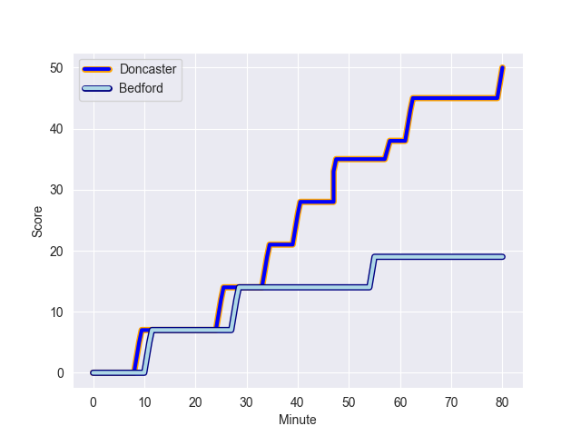
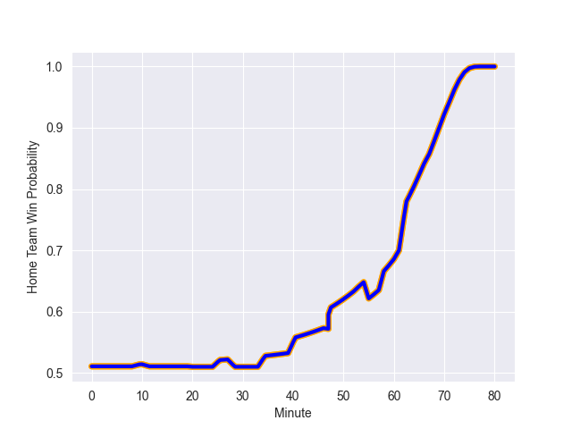

---  
layout: page  
title: Bedford at Doncaster; 19-50  
date: 2022-10-08 15:30:00 18:00:00 -0500  
categories: match review  
---
# Bedford (1257.02) at Doncaster (1241.84)

# Prediction: Doncaster by 3.5

Bedford by 1.5 on a neutral field
## Scores over Time

## Win Probability over Time

# Pre-Match Prediction: Bedford by 3.8

Bedford by 1.2 on a neutral pitch

|   Away Minutes | Away Player           |   Away elo |   Away Percentile |   Number |   Home Percentile |   Home elo | Home Player          |   Home Minutes |
|---------------:|:----------------------|-----------:|------------------:|---------:|------------------:|-----------:|:---------------------|---------------:|
|             66 | Joey Conway           |      77.83 |                28 |        1 |                25 |      75.98 | Ben Carlile          |             65 |
|             47 | Jack Hughes           |      82.73 |                60 |        2 |                84 |      88.89 | George Edgson        |             62 |
|             47 | Corrie Barrett        |      81.78 |                46 |        3 |                48 |      80.8  | Jake Armstrong       |             58 |
|             74 | Robin Williams        |      86.6  |                71 |        4 |                 8 |      71.02 | Ehize Ehizode        |             80 |
|             80 | Jordan Onojaife       |      77.29 |                26 |        5 |                60 |      82.75 | Ben Murphy           |             67 |
|             80 | Huw Taylor            |      76.43 |                24 |        6 |                43 |      79.84 | Thom Smith           |             80 |
|             80 | Jac Arthur            |      82.25 |                60 |        7 |                19 |      75.98 | Jared Cardew         |             53 |
|             20 | Tui Uru               |      79.26 |                39 |        8 |                78 |      89.11 | John Kelly           |             80 |
|             61 | Alex Day              |      94.99 |                87 |        9 |                85 |      92.8  | Alex Dolly           |             67 |
|             80 | William Maisey        |      88.87 |                77 |       10 |                60 |      82.98 | Sam Olver            |             71 |
|             80 | Dean Adamson          |      86.15 |                72 |       11 |                70 |      88.07 | Maliq Holden         |             80 |
|             80 | Michael Le Bourgeois  |      87.98 |                75 |       12 |                88 |      91.45 | Conor Davidson       |             80 |
|             71 | Ethan Grayson         |      87.73 |                74 |       13 |               nan |      72.87 | Rory Hutchinson      |             80 |
|             80 | Sean French           |      80.09 |                38 |       14 |                58 |      81.99 | George Simpson       |             80 |
|             67 | George Hendy          |      85.46 |                64 |       15 |                78 |      91.06 | Harry Davey          |             61 |
|             60 | Charles Rylands       |      81.27 |                53 |       16 |                43 |      79.66 | Karl Garside         |             22 |
|             33 | Ed Prowse             |      86.13 |                76 |       17 |                77 |      88.91 | Joe Margetts         |             19 |
|             33 | Jacob Fields          |      88.5  |                82 |       18 |               nan |      77.52 | Will Holling         |             18 |
|             19 | Jake Garside          |      81.21 |                53 |       19 |                34 |      78.59 | Jake Pope            |             15 |
|             14 | Lewis Holsey          |      85.19 |                73 |       20 |                59 |      82.35 | Evan Mintern         |             13 |
|             13 | Matthew Samuel Worley |      79.27 |                38 |       21 |                38 |      79.78 | Joe Green            |             13 |
|              9 | Patrick Tapley        |      81.83 |                57 |       22 |               nan |      79.88 | Alexander Lloyd-Seed |              9 |
|              6 | Emeka Atuanya         |      80.65 |               nan |       23 |                51 |      80.94 | Martin Molina        |             27 |

