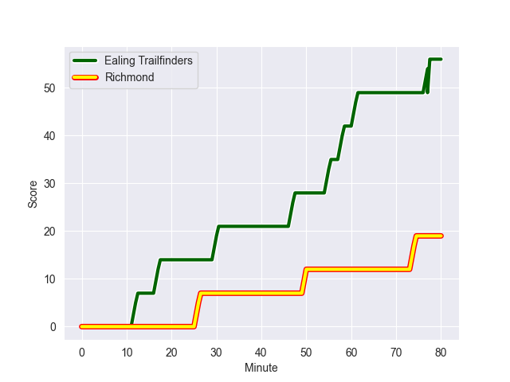
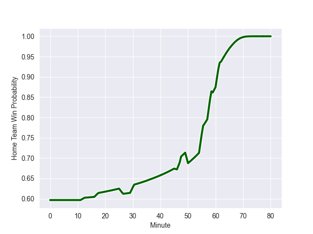

---  
layout: page  
title: Richmond at Ealing Trailfinders; 19-56  
date: 2022-10-08 16:00:00 18:00:00 -0500  
categories: match review  
---
# Richmond (1165.4) at Ealing Trailfinders (1357.74)

# Prediction: Ealing Trailfinders by 24.2

Ealing Trailfinders by 19.2 on a neutral field
## Scores over Time

## Win Probability over Time

# Pre-Match Prediction: Ealing Trailfinders by 26.5

Ealing Trailfinders by 21.5 on a neutral pitch

|   Away Minutes | Away Player        |   Away elo |   Away Percentile |   Number |   Home Percentile |   Home elo | Home Player         |   Home Minutes |
|---------------:|:-------------------|-----------:|------------------:|---------:|------------------:|-----------:|:--------------------|---------------:|
|             62 | Conor Maguire      |      75.87 |                18 |        1 |                90 |      93.14 | Kyle John Whyte     |             59 |
|             62 | Alexander Post     |      76.13 |                20 |        2 |                95 |     100.53 | Shaun Malton        |             59 |
|             55 | Jimmy Litchfield   |      74.13 |                12 |        3 |                97 |     107.52 | Lewis Thiede        |             47 |
|             55 | Will Carrick-Smith |      79.39 |                43 |        4 |                93 |      99.94 | Bobby de Wee        |             80 |
|             65 | Sam Collingridge   |      72.95 |                14 |        5 |                82 |      90.07 | Barney Maddison     |             69 |
|             80 | Ethan Benson       |      76.9  |                23 |        6 |                61 |      82.46 | Rob Farrar          |             59 |
|             80 | Tobias Saysell     |      92.31 |                86 |        7 |                82 |      89.64 | Langi Gleeson       |             80 |
|             80 | Mark Bright        |      63.33 |                 2 |        8 |                96 |     109.04 | Ryan Smid           |             62 |
|             46 | Callum Watson      |      70.93 |                 7 |        9 |                91 |      98.65 | Craig Hampson       |             36 |
|             80 | Bill Johnston      |      79.92 |                42 |       10 |                27 |      78.61 | Dan Lancaster       |             80 |
|             66 | Tom Mills          |      78.27 |                32 |       11 |                79 |      88.88 | Luke Daniels        |             80 |
|             80 | Paul Kiernan       |      78.64 |                34 |       12 |                74 |      88.84 | Steve Shingler      |             80 |
|             80 | Paddy Case         |      78.22 |                31 |       13 |                49 |      81.67 | Reuben Bird-Tulloch |             80 |
|             80 | Alexander O'Meara  |      79.78 |                43 |       14 |                50 |      80.92 | Jack Metcalf        |             80 |
|             55 | Ted Landray        |      75.71 |                17 |       15 |                86 |      92.77 | Jonah Holmes        |             66 |
|             34 | James Lennon       |      85.42 |                71 |       16 |                84 |      92.11 | Jordan Burns        |             44 |
|             25 | Ntinga Mpiko       |      76.68 |                24 |       17 |                26 |      78.49 | Jimmy Roots         |             33 |
|             25 | Myles Scott        |      86.16 |                71 |       18 |                43 |      80.01 | Cameron Terry       |             21 |
|             25 | Owain James        |      78.84 |                37 |       19 |                69 |      86.37 | Will Montgomery     |             21 |
|             18 | Luke Spring        |      79.77 |               nan |       20 |                60 |      83.23 | James Gibbons       |             21 |
|             18 | Vaughan Bentley    |      79.6  |               nan |       21 |                84 |      90.69 | Jack Digby          |             18 |
|             15 | Miles Wakeling     |      77.81 |                28 |       22 |                96 |     103.6  | David Johnston      |             14 |
|             14 | Zuriel Makele      |      79.94 |               nan |       23 |                78 |      88.92 | Simon Linsell       |             11 |

