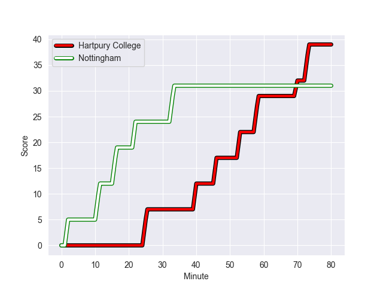
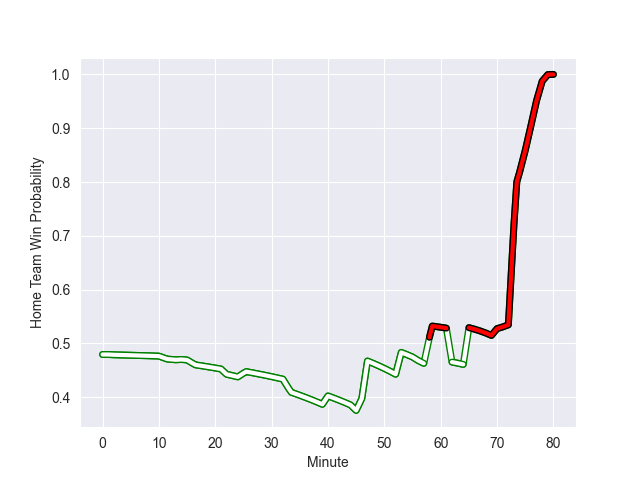

---  
layout: page  
title: Nottingham at Hartpury College; 31-39  
date: 2022-10-08 15:30:00 18:00:00 -0500  
categories: match review  
---
# Prediction: Hartpury College by 1.4

Nottingham by 3.6 on a neutral field
## Scores over Time

## Win Probability over Time

# Pre-Match Prediction: Nottingham by 1.0

Nottingham by 6.0 on a neutral pitch

|   Away Minutes | Away Player               |   Away elo |   Away Percentile |   Number |   Home Percentile |   Home elo | Home Player             |   Home Minutes |
|---------------:|:--------------------------|-----------:|------------------:|---------:|------------------:|-----------:|:------------------------|---------------:|
|             53 | Aniseko Sio               |      80.25 |                24 |        1 |                37 |      79.05 | Aristot Benz-Salomon    |             70 |
|             53 | Jack Dickinson            |      86.91 |                69 |        2 |                11 |      73.3  | Ellis Shipp             |             62 |
|             53 | Dan Richardson            |      85.32 |                73 |        3 |                40 |      78.87 | Sam Rodman              |             45 |
|             80 | Lewis Chessum             |      81.75 |                52 |        4 |                34 |      78.3  | AJ MacGinty             |             45 |
|             80 | Thomas Manz               |      87.82 |                75 |        5 |                33 |      77.89 | Dale Lemon              |             80 |
|             47 | George Cox                |      89.2  |                82 |        6 |                92 |      98.31 | Ruan Ackermann          |             80 |
|             53 | Emeka Remigius Ilione     |      80.76 |               nan |        7 |               nan |      80    | Lennon Greggains        |             14 |
|             80 | Josh Poullet              |      79.62 |                41 |        8 |                 8 |      69.18 | Mitch Eadie             |             62 |
|             47 | Liam Slatem               |      86.09 |                73 |        9 |                66 |      84.02 | Jean-Baptiste Bruzulier |             45 |
|             80 | Sam Hollingsworth         |      75.02 |                14 |       10 |               nan |      82.35 | George Barton           |             80 |
|             65 | Harry Graham              |      81.26 |                52 |       11 |                19 |      76.16 | Matthew McNab           |             80 |
|             56 | Javiah Pohe               |      75.94 |                18 |       12 |                23 |      77.43 | James Williams          |             80 |
|             80 | Marcus Alexander Ramage   |      88.62 |                76 |       13 |                41 |      80.11 | Joseph Jenkins          |             80 |
|             80 | David Williams            |      73.15 |                10 |       14 |                22 |      76.79 | Bradley Denty           |             80 |
|             80 | Jack Neville              |      83.61 |                55 |       15 |                17 |      75.5  | Tommy Mathews           |             80 |
|             33 | Sam Edwards               |      75.91 |                16 |       16 |                68 |      83.45 | Harry Short             |             66 |
|             33 | Iosefa Danny Wayne Fiaola |      85.89 |                70 |       17 |                 2 |      66.17 | Alex Gibson             |             35 |
|             27 | Xavier Valentine          |      80    |               nan |       18 |                64 |      83.64 | Matty Jones             |             35 |
|             27 | Lewis Barrett             |      77.18 |                24 |       19 |                21 |      75.42 | Jack Davies             |             35 |
|             27 | Toby Williams             |      72.99 |                 9 |       20 |                69 |      84.1  | Ethan Hunt              |             18 |
|             27 | Harry Clayton             |      82.97 |                63 |       21 |               nan |      81.01 | Jack Bartlett           |             18 |
|             24 | Ross Bundy                |      81.54 |                52 |       22 |                36 |      78.92 | Harry Fry               |             10 |
|             15 | Joe Browning              |      70.02 |                 6 |       23 |                 0 |      -1.46 | Solomone Kata           |             80 |

