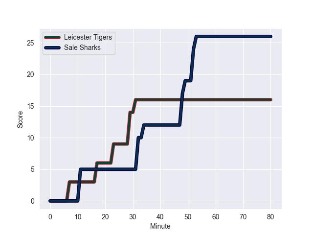
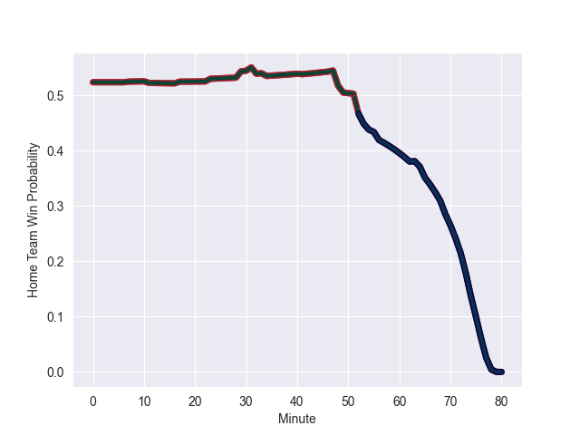

---  
layout: page  
title: Sale Sharks at Leicester Tigers; 26.0-16.0  
date: 2022-10-08 10:00:00 18:00:00 -0500  
categories: match review  
---
# Sale Sharks (1379.83) at Leicester Tigers (1421.68); 26.0-16.0

# Prediction: Leicester Tigers by 9.2

Leicester Tigers by 4.2 on a neutral field
## Scores over Time

## Win Probability over Time

# Pre-Match Prediction: Leicester Tigers by 8.5

Leicester Tigers by 3.5 on a neutral pitch

|   Away Minutes | Away Player         |   Away elo |   Away Percentile |   Number |   Home Percentile |   Home elo | Home Player          |   Home Minutes |
|---------------:|:--------------------|-----------:|------------------:|---------:|------------------:|-----------:|:---------------------|---------------:|
|             47 | Bevan Rodd          |      92.65 |                89 |        1 |                87 |      90.63 | James Cronin         |             65 |
|             63 | Akker van der Merwe |     105.02 |                97 |        2 |                91 |      95.15 | Julian Montoya       |             73 |
|             69 | Nic Schonert        |      74.01 |                11 |        3 |                90 |      92.45 | Dan Cole             |             54 |
|             80 | Cobus Wiese         |      90.09 |                82 |        4 |                87 |      93.39 | Harry Wells          |             80 |
|             65 | Jonny Hill          |      92.23 |                85 |        5 |                92 |      98.63 | Calum Green          |             56 |
|             69 | Jono Ross           |      98.3  |                91 |        6 |                83 |      88.46 | George Martin        |             54 |
|             80 | Tom Curry           |      89.37 |                83 |        7 |                97 |     112.22 | Hanro Liebenberg     |             80 |
|             80 | Jean-Luc du Preez   |     113.39 |                99 |        8 |                74 |      87.35 | Jasper Wiese         |             80 |
|             41 | Gus Warr            |      78.77 |                37 |        9 |                98 |     112.06 | Richard Wigglesworth |             54 |
|             80 | Robert du Preez     |      80.78 |                47 |       10 |                94 |     106.9  | Freddie Burns        |             74 |
|             73 | Tom O'Flaherty      |      98.25 |                91 |       11 |                96 |     106.19 | Nemani Nadolo        |             80 |
|             65 | Manu Tuilagi        |     107.11 |                97 |       12 |                89 |      96.81 | Jimmy Gopperth       |             80 |
|             80 | Sam James           |     103.79 |                94 |       13 |                83 |      92.32 | Matt Scott           |             65 |
|             80 | Tom Roebuck         |      79.97 |                45 |       14 |                28 |      77.65 | Harry Potter         |             80 |
|             80 | Joe Carpenter       |      78.63 |                36 |       15 |                83 |      93.16 | Freddie Steward      |             80 |
|             17 | Ewan Ashman         |      79.41 |                38 |       16 |                 3 |      68.91 | Charlie Clare        |              7 |
|             33 | Simon McIntyre      |      90.39 |                86 |       17 |                31 |      78.63 | Nephi Leatigaga      |             15 |
|             11 | Coenie Oosthuizen   |     109.93 |                98 |       18 |                70 |      84.59 | Joe Heyes            |             26 |
|             15 | Josh Beaumont       |     101.23 |               nan |       19 |                16 |      74.02 | Eli Snyman           |             24 |
|             11 | Sam Dugdale         |      81.44 |                55 |       20 |                90 |      96.3  | Olly Cracknell       |             26 |
|             39 | Raffi Quirke        |      82.52 |                60 |       21 |                91 |      96.15 | Jack van Poortvliet  |             26 |
|             15 | Sam Hill            |      98    |               nan |       22 |                17 |      75.38 | Phil Cokanasiga      |              6 |
|              7 | Arron Reed          |      91.7  |                83 |       23 |                48 |      80.48 | Anthony Watson       |             15 |

