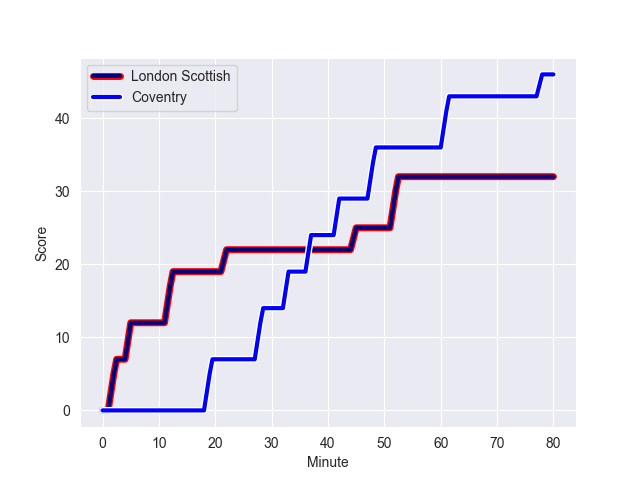
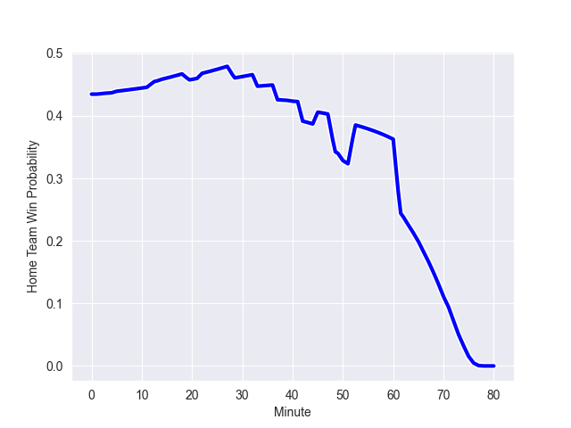

---  
layout: page  
title: Coventry at London Scottish; 46-32  
date: 2022-10-08 16:00:00 18:00:00 -0500  
categories: match review  
---
# Coventry (1156.0) at London Scottish (1068.28)

# Prediction: Coventry by 3.8

Coventry by 8.8 on a neutral field
## Scores over Time

## Win Probability over Time

# Pre-Match Prediction: Coventry by 3.2

Coventry by 8.2 on a neutral pitch

|   Away Minutes | Away Player           |   Away elo |   Away Percentile |   Number |   Home Percentile |   Home elo | Home Player           |   Home Minutes |
|---------------:|:----------------------|-----------:|------------------:|---------:|------------------:|-----------:|:----------------------|---------------:|
|             80 | Toby Trinder          |      80.3  |                46 |        1 |                23 |      76.98 | Sam Gratton           |             40 |
|             79 | Suva Ma'asi           |      77.35 |                24 |        2 |                18 |      75.82 | Austin Wallis         |             71 |
|             50 | Harry Seward          |      81.02 |                50 |        3 |                 0 |      59.34 | Joe Rees              |             74 |
|             63 | George Smith          |      77.08 |                28 |        4 |                15 |      73.59 | Matt Wilkinson        |             80 |
|             80 | James Tyas            |      67.51 |                 6 |        5 |                60 |      80.79 | Angus Southon         |             50 |
|             80 | Fred Betteridge       |      72.86 |                10 |        6 |                18 |      74.66 | David Douglas Bridge  |             80 |
|             71 | Josh Bainbridge       |      79.4  |                42 |        7 |                21 |      76.66 | Dan Cuthbert          |             74 |
|             80 | Senitiki Nayalo       |      80.35 |                45 |        8 |                 3 |      64.99 | Cameron King          |             80 |
|             63 | Will Lane             |      79.3  |                45 |        9 |                 2 |      65.61 | Daniel Nutton         |             71 |
|             80 | Patrick Pellegrini    |      78.66 |                41 |       10 |                 9 |      72.5  | Harry Sheppard        |             80 |
|             50 | James Martin          |      78.8  |                42 |       11 |                37 |      78.78 | Cassius Cleaves       |             40 |
|             50 | George Worboys        |      80    |               nan |       12 |                12 |      73.63 | Robert David McCallum |             14 |
|             80 | Will Rigg             |      77.68 |                24 |       13 |                10 |      72.83 | Theo Manihera         |             80 |
|             80 | William Talbot-Davies |      71.59 |                 8 |       14 |                 0 |      54.97 | Noah Ferdinand        |             80 |
|             80 | Louis Brown           |      74.86 |                14 |       15 |                 7 |      70.57 | Cameron Anderson      |             80 |
|             30 | Shea Cornish          |      79.54 |               nan |       16 |                18 |      75.87 | Zach Clow             |             66 |
|             16 | Jake Bridges          |      75.41 |                16 |       17 |               nan |      78.84 | Sam Smith             |             40 |
|             30 | Ollie Betteridge      |      77.98 |                27 |       18 |                11 |      73.69 | Maurice Nwakor        |             40 |
|             17 | Finlay Ogden          |      78.23 |                32 |       19 |                 1 |      63.97 | Brian Tuilagi         |             30 |
|             17 | Tom Ball              |      82.95 |                65 |       20 |                 4 |      69.96 | Luca Petrozzi         |              9 |
|             14 | Ollie Andrews         |      79.87 |               nan |       21 |               nan |      80    | Toby Tyson            |              9 |
|              9 | Frankie Read          |      79.42 |               nan |       22 |                41 |      78.39 | William Hobson        |              6 |
|              1 | Oliver Stone          |      80    |               nan |       23 |               nan |      80    | Daniel Lewis          |              6 |

