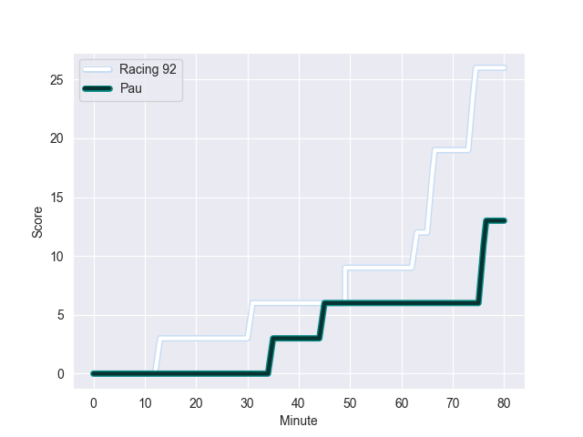
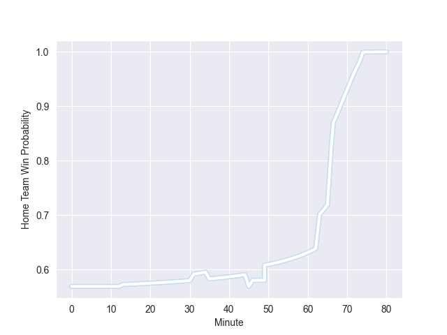

---  
layout: page  
title: Pau at Racing 92; 13-26  
date: 2022-10-08 17:00:00 18:00:00 -0500  
categories: match review  
---
# Prediction: Racing 92 by 10.7

Racing 92 by 5.7 on a neutral field
## Scores over Time

## Win Probability over Time

# Pre-Match Prediction: Racing 92 by 11.6

Racing 92 by 6.6 on a neutral pitch

|   Away Minutes | Away Player         |   Away elo |   Away Percentile |   Number |   Home Percentile |   Home elo | Home Player         |   Home Minutes |
|---------------:|:--------------------|-----------:|------------------:|---------:|------------------:|-----------:|:--------------------|---------------:|
|             48 | Siegfried Fisi'ihoi |     107.85 |                89 |        1 |                16 |      78.49 | Hassane Kolingar    |             46 |
|             73 | Youri Delhommel     |      94.78 |                63 |        2 |                97 |     116.03 | Camille Chat        |             46 |
|             48 | Nicolas Corato      |      81.25 |                32 |        3 |                88 |     108.29 | Trevor Nyakane      |             46 |
|             80 | Mariano Galarza     |     107.53 |                86 |        4 |                82 |     102.85 | Baptiste Chouzenoux |             80 |
|             58 | Baptiste Pesenti    |      95.15 |                64 |        5 |                77 |     103.09 | Dom Bird            |             46 |
|             80 | Beka Gorgadze       |     106.84 |                84 |        6 |                92 |     114.17 | Arthur Iturria      |             49 |
|             48 | Sean Dougall        |     100.38 |                78 |        7 |                39 |      81.54 | Ibrahim Diallo      |             80 |
|             80 | Jordan Joseph       |      77.94 |                13 |        8 |                40 |      84.68 | Anthime Hemery      |             80 |
|             53 | Thibault Daubagna   |     116.81 |                96 |        9 |                40 |      82.5  | Nolann Le Garrec    |             55 |
|             80 | Thibault Debaes     |      81.34 |                33 |       10 |                95 |     119.21 | Finn Russell        |             80 |
|             48 | Eoghan Barrett      |      80.81 |                36 |       11 |               nan |      80    | Christian Wade      |             80 |
|             80 | Aminiasi Tuimaba    |      98.73 |                67 |       12 |                99 |     129.78 | Gael Fickou         |             80 |
|             48 | Yvan Reilhac        |      93.24 |                57 |       13 |                66 |      98    | Francis Saili       |             46 |
|             80 | Gervais Cordin      |      88.44 |                60 |       14 |                57 |      86.66 | Donovan Taofifenua  |             80 |
|             80 | Clement Laporte     |     114.43 |                93 |       15 |                97 |     120.83 | Warrick Gelant      |             49 |
|             32 | Émilien Gailleton   |      90.82 |                53 |       16 |                53 |      90.98 | Etienne Dussartre   |             34 |
|             32 | Clement Mondinat    |      79.32 |               nan |       17 |                 0 |      70.77 | Janick Tarrit       |             34 |
|             32 | Guram Papidze       |      92.56 |                60 |       18 |                90 |     111.31 | Antonie Claassen    |             34 |
|             32 | Remi Seneca         |      96.45 |                67 |       19 |                82 |     103.91 | Cedate Gomes Sa     |             34 |
|             32 | Thibault Hamonou    |      74.48 |                 3 |       20 |                94 |     112.55 | Eddy Ben Arous      |             34 |
|             27 | Clovis Le bail      |     104.89 |                82 |       21 |                75 |     101.92 | Max Spring          |             31 |
|             22 | Baptiste Pesenti    |      95.15 |                64 |       22 |                32 |      80.12 | Maxime Baudonne     |             31 |
|              7 | Ignacio Calles      |      87.39 |                47 |       23 |                81 |     104.23 | Antoine Gibert      |             25 |

