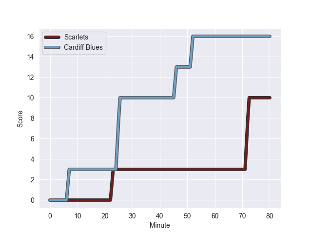
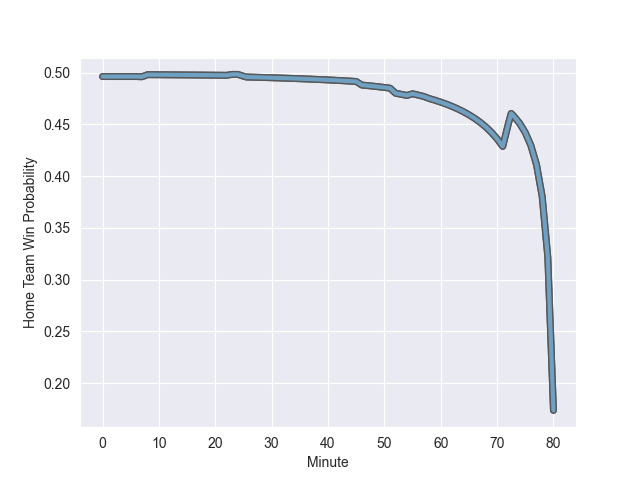

---  
layout: page  
title: Cardiff Blues at Scarlets; 16-10  
date: 2022-10-08 18:15:00 18:00:00 -0500  
categories: match review  
---
# Cardiff Blues (1423.0) at Scarlets (1465.09); 16-10

# Prediction: Scarlets by 9.2

Scarlets by 4.2 on a neutral field
## Scores over Time

## Win Probability over Time

# Pre-Match Prediction: Scarlets by 4.9

Cardiff Blues by 0.1 on a neutral pitch

|   Away Minutes | Away Player         |   Away elo |   Away Percentile |   Number |   Home Percentile |   Home elo | Home Player      |   Home Minutes |
|---------------:|:--------------------|-----------:|------------------:|---------:|------------------:|-----------:|:-----------------|---------------:|
|             55 | Rhys Carré          |      87.18 |                54 |        1 |                69 |      96.61 | Steffan Thomas   |             52 |
|             55 | Kristian Dacey      |     101.3  |                79 |        2 |                74 |     100.48 | Ryan Elias       |             52 |
|             70 | Dimitri Arhip       |      90.86 |                60 |        3 |                64 |      94.6  | Javan Sebastian  |             52 |
|             27 | Lopeti Timani       |     102.05 |                78 |        4 |                56 |      90.59 | Tom Price        |             77 |
|             70 | Seb Davies          |      88.23 |                52 |        5 |                60 |      93.04 | Sam Lousi        |             80 |
|             80 | Josh Turnbull       |      87.33 |                59 |        6 |                96 |     119.33 | Vaea Fifita      |             80 |
|             80 | Thomas Young        |     101.99 |                81 |        7 |                72 |      96.54 | Blade Thomson    |             58 |
|             80 | Taulupe Faletau     |     105.14 |                81 |        8 |                55 |      92.6  | Sione Kalamafoni |             80 |
|             69 | Tomos Williams      |     105.73 |                85 |        9 |                72 |      99.68 | Gareth Davies    |             52 |
|             54 | Jarrod Evans        |      98.12 |                68 |       10 |                 8 |      76.78 | Sam Costelow     |             80 |
|             80 | Theo Cabango        |      68.3  |                 0 |       11 |                84 |     104.53 | Ryan Conbeer     |             80 |
|             80 | Uilisi Halaholo     |     116.26 |                94 |       12 |                72 |     100.4  | Jonathan Davies  |             80 |
|              8 | Rey Lee-Lo          |     106.23 |                83 |       13 |                64 |      90.95 | Corey Baldwin    |             54 |
|             80 | Jason Harries       |      98.6  |                76 |       14 |                78 |     102.91 | Johnny McNicholl |             80 |
|             80 | Rhys Priestland     |      96.97 |                66 |       15 |               nan |     108.52 | Leigh Halfpenny  |             80 |
|             72 | Max Llewellyn       |      87.58 |                49 |       16 |                92 |     109.24 | Ken Owens        |             28 |
|             53 | Shane Lewis-Hughes  |      94.28 |                69 |       17 |                81 |     102.7  | Wyn Jones        |             28 |
|             26 | Mason Grady         |      79.2  |                26 |       18 |                54 |      88.93 | Dane Blacker     |             28 |
|             25 | Corey Domachowski   |      96.26 |                72 |       19 |                18 |      78.8  | Harri O'Connor   |             28 |
|             25 | Kirby Myhill        |      94.07 |                63 |       20 |                78 |     100.07 | Steffan Evans    |             26 |
|             11 | Lloyd Williams      |      97.75 |                69 |       21 |                59 |      92.92 | Shaun Evans      |             22 |
|             10 | William Davies-King |      77.46 |                10 |       22 |                36 |      81.63 | Jac Price        |              3 |
|             10 | Teddy Williams      |      80    |               nan |       23 |               nan |     nan    | nan              |            nan |

