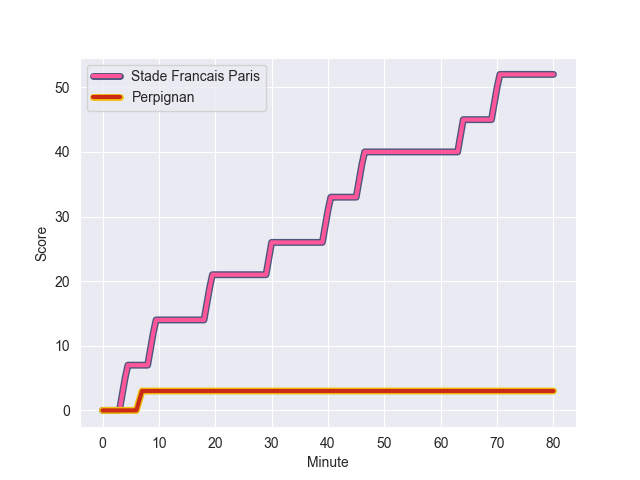
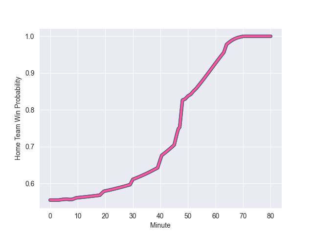

---  
layout: page  
title: Perpignan at Stade Francais Paris; 3-52  
date: 2022-10-08 17:00:00 18:00:00 -0500  
categories: match review  
---
# Prediction: Stade Francais Paris by 14.5

Stade Francais Paris by 9.5 on a neutral field
## Scores over Time

## Win Probability over Time

# Pre-Match Prediction: Stade Francais Paris by 17.2

Stade Francais Paris by 12.2 on a neutral pitch

|   Away Minutes | Away Player           |   Away elo |   Away Percentile |   Number |   Home Percentile |   Home elo | Home Player             |   Home Minutes |
|---------------:|:----------------------|-----------:|------------------:|---------:|------------------:|-----------:|:------------------------|---------------:|
|             51 | Giorgi Tetrashvili    |      86.94 |                51 |        1 |                77 |     100.5  | Clement Castets         |             48 |
|             51 | Victor Montgaillard   |      79.58 |               nan |        2 |                68 |      99.4  | Craig Burden            |             50 |
|             41 | Siua Halanukonuka     |     109.36 |                90 |        3 |                83 |     105.25 | Giorgi Melikidze        |             53 |
|             14 | Will Witty            |      91.77 |                57 |        4 |                87 |     108.73 | Hugh Pyle               |             50 |
|              5 | Andrei Mahu           |      92.85 |                58 |        5 |                58 |      92.39 | Steven Cummins          |             80 |
|             80 | Masalosalo Tutaia     |      94.06 |                61 |        6 |                66 |      93.67 | Camille Gerondeau       |             80 |
|             80 | Fulgence Ouedraogo    |     124.92 |                98 |        7 |                93 |     113.74 | Sekou Macalou           |             49 |
|             80 | Genesis Mamea Lemalu  |     108.33 |                85 |        8 |                90 |     111.59 | Giovanni Habel-Kueffner |             49 |
|             51 | Matteo Rodor          |      79.64 |                19 |        9 |                59 |      91.87 | Arthur Coville          |             51 |
|             80 | Brynard Stander       |      78.76 |                14 |       10 |                49 |      85.96 | Leo Barre               |             80 |
|             80 | Mathieu Acebes        |     122.09 |                97 |       11 |                94 |     116.26 | Sefa Naivalu            |             80 |
|             51 | Alivereti Duguivalu   |      84.97 |                44 |       12 |                71 |     100.86 | Julien Delbouis         |             80 |
|             80 | Jeronimo de la Fuente |     101.19 |                72 |       13 |                96 |     120.33 | Telusa Veainu           |             51 |
|             80 | Théo Forner           |      78.77 |                21 |       14 |                66 |      92.55 | Nadir Megdoud           |             80 |
|             51 | Boris Goutard         |      73.12 |                 2 |       15 |                75 |     101.49 | Kylan Hamdaoui          |             80 |
|             75 | Karl Chateau          |      92.25 |                65 |       16 |               nan |      80.26 | Sergo Abramishvili      |             32 |
|             66 | Lucas Velarte         |      80.12 |                21 |       17 |                72 |      96.59 | Marcos Kremer           |             31 |
|             39 | Akato Fakatika        |      79.58 |               nan |       18 |                50 |      84.41 | Tornike Jalagonia       |             31 |
|             29 | Sadek Deghmache       |      81.78 |                36 |       19 |                75 |     101.05 | Lucas Peyresblanques    |             30 |
|             29 | Xavier Chiocci        |     100.7  |                77 |       20 |                36 |      82.69 | JJ van der Mescht       |             30 |
|             29 | Brayden Wiliame       |      78.54 |                15 |       21 |                79 |     104.64 | Jeremy Ward             |             29 |
|             29 | Tristan Tedder        |      94.52 |                63 |       22 |                68 |      97.87 | James Hall              |             29 |
|             29 | Seilala Lam           |      88.59 |                49 |       23 |                56 |      88.65 | Nemo Roelofse           |             27 |

