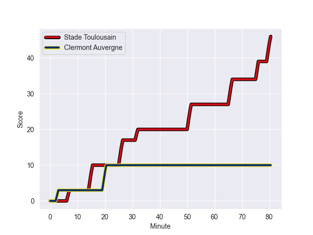
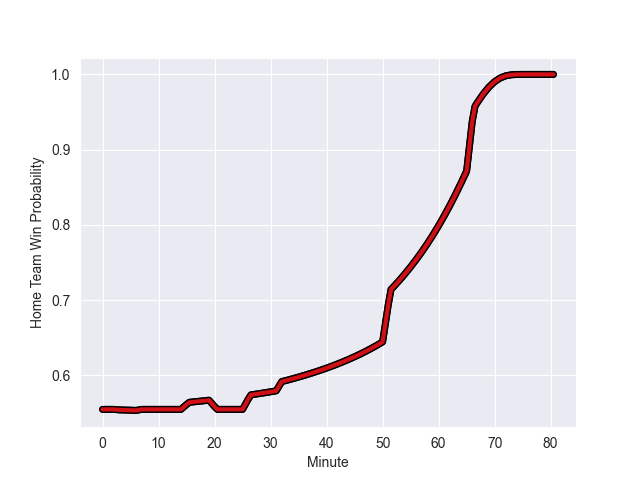

---  
layout: page  
title: Clermont Auvergne at Stade Toulousain; 10-46  
date: 2022-10-08 21:05:00 18:00:00 -0500  
categories: match review  
---
# Clermont Auvergne (1455.26) at Stade Toulousain (1655.79); 10-46

# Prediction: Stade Toulousain by 25.1

Stade Toulousain by 20.1 on a neutral field
## Scores over Time

## Win Probability over Time

# Pre-Match Prediction: Stade Toulousain by 22.5

Stade Toulousain by 17.5 on a neutral pitch

|   Away Minutes | Away Player           |   Away elo |   Away Percentile |   Number |   Home Percentile |   Home elo | Home Player        |   Home Minutes |
|---------------:|:----------------------|-----------:|------------------:|---------:|------------------:|-----------:|:-------------------|---------------:|
|             80 | Giorgi Beria          |      86.38 |                51 |        1 |                84 |     104.99 | Rodrigue Neti      |             80 |
|             80 | Adrien Pelissie       |     102.51 |                74 |        2 |                98 |     120.8  | Julien Marchand    |             80 |
|             80 | Giorgi Dzmanashvili   |      80.61 |               nan |        3 |                93 |     113.84 | Dorian Aldegheri   |             80 |
|             80 | Tomas Lavanini        |     108.19 |                87 |        4 |                91 |     112.81 | Anthony Jelonch    |             80 |
|             80 | Sebastien Vahaamahina |     122.77 |                97 |        5 |                67 |      96.54 | Thibaud Flament    |             80 |
|             80 | Jacobus van Tonder    |      87.05 |                58 |        6 |                94 |     117.67 | Alexandre Roumat   |             80 |
|             80 | Killian Tixeront      |      84.93 |                50 |        7 |                94 |     115.25 | Rynhardt Elstadt   |             80 |
|             80 | Loic Godener          |      97.15 |                66 |        8 |                86 |     108.82 | Selevasio Tolofua  |             80 |
|             80 | Baptiste Jauneau      |      80.75 |               nan |        9 |                99 |     133.06 | Antoine Dupont     |             80 |
|             80 | Jules Plisson         |     116.48 |                93 |       10 |                95 |     118.99 | Thomas Ramos       |             80 |
|             80 | Marvin O'Connor       |     105.13 |                85 |       11 |                73 |      96.92 | Matthis Lebel      |             80 |
|             80 | Samuel Ezeala         |      79.44 |                22 |       12 |                89 |     110.08 | Sofiane Guitoune   |             80 |
|             80 | Damian Penaud         |     120.8  |                97 |       13 |                81 |     105.21 | Tim Nanai-Williams |             80 |
|             80 | Bautista Delguy       |      96.59 |                72 |       14 |                81 |     103.27 | Arthur Retiere     |             80 |
|             80 | Cheikh Tiberghien     |      86.47 |                56 |       15 |                73 |      97.54 | Ange Capuozzo      |             80 |

