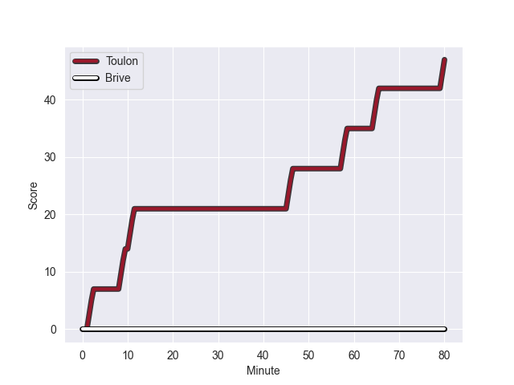
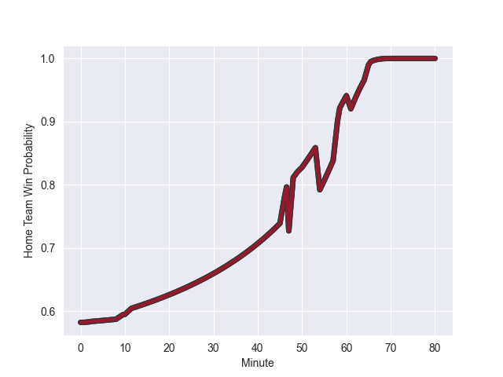

---  
layout: page  
title: Brive at Toulon; 0-47  
date: 2022-10-08 17:00:00 18:00:00 -0500  
categories: match review  
---
# Brive (1269.74) at Toulon (1414.55); 0-47

# Prediction: Toulon by 19.5

Toulon by 14.5 on a neutral field
## Scores over Time

## Win Probability over Time

# Pre-Match Prediction: Toulon by 19.0

Toulon by 14.0 on a neutral pitch

|   Away Minutes | Away Player           |   Away elo |   Away Percentile |   Number |   Home Percentile |   Home elo | Home Player                    |   Home Minutes |
|---------------:|:----------------------|-----------:|------------------:|---------:|------------------:|-----------:|:-------------------------------|---------------:|
|             50 | Daniel Brennan        |      75.68 |                15 |        1 |                94 |      97.38 | Jean-Baptiste Gros             |             48 |
|             50 | Lucas da Silva        |      83.95 |                71 |        2 |                72 |      84.92 | Anthony Etrillard              |             48 |
|             50 | Marcel van der Merwe  |      77.8  |                27 |        3 |                91 |      94.16 | Beka Gigashvili                |             48 |
|             47 | Oskar Rixen           |      80.85 |                50 |        4 |                89 |      95.36 | Eben Etzebeth                  |             80 |
|             45 | Fabrice Metz          |      83.61 |                63 |        5 |                84 |      91.25 | Brian Alainu'uese              |             61 |
|             80 | Sasha Gue             |      79.29 |                43 |        6 |               nan |      80    | Mattéo Le Corvec               |             58 |
|             80 | Lucas Paulos          |      87.28 |                74 |        7 |                98 |     111.24 | Charles Ollivon                |             58 |
|             80 | Noe Bedou             |      80.16 |               nan |        8 |                94 |     104.6  | Facundo Isa                    |             80 |
|             80 | Paul Abadie           |      71.78 |                 9 |        9 |                93 |      99.71 | Benoit Paillaugue              |             54 |
|             61 | Tom Raffy             |      81.32 |               nan |       10 |                27 |      77.75 | Ihaia West                     |             80 |
|             80 | Axel Muller           |      99.91 |                92 |       11 |                18 |      75.94 | Gaël Dréan                     |             47 |
|             80 | Guillaume Galletier   |      77.81 |                27 |       12 |                72 |      87.17 | Duncan Paia'aua                |             80 |
|             80 | Bundee Aki            |     114.55 |                99 |       13 |                94 |     103.29 | Waisea Nayacalevu Vuidravuwalu |             80 |
|             61 | Nick Abendanon        |     100.67 |                92 |       14 |                99 |     130.88 | Cheslin Kolbe                  |             80 |
|             47 | Thomas Laranjeira     |      92.08 |                79 |       15 |                43 |      79.77 | Thomas Salles                  |             80 |
|             35 | Andres Zafra Tarazona |      70.58 |                 9 |       16 |                60 |      84.36 | Alofa Alofa                    |             33 |
|             33 | Paul Abadie           |      71.78 |                 9 |       17 |                39 |      80.34 | Dany Priso                     |             32 |
|             30 | Wesley Tapueluelu     |      78.25 |                31 |       18 |                68 |      83.03 | Teddy Baubigny                 |             32 |
|             33 | Mathis Ferté          |      80    |               nan |       19 |                67 |      84.71 | Kieran Brookes                 |             32 |
|             30 | Malino Vanai          |      82.38 |                62 |       20 |                90 |     100.89 | Baptiste Serin                 |             26 |
|             30 | Florian Dufour        |      88.28 |                82 |       21 |                96 |     106.13 | Sergio Parisse                 |             22 |
|             19 | Enzo Sanga            |      73.01 |                10 |       22 |                98 |     111.24 | Charles Ollivon                |             22 |
|             19 | Tanguy Lacoste        |      80    |               nan |       23 |                90 |      97.32 | Jone Qovu Nailiko              |             19 |

