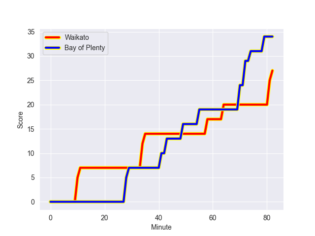
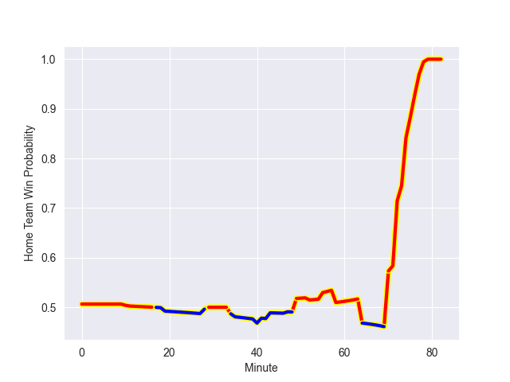

---  
layout: page  
title: Bay of Plenty at Waikato; 34.0-27.0  
date: 2022-10-08 21:05:00 18:00:00 -0500  
categories: match review  
---
# Bay of Plenty (1407.4) at Waikato (1455.44); 34.0-27.0

# Prediction: Waikato by 9.8

Waikato by 4.8 on a neutral field
## Scores over Time

## Win Probability over Time

# Pre-Match Prediction: Waikato by 8.1

Waikato by 3.1 on a neutral pitch

|   Away Minutes | Away Player            |   Away elo |   Away Percentile |   Number |   Home Percentile |   Home elo | Home Player          |   Home Minutes |
|---------------:|:-----------------------|-----------:|------------------:|---------:|------------------:|-----------:|:---------------------|---------------:|
|             64 | Aidan Ross             |     109.71 |                91 |        1 |                88 |     108.21 | Ayden Johnstone      |             47 |
|             64 | Kurt Eklund            |     113.92 |                95 |        2 |                97 |     119.7  | Rhys Marshall        |             74 |
|             72 | Tevita Mafileo         |      84.25 |                48 |        3 |                28 |      78.99 | George Dyer          |             60 |
|             82 | Justin Sangster        |      83.93 |                43 |        4 |                75 |     100.3  | Hamilton Burr        |             55 |
|             82 | Manaaki Selby-Rickit   |      96.44 |                67 |        5 |                93 |     114.31 | Laghlan McWhannell   |             82 |
|             82 | Naitoa Ah Kuoi         |      88.09 |                60 |        6 |                35 |      80.03 | Patrick McCurran     |             74 |
|             72 | Jacob Norris           |      94.73 |                69 |        7 |                75 |      98.81 | Mitchell Jacobson    |             82 |
|             47 | Nikora Broughton       |      82.24 |                35 |        8 |                92 |     113.32 | Luke Jacobson        |             82 |
|             72 | Te Toiroa Tahuriorangi |     106.7  |                86 |        9 |                 9 |      77.46 | Xavier Roe           |             52 |
|             40 | Kaleb Trask            |      86.43 |                51 |       10 |                96 |     119.57 | Damian McKenzie      |             82 |
|             82 | Nigel Ah Wong          |     117.46 |                95 |       11 |                27 |      79.52 | Daniel Sinkinson     |             82 |
|             19 | Kaveinga Finau         |     105.39 |                82 |       12 |                94 |     116.6  | Anton Lienert-Brown  |             49 |
|             82 | Joey Walton            |      88.32 |                51 |       13 |                67 |      97.74 | Bailyn Sullivan      |             82 |
|             82 | Leroy Carter           |      81.52 |                39 |       14 |                49 |      83.27 | Liam Coombes-Fabling |             82 |
|             82 | Emoni Narawa           |      90.59 |                63 |       15 |                11 |      77.47 | Tepaea Cook-Savage   |             74 |
|             18 | Anaru Rangi            |      97.64 |                69 |       16 |                45 |      84.08 | Pita Anae Ah-Sue     |              8 |
|             18 | Haereiti Hetet         |      88.51 |                56 |       17 |                42 |      82.7  | Ollie Norris         |             35 |
|             10 | Jeff Thwaites          |     102.17 |                80 |       18 |                79 |     101.83 | Sosefo Kautai        |             22 |
|             10 | Veveni Lasaqa          |      81.25 |                38 |       19 |                89 |     110.31 | James Tucker         |             27 |
|             35 | Zane Kapeli            |      98.84 |                71 |       20 |                 5 |      75.21 | Jack Lam             |              8 |
|             42 | Wharenui Hawera        |      90.52 |                57 |       21 |                44 |      82.57 | Cortez Ratima        |             30 |
|             63 | Lalamilo Lalamilo      |      78.77 |                16 |       22 |                72 |     100.34 | D'Angelo Leuila      |             33 |
|             10 | Taylor Haugh           |      79.04 |                23 |       23 |                34 |      79.98 | Tana Tuhakaraina     |              8 |

