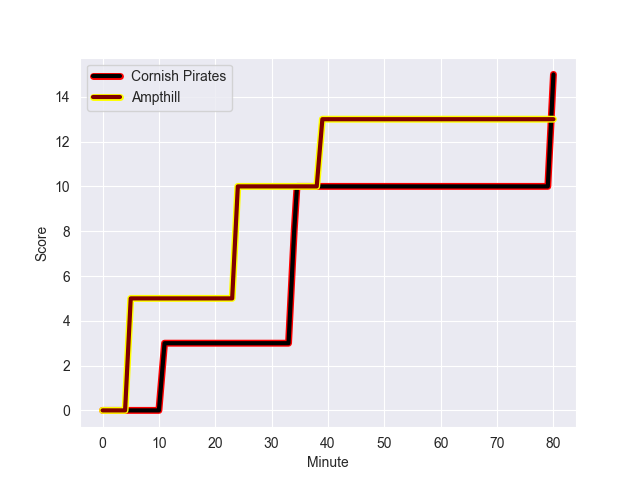
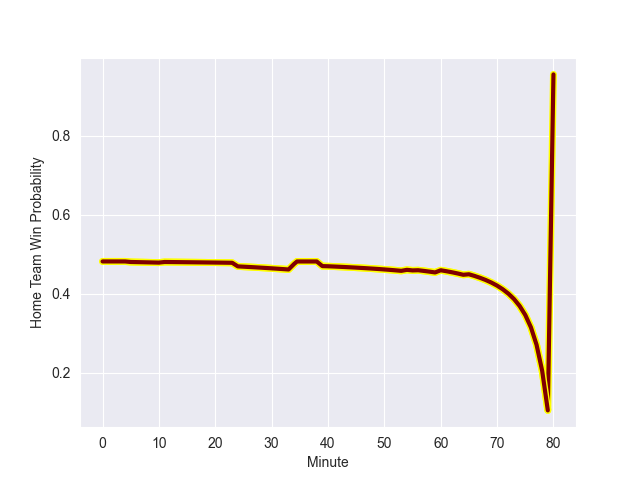

---  
layout: page  
title: Ampthill at Cornish Pirates; 13-15  
date: 2022-10-09 15:30:00 18:00:00 -0500  
categories: match review  
---
# Prediction: Cornish Pirates by 1.5

Ampthill by 3.5 on a neutral field
## Scores over Time

## Win Probability over Time

# Pre-Match Prediction: Ampthill by 10.8

Cornish Pirates by 5.8 on a neutral pitch

|   Away Minutes | Away Player          |   Away elo |   Away Percentile |   Number |   Home Percentile |   Home elo | Home Player            |   Home Minutes |
|---------------:|:---------------------|-----------:|------------------:|---------:|------------------:|-----------:|:-----------------------|---------------:|
|             11 | Griff Phillipson     |      80.39 |                28 |        1 |                 6 |      75.88 | Marlen Walker          |             60 |
|             80 | Matt Gallagher       |      81.36 |               nan |        2 |                26 |      80.28 | William Crane          |             65 |
|             40 | Joe Sproston         |      79.11 |                21 |        3 |                26 |      79.77 | Harvey Beaton          |             60 |
|             80 | Charlie Beckett      |     107.94 |                86 |        4 |                 7 |      76.32 | Cory Teague            |             65 |
|             40 | Alfie Bell           |      81.24 |                32 |        5 |                 3 |      72.85 | Will Britton           |             80 |
|             80 | Harry Wilson         |      79.29 |                25 |        6 |                27 |      79.72 | Alex Everett           |             56 |
|             80 | James Tunney         |      80.03 |               nan |        7 |                57 |      87.05 | John Stevens           |             80 |
|             80 | Caleb Montgomery     |      79.87 |                28 |        8 |                29 |      81.31 | Sebastian Nagle-Taylor |             80 |
|             80 | Peter White          |      80.51 |                31 |        9 |                15 |      78.39 | Ruaridh Dawson         |             65 |
|             80 | Gwyn Parks           |      80.51 |                27 |       10 |                44 |      84.21 | Arwel Robson           |             60 |
|             80 | Ben Cambriani        |      82.03 |                43 |       11 |                39 |      81.36 | Robin Wedlake          |             80 |
|             80 | Joshua Bragman       |      85.47 |                45 |       12 |                36 |      82.43 | Joe Elderkin           |             54 |
|             80 | Rekeiti Ma'asi-White |      80.79 |                27 |       13 |                49 |      88.43 | Rory Parata            |             80 |
|             80 | Conor Rankin         |      79.56 |                28 |       14 |                37 |      82.31 | Tom Wyatt              |             80 |
|             80 | Tomas Bacon          |      80.83 |               nan |       15 |                44 |      84.87 | Alexander AJ Cant      |             80 |
|             49 | Archie McArthur      |      80.83 |               nan |       16 |                52 |      89.91 | Garyn Smith            |             26 |
|             40 | Rob Hardwick         |      80.28 |                23 |       17 |                40 |      82.69 | Lewis Pearson          |             24 |
|             40 | Fyn Brown            |      80    |               nan |       18 |               nan |      80.49 | Matt Johnson           |             20 |
|             20 | Dominic Hardman      |      78.84 |               nan |       19 |                59 |      91.22 | Jack Andrew            |             20 |
|             80 | Solomone Kata        |       5.4  |                 0 |       20 |                40 |      83.52 | Carwyn Penny           |             20 |
|             80 | Solomone Kata        |       5.4  |                 0 |       21 |                27 |      80.34 | James Fender           |             15 |
|             80 | Solomone Kata        |       5.4  |                 0 |       22 |                52 |      87.89 | Tom Kessell            |             15 |
|             80 | Solomone Kata        |       5.4  |                 0 |       23 |               nan |      80.3  | Morgan Nelson          |             15 |

