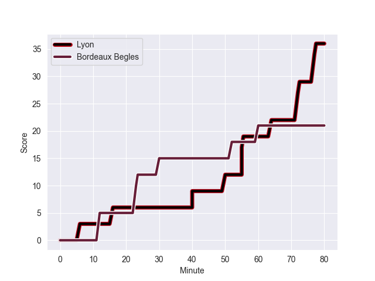
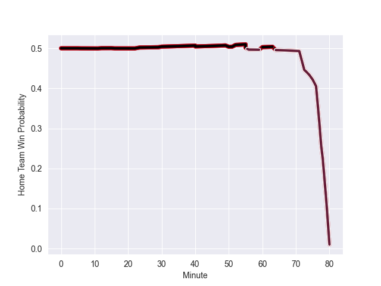

---  
layout: page  
title: Bordeaux Begles at Lyon; 21-36  
date: 2022-10-09 21:05:00 18:00:00 -0500  
categories: match review  
---
# Bordeaux Begles (1292.41) at Lyon (1293.8); 21-36

# Prediction: Lyon by 5.1

Lyon by 0.1 on a neutral field
## Scores over Time

## Win Probability over Time

# Pre-Match Prediction: Lyon by 7.6

Lyon by 2.6 on a neutral pitch

|   Away Minutes | Away Player               |   Away elo |   Away Percentile |   Number |   Home Percentile |   Home elo | Home Player          |   Home Minutes |
|---------------:|:--------------------------|-----------:|------------------:|---------:|------------------:|-----------:|:---------------------|---------------:|
|             65 | Jefferson Poirot          |      74.96 |                14 |        1 |                 6 |      70.34 | Sebastien Taofifenua |             38 |
|             51 | Pablo Dimcheff            |      80.26 |                48 |        2 |                77 |      86.58 | Liam Coltman         |             56 |
|             51 | Ben Tameifuna             |     103.92 |                96 |        3 |                 5 |      70.66 | Hamza Kaabeche       |             47 |
|             80 | Thomas Jolmes             |      71.27 |                13 |        4 |                23 |      76.19 | Joel Kpoku           |             80 |
|             57 | Jandré Marais             |      96.55 |                90 |        5 |                91 |      97.62 | Izack Rodda          |             56 |
|             80 | Bastien Vergnes Taillefer |      82.15 |                59 |        6 |                62 |      82.93 | Mickael Guillard     |             47 |
|             80 | Remi Lamerat              |     107.56 |                97 |        7 |                83 |      89.28 | Beka Saghinadze      |             80 |
|             51 | Alban Roussel             |      86.74 |                79 |        8 |                94 |     104.7  | Arno Botha           |             56 |
|             67 | Yann Lesgourgues          |      81.42 |                54 |        9 |                98 |     111.93 | Jean-Marc Doussain   |             47 |
|             80 | Matthieu Jalibert         |      90.41 |                81 |       10 |                15 |      75.28 | Leo Berdeu           |             80 |
|             80 | Federico Mori             |      69.58 |                 5 |       11 |                58 |      81.93 | Ethan Dumortier      |             80 |
|             80 | Yoram Moefana             |      90.36 |                80 |       12 |                67 |      85.61 | Michael McDonald     |             56 |
|             57 | Pablo Uberti              |      86.36 |                71 |       13 |                99 |     117.54 | Chris Ashton         |             80 |
|             80 | Louis Bielle-Biarrey      |      79.4  |                40 |       14 |                24 |      77.19 | Xavier Mignot        |             80 |
|             80 | Romain Buros              |      99.04 |                93 |       15 |                54 |      82.32 | Davit Niniashvili    |             80 |
|             29 | Maxime Lamothe            |      78.92 |                38 |       16 |                 4 |      68.98 | Jerome Rey           |             42 |
|             29 | Caleb Timu                |      75.43 |                22 |       17 |                28 |      79.1  | Richie Asiata        |             33 |
|             29 | Sipili Falatea            |      84.19 |                69 |       18 |                94 |     101.83 | Baptiste Couilloud   |             33 |
|             23 | Tani Vili                 |      81.19 |                46 |       19 |                 4 |      69.4  | Colby Fainga'a       |             33 |
|             23 | Pierre Bochaton           |     102.44 |                94 |       20 |                94 |     104.09 | Jordan Taufua        |             24 |
|             15 | Lekso Kaulashvili         |      93.78 |                90 |       21 |                40 |      78.76 | Temo Mayanavanua     |             24 |
|             13 | Jules Gimbert             |      73.51 |               nan |       22 |                55 |      81.27 | Thibault Regard      |             24 |
|             80 | Solomone Kata             |       1.72 |                 0 |       23 |                50 |      79.33 | Yanis Charcosset     |             24 |

