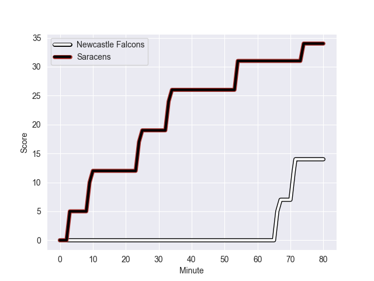
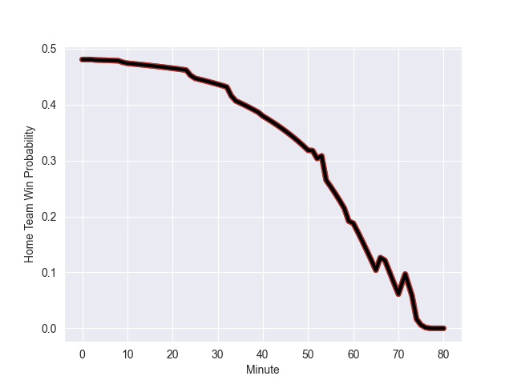

---  
layout: page  
title: Saracens at Newcastle Falcons; 34.0-14.0  
date: 2022-10-09 10:00:00 18:00:00 -0500  
categories: match review  
---
# Prediction: Saracens by 0.4

Saracens by 5.4 on a neutral field
## Scores over Time

## Win Probability over Time

# Pre-Match Prediction: Saracens by 2.2

Saracens by 7.2 on a neutral pitch

|   Away Minutes | Away Player        |   Away elo |   Away Percentile |   Number |   Home Percentile |   Home elo | Home Player         |   Home Minutes |
|---------------:|:-------------------|-----------:|------------------:|---------:|------------------:|-----------:|:--------------------|---------------:|
|             80 | Mako Vunipola      |     110.69 |                98 |        1 |                87 |      90.88 | Adam Brocklebank    |             59 |
|             67 | Kapeli Pifeleti    |      81.29 |                45 |        2 |                30 |      78.07 | George McGuigan     |             51 |
|             59 | Marco Riccioni     |      76.35 |                15 |        3 |                64 |      83.43 | Richard Palframan   |             67 |
|             80 | Callum Hunter-Hill |      67.77 |                 6 |        4 |                 1 |      59.8  | Greg Peterson       |             53 |
|             80 | Theo McFarland     |      89.31 |                82 |        5 |                74 |      87.24 | Sean Robinson       |             80 |
|             53 | Jackson Wray       |     103.2  |                94 |        6 |                98 |     112.31 | Will Welch          |             80 |
|             76 | Ben Earl           |     102.13 |                94 |        7 |                86 |      92.73 | Connor Collett      |             80 |
|             60 | Billy Vunipola     |     117.5  |                98 |        8 |                 8 |      68.73 | Callum Chick        |             40 |
|             76 | Ivan van Zyl       |      84.83 |                68 |        9 |                14 |      74.52 | Sam Stuart          |             51 |
|             80 | Owen Farrell       |     124.37 |               100 |       10 |                76 |      88.6  | Tian Schoeman       |             80 |
|             59 | Alex Lewington     |      86.03 |                72 |       11 |                12 |      73.73 | Mateo Carreras      |             80 |
|             80 | Nick Tompkins      |     103.99 |                95 |       12 |                55 |      83.02 | Matias Orlando      |             59 |
|             76 | Alex Lozowski      |      82.49 |                53 |       13 |                97 |     110.11 | Matias Moroni       |             80 |
|             80 | Max Malins         |      84.84 |                69 |       14 |                94 |     103.02 | Adam Radwan         |             52 |
|             80 | Elliot Daly        |      82.16 |                52 |       15 |                96 |     103.83 | Tom Penny           |             80 |
|             13 | Theo Dan           |      83.12 |                64 |       16 |                67 |      83.15 | Jamie Blamire       |             29 |
|             20 | Eroni Mawi         |      77.14 |                21 |       17 |                87 |      89.77 | Logovi'i Mulipola   |             21 |
|             21 | Alec Clarey        |      74.95 |                17 |       18 |                31 |      78.2  | Mark Tampin         |             13 |
|              4 | Hugh Tizard        |      84.18 |                65 |       19 |                26 |      76.59 | Sebastian de Chaves |             27 |
|             27 | Andy Christie      |      83.53 |                64 |       20 |                84 |      91.71 | Freddie Lockwood    |             40 |
|              4 | Ruben de Haas      |      79.02 |                36 |       21 |                96 |     107.09 | Michael Young       |             29 |
|             21 | Alex Goode         |      99.17 |                91 |       22 |                12 |      73.58 | Pete Lucock         |             21 |
|              4 | Josh Hallett       |      79.88 |                43 |       23 |                31 |      78.18 | Ben Stevenson       |             28 |

