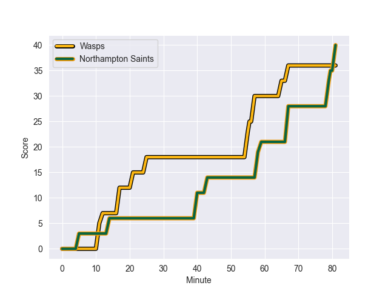
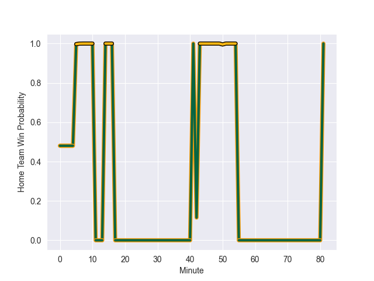

---  
layout: page  
title: Northampton Saints at Wasps; 40.0-36.0  
date: 2022-10-09 10:00:00 18:00:00 -0500  
categories: match review  
---
# Prediction: Wasps by 1.6

Northampton Saints by 3.4 on a neutral field
## Scores over Time

## Win Probability over Time

# Pre-Match Prediction: Northampton Saints by 2.8

Northampton Saints by 2.2 on a neutral pitch

|   Away Minutes | Away Player          |   Away elo |   Away Percentile |   Number |   Home Percentile |   Home elo | Home Player          |   Home Minutes |
|---------------:|:---------------------|-----------:|------------------:|---------:|------------------:|-----------:|:---------------------|---------------:|
|             51 | Alex Waller          |     120.26 |                98 |        1 |                72 |      98.71 | Robin Hislop         |             51 |
|             78 | Sam Matavesi         |      89.85 |                50 |        2 |                52 |      90.96 | Gabriel Oghre        |             81 |
|             57 | Paul Hill            |     110.62 |                92 |        3 |                77 |     101.16 | John Ryan            |             56 |
|             81 | Lukhan Salakaia-Loto |     112.33 |                92 |        4 |                95 |     119.17 | Joe Launchbury       |             41 |
|             58 | Alex Moon            |     121.31 |                97 |        5 |                72 |      99.59 | Kiran McDonald       |             81 |
|             81 | Alex Coles           |      86.93 |                49 |        6 |                68 |      94.84 | Ben Morris           |             14 |
|             81 | Lewis Ludlam         |     108.2  |                88 |        7 |                82 |     103.21 | Jack Willis          |             81 |
|             51 | Sam Graham           |      78.1  |               nan |        8 |                82 |     103.1  | Nizaam Carr          |             81 |
|             81 | Alex Mitchell        |     113.85 |                92 |        9 |                97 |     118.99 | Dan Robson           |             40 |
|             48 | Dan Biggar           |     133.64 |                98 |       10 |                14 |      78.08 | Charlie Atkinson     |             81 |
|             81 | Ollie Sleightholme   |      95.2  |                71 |       11 |                83 |     103.69 | Josh Bassett         |             81 |
|             81 | Fraser Dingwall      |      88.31 |                49 |       12 |                92 |     112.5  | Ryan Mills           |             81 |
|             62 | Matt Proctor         |      83.68 |                51 |       13 |                96 |     119.78 | Burger Odendaal      |             81 |
|             81 | Tommy Freeman        |      88.05 |                59 |       14 |                75 |      98.14 | Paolo Odogwu         |             67 |
|             81 | George Furbank       |     115.82 |                94 |       15 |                80 |     104.26 | Jacob Umaga          |             81 |
|              3 | Robbie Smith         |     103.49 |               nan |       16 |                91 |     108.81 | Dan Frost            |             14 |
|             30 | Ethan Waller         |     108.94 |                90 |       17 |               nan |      80.53 | Rodrigo Martinez     |             30 |
|             24 | Alfie Petch          |      80.62 |                29 |       18 |                92 |     111.2  | Biyi Alo             |             25 |
|             23 | David Ribbans        |     111.81 |                91 |       19 |                43 |      83.86 | Tim Cardall          |             40 |
|             30 | Juarno Augustus      |      88.86 |                48 |       20 |                43 |      83.26 | Kieran Curran        |             53 |
|              0 | Tom James            |      83.05 |                33 |       21 |                58 |      91.3  | Will Porter          |             41 |
|             30 | Rory Hutchinson      |     113.83 |               nan |       22 |                40 |      81.6  | Will Haydon-Wood     |             14 |
|             22 | Courtnall Skosan     |     125.44 |                98 |       23 |               nan |      80    | Immanuel Feyi-Waboso |              0 |

