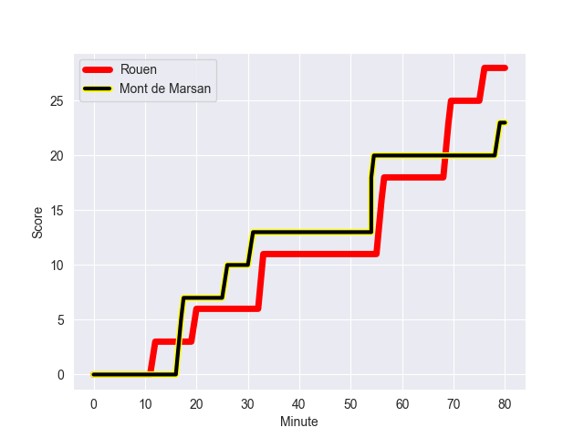
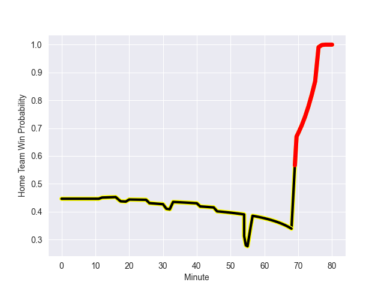

---  
layout: page  
title: Mont de Marsan at Rouen; 23-28  
date: 2022-10-13 21:00:00 18:00:00 -0500  
categories: match review  
---
# Mont de Marsan (1038.64) at Rouen (962.76); 23-28

# Prediction: Mont de Marsan by 2.6

Mont de Marsan by 7.6 on a neutral field
## Scores over Time

## Win Probability over Time

# Pre-Match Prediction: Mont de Marsan by 2.3

Mont de Marsan by 7.3 on a neutral pitch

|   Away Minutes | Away Player           |   Away elo |   Away Percentile |   Number |   Home Percentile |   Home elo | Home Player           |   Home Minutes |
|---------------:|:----------------------|-----------:|------------------:|---------:|------------------:|-----------:|:----------------------|---------------:|
|             41 | Thomas Bultel         |      67.61 |                73 |        1 |                42 |      59.4  | Soulemane Camara      |             52 |
|             58 | Romain Laterrade      |      74.76 |                87 |        2 |                84 |      73.28 | Mathieu Bonnot        |             53 |
|             41 | Gheorge Gajion        |      62.28 |                59 |        3 |                96 |      99.25 | Mohamed Boughanmi     |             46 |
|             80 | Nicolas Garrault      |      84.89 |                91 |        4 |                46 |      60.66 | Raphaël Vieilledent   |             47 |
|             52 | Andrei Ostrikov       |      61.83 |                50 |        5 |                44 |      60.77 | Toby Salmon           |             80 |
|             80 | Yann Brethous         |      78.66 |                87 |        6 |                72 |      66.97 | Willy N'Diaye         |             67 |
|             80 | Léo Banos             |      62.27 |                61 |        7 |                61 |      63.36 | Jean Leleu            |             80 |
|             52 | William Wavrin        |      93.67 |                96 |        8 |                38 |      60.15 | Valentino Mapapalangi |             80 |
|             58 | Christophe Loustalot  |      56.97 |                21 |        9 |                16 |      56.2  | Joris Lezat           |             58 |
|             55 | Joris Pialot          |      60.26 |                46 |       10 |                21 |      57.32 | Franck Pourteau       |             80 |
|             80 | Julien Cabannes       |      61.87 |                50 |       11 |                85 |      74.77 | Benito Masilevu       |             80 |
|             63 | Simon Renda           |      59.58 |                33 |       12 |                64 |      65.87 | Alex Luatua           |             62 |
|             80 | Ambrose Curtis        |      71.32 |                80 |       13 |                48 |      62.58 | Opetera Peleseuma     |             80 |
|             80 | Pierre Sayerse        |      64.21 |                63 |       14 |                43 |      60.69 | Malcolm Bertschy      |             80 |
|             80 | Yoann Laousse Azpiazu |      91.49 |                93 |       15 |                79 |      77.18 | Peter Lydon           |             80 |
|             39 | Jean-Luc Innocente    |      64.85 |                64 |       16 |                18 |      56.81 | Hugo Ndiaye           |             34 |
|             39 | Lasha Macharashvili   |      68.99 |                75 |       17 |                 0 |      32.26 | John-Charles Astle    |             33 |
|             28 | Aston Fortuin         |      53.27 |                11 |       18 |                52 |      61.89 | Cody Thomas           |             28 |
|             28 | Mike Faleafa          |      63.08 |                54 |       19 |                10 |      54.78 | Efitusi Ma'afu        |             27 |
|             25 | Willie du Plessis     |      74.79 |                76 |       20 |                76 |      70.18 | Michael Baska         |             22 |
|             22 | Martin Doan           |      63.92 |                60 |       21 |                41 |      61.55 | Taylor Gontineac      |             18 |
|             22 | Simon Labouyrie       |      49.03 |                 2 |       22 |                 3 |      45.86 | Abdelkarim Fofana     |             13 |
|             17 | Simon Desaubies       |      56.62 |                18 |       23 |               nan |     nan    | nan                   |            nan |

