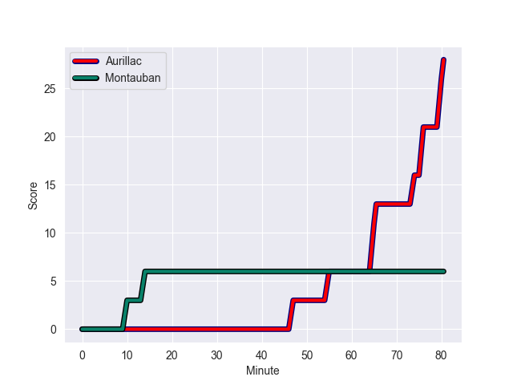
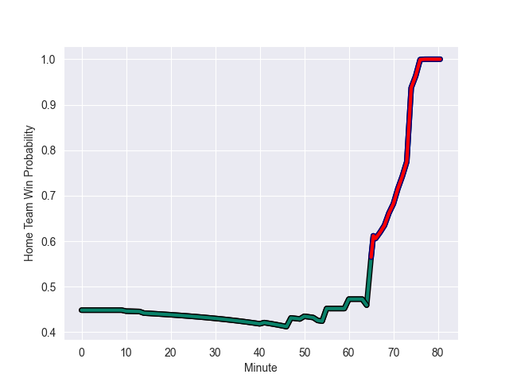

---  
layout: page  
title: Montauban at Aurillac; 6-28  
date: 2022-10-14 19:30:00 18:00:00 -0500  
categories: match review  
---
# Montauban (984.6) at Aurillac (949.85); 6-28

# Prediction: Aurillac by 1.5

Montauban by 3.5 on a neutral field
## Scores over Time

## Win Probability over Time

# Pre-Match Prediction: Montauban by 2.2

Montauban by 2.8 on a neutral pitch

|   Away Minutes | Away Player        |   Away elo |   Away Percentile |   Number |   Home Percentile |   Home elo | Home Player           |   Home Minutes |
|---------------:|:-------------------|-----------:|------------------:|---------:|------------------:|-----------:|:----------------------|---------------:|
|             55 | Lucas Seyrolle     |      45.96 |                 2 |        1 |                80 |      71.22 | Alexandre Plantier    |             53 |
|             50 | Cyril Deligny      |      53.25 |                 6 |        2 |                81 |      72.25 | Adrian Smith          |             64 |
|             80 | Victor Laval       |      57.84 |                25 |        3 |                80 |      70.99 | Giorgi Kartvelishvili |             64 |
|             80 | Tjuee Uanivi       |      57.63 |                26 |        4 |                87 |      80.3  | Eoghan Masterson      |             80 |
|             71 | Alexandre Manukula |      71.32 |                78 |        5 |                23 |      57.11 | Jean-Baptiste Singer  |             41 |
|             60 | Otar Giorgadze     |      67.78 |                68 |        6 |                31 |      58.28 | Beka Shvangiradze     |             64 |
|             80 | Stéphane Munoz     |      55.03 |                15 |        7 |                14 |      54.97 | Théo Cambon           |             80 |
|             50 | Tyrone Viiga       |      62.14 |                46 |        8 |                71 |      69.85 | Dylan Cretin          |             80 |
|             75 | Shaun Venter       |      95.78 |                94 |        9 |                16 |      56.1  | Mikheil Alania        |             69 |
|             66 | Romain Riguet      |      60.4  |               nan |       10 |                59 |      63.21 | Marc Palmier          |             80 |
|             80 | Bastien Guillemin  |      62.45 |                54 |       11 |                79 |      71.25 | AJ Coertzen           |             74 |
|             74 | Taleta Tupuola     |      74.36 |                79 |       12 |                32 |      59.35 | Elijah Niko           |             80 |
|             80 | Paul Bonnefond     |      89.74 |                93 |       13 |                33 |      59.59 | Jimmy Yobo            |             80 |
|             80 | Semesa Rokoduguni  |      87.76 |                93 |       14 |                50 |      61.79 | Giorgi Gogoladze      |             80 |
|             80 | Segundo Tuculet    |      44.25 |                 1 |       15 |                 4 |      48.96 | Anderson Neisen       |             53 |
|             30 | Kevin Firmin       |      64.91 |                69 |       16 |                62 |      64.09 | Georgi Javakhia       |             39 |
|             30 | Dimitri Vaotoa     |      46.38 |                 3 |       17 |                44 |      60.29 | Jean-Jacques Gymael   |             27 |
|             25 | Nicolas Agnesi     |      72.95 |                83 |       18 |                12 |      54.34 | Christa Powell        |             27 |
|             20 | Simon Renaud       |      49.9  |                 4 |       19 |                12 |      55.3  | Theo Lachaud          |             16 |
|             14 | Jérôme Bosviel     |      73.61 |                75 |       20 |               nan |      59.3  | Henzo Kiteau          |             16 |
|              9 | Kyllian Ringuet    |      60    |               nan |       21 |                45 |      61.21 | Maxime Profit         |             16 |
|              6 | Raphael Sanchez    |      56.4  |                16 |       22 |                 4 |      51.35 | David Delarue         |             11 |
|              5 | Anthony Meric      |      44.43 |               nan |       23 |                18 |      56.53 | Antoine Aucagne       |              6 |

