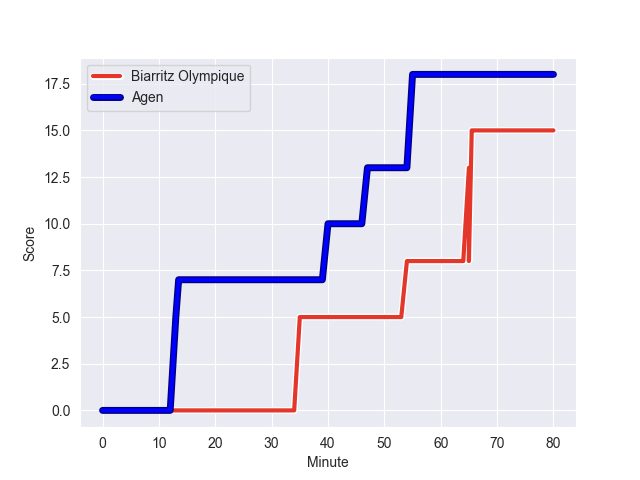
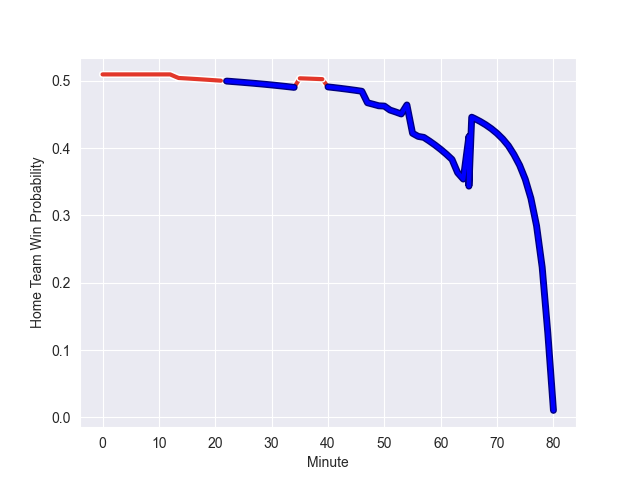

---  
layout: page  
title: Agen at Biarritz Olympique; 18-15  
date: 2022-10-14 21:00:00 18:00:00 -0500  
categories: match review  
---
# Agen (1228.17) at Biarritz Olympique (1244.47); 18-15

# Prediction: Biarritz Olympique by 6.6

Biarritz Olympique by 1.6 on a neutral field
## Scores over Time

## Win Probability over Time

# Pre-Match Prediction: Biarritz Olympique by 7.1

Biarritz Olympique by 2.1 on a neutral pitch

|   Away Minutes | Away Player          |   Away elo |   Away Percentile |   Number |   Home Percentile |   Home elo | Home Player         |   Home Minutes |
|---------------:|:---------------------|-----------:|------------------:|---------:|------------------:|-----------:|:--------------------|---------------:|
|             51 | Richard Barrington   |      84.25 |                69 |        1 |                86 |      90.24 | Guy Millar          |             54 |
|             57 | Mike Sosene-Feagai   |      85.17 |                73 |        2 |                60 |      82.24 | Thomas Sauveterre   |             54 |
|             57 | Alex Burin           |      79.64 |                39 |        3 |                32 |      78.36 | Luka Tchelidze      |             50 |
|             80 | Joe Maksymiw         |      80.16 |                46 |        4 |                77 |      88.92 | Johan Aliouat       |             54 |
|             51 | William Demotte      |      88.14 |                77 |        5 |                 1 |      60.35 | Johnny Dyer         |             80 |
|             73 | Antoine Erbani       |      85.16 |                71 |        6 |                34 |      80.26 | Simon Augry         |             80 |
|             51 | Evan Olmstead        |      64.46 |                 2 |        7 |                 4 |      69.35 | Elliot Dixon        |             80 |
|             80 | Martin Devergie      |      84.24 |                63 |        8 |                81 |      91.41 | Tornike Jalagonia   |             54 |
|             63 | Dorian Bellot        |      78.43 |                25 |        9 |                 9 |      72.71 | Kerman Aurrekoetxea |             57 |
|             80 | Thomas Vincent       |      94.66 |                84 |       10 |                28 |      77.92 | Baptiste Germain    |             63 |
|             80 | Iban Etcheverry      |      89.45 |                81 |       11 |                75 |      87.05 | Steeve Barry        |             80 |
|             80 | Harry Sloan          |      99.63 |                91 |       12 |                66 |      85.37 | Auguste Cadot       |             63 |
|             63 | Baptiste Lafond      |      68.17 |                 5 |       13 |                64 |      84.92 | Ilian Perraux       |             80 |
|             80 | Loris Tolot          |      58.34 |                 0 |       14 |                99 |     117.23 | Henry Speight       |             80 |
|             80 | Jean-Marcelin Buttin |      85.6  |                64 |       15 |                60 |      83.82 | Joe Jonas           |             80 |
|             29 | Samuel Nollet        |      76.16 |                19 |       16 |                53 |      83.77 | Lasha Tabidze       |             30 |
|             29 | Zak Farrance         |      90.95 |                84 |       17 |                73 |      87.41 | Bastien Soury       |             26 |
|             29 | Hans Lombard-Buret   |      78.36 |                32 |       18 |                70 |      85.09 | Josh Tyrell         |             26 |
|             23 | Loris Zarantonello   |      74.9  |                16 |       19 |                44 |      81.12 | Baptiste Erdocio    |             26 |
|             23 | Théo Sauzaret        |      80.36 |               nan |       20 |                64 |      83.16 | Thomas Hebert       |             26 |
|             17 | Danré Gerber         |      81.56 |                49 |       21 |                38 |      79.55 | Barnabe Couilloud   |             23 |
|             17 | Theo Idjellidaine    |      74.79 |                13 |       22 |                 0 |      59.82 | Gilles Bosch        |             17 |
|              7 | Matthieu Bonnet      |      87.41 |                79 |       23 |                53 |      82.44 | Baptiste Fariscot   |             17 |

