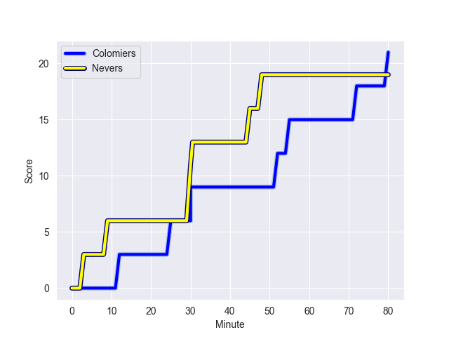
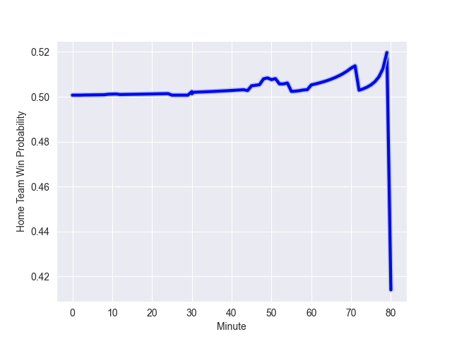

---  
layout: page  
title: Nevers at Colomiers; 19-21  
date: 2022-10-14 19:30:00 18:00:00 -0500  
categories: match review  
---
# Nevers (979.55) at Colomiers (966.27); 19-21

# Prediction: Colomiers by 3.7

Nevers by 1.3 on a neutral field
## Scores over Time

## Win Probability over Time

# Pre-Match Prediction: Nevers by 2.7

Nevers by 2.3 on a neutral pitch

|   Away Minutes | Away Player              |   Away elo |   Away Percentile |   Number |   Home Percentile |   Home elo | Home Player           |   Home Minutes |
|---------------:|:-------------------------|-----------:|------------------:|---------:|------------------:|-----------:|:----------------------|---------------:|
|             44 | Aitor Kitutu             |      69.58 |                76 |        1 |                54 |      62.75 | Hugo Djehi            |             53 |
|             55 | Issam Hamel              |      71.24 |                79 |        2 |                76 |      69.68 | Thomas Larrieu        |             53 |
|             57 | Cleopas Kundiona         |      58.18 |                25 |        3 |                65 |      65.23 | Marco Fepulea'i       |             53 |
|             53 | Lasha Jaiani             |      58.88 |                33 |        4 |                 3 |      48.55 | Anthony Coletta       |             80 |
|             80 | Christiaan van der Merwe |      55.39 |                18 |        5 |                18 |      56.28 | Maxime Granouillet    |             53 |
|             80 | Julien Kazubek           |      51.21 |                10 |        6 |                28 |      57.83 | Pierre-Samuel Pacheco |             80 |
|             80 | Jason-Colin Fraser       |      94.3  |                95 |        7 |                 7 |      51.98 | Waël Ponpon           |             80 |
|             50 | Shaun Adendorff          |      71.98 |                75 |        8 |                72 |      68.22 | Jorick Dastugue       |             80 |
|             59 | Guillaume Manevy         |      69.36 |                75 |        9 |                78 |      71.42 | Ugo Seguela           |             71 |
|             56 | Yohan Le Bourhis         |      63.72 |                59 |       10 |                41 |      61.14 | Romuald Séguy         |             80 |
|             80 | Christian Erasmus        |      69.54 |                77 |       11 |                95 |      92.49 | Alexis Palisson       |             55 |
|             80 | Leonard Paris            |      72.96 |                76 |       12 |                67 |      67.77 | Johan Deysel (Jnr)    |             80 |
|             80 | Emmanuel Vaitulukina     |      60.71 |                38 |       13 |                78 |      73.85 | Michele Campagnaro    |             55 |
|             80 | Andrzej Charlat          |      68.02 |                74 |       14 |                35 |      59.1  | Valentin Saurs        |             80 |
|             60 | Thomas Zenon             |      56.54 |                17 |       15 |                61 |      67.58 | Thomas Girard         |             80 |
|             36 | Tomike Mataradze         |      54.49 |                10 |       16 |                72 |      68.25 | Andrew Ready          |             27 |
|             30 | Kevin Noah               |      67.09 |                71 |       17 |                66 |      65.67 | Alexandre Ricard      |             27 |
|             27 | Lado Chachanidze         |      57.39 |                25 |       18 |                78 |      71.23 | Guillaume Tartas      |             27 |
|             25 | Quentin Beaudaux         |      55.58 |                15 |       19 |               nan |      61.54 | Robin Bellemand       |             27 |
|             24 | Shaun Reynolds           |      50.7  |                 4 |       20 |                45 |      63.08 | Peni Rokoduguni       |             25 |
|             23 | Aselo Ikahehegi          |      57.36 |                21 |       21 |                70 |      68.72 | Fabien Perrin         |             25 |
|             21 | Arthurs Barbier          |      59.69 |               nan |       22 |                48 |      61.59 | Edoardo Gori          |              9 |
|             20 | Kylian Jaminet           |      91.12 |                94 |       23 |               nan |     nan    | nan                   |            nan |

