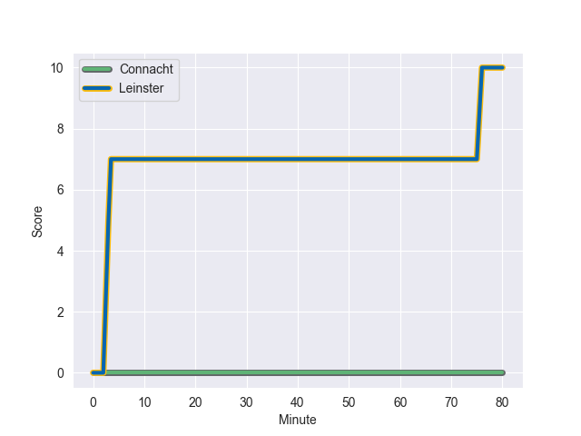
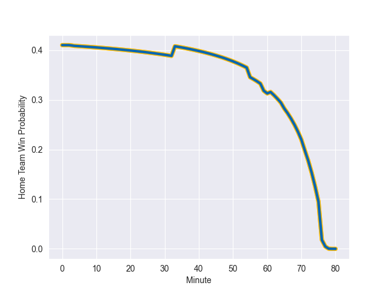

---  
layout: page  
title: Leinster at Connacht; 10-0  
date: 2022-10-14 20:35:00 18:00:00 -0500  
categories: match review  
---
# Leinster (1165.0) at Connacht (1007.34); 10-0

# Prediction: Leinster by 10.8

Leinster by 15.8 on a neutral field
## Scores over Time

## Win Probability over Time

# Pre-Match Prediction: Leinster by 10.5

Leinster by 15.5 on a neutral pitch

|   Away Minutes | Away Player        |   Away elo |   Away Percentile |   Number |   Home Percentile |   Home elo | Home Player           |   Home Minutes |
|---------------:|:-------------------|-----------:|------------------:|---------:|------------------:|-----------:|:----------------------|---------------:|
|             45 | Ed Byrne           |      74.29 |                85 |        1 |                90 |      83.75 | Peter Dooley          |             45 |
|             80 | Dan Sheehan        |      68.75 |                74 |        2 |                56 |      62.97 | Dave Heffernan        |             59 |
|             40 | Tadhg Furlong      |      77.99 |                88 |        3 |                83 |      72.6  | Finlay Bealham        |             59 |
|             80 | Ross Molony        |      87.67 |                93 |        4 |                29 |      57.95 | Niall Murray          |             80 |
|             61 | James Ryan         |      82.22 |                89 |        5 |                78 |      71.49 | Gavin Thornbury       |             55 |
|             80 | Caelan Doris       |      90.53 |                94 |        6 |                80 |      72.85 | Josh Murphy           |             80 |
|             80 | Josh van der Flier |      93.75 |                96 |        7 |                45 |      61.21 | Shamus Hurley-Langton |             55 |
|             33 | Jack Conan         |     103.92 |                97 |        8 |                68 |      67.19 | Paul Boyle            |             65 |
|             55 | Cormac Foley       |      60.44 |               nan |        9 |               nan |      61.23 | Colm Reilly           |             49 |
|             80 | Ross Byrne         |      79.99 |                82 |       10 |                92 |      94.19 | Jack Carty            |             80 |
|             71 | Rob Russell        |      59.81 |                39 |       11 |                81 |      72.29 | Mack Hansen           |             80 |
|             45 | Charlie Ngatai     |      85.88 |                90 |       12 |                51 |      63.05 | David Hawkshaw        |             80 |
|             80 | Garry Ringrose     |      77.66 |                82 |       13 |                 0 |      34.69 | Byron Ralston         |             80 |
|             80 | Liam Turner        |      64.9  |               nan |       14 |                77 |      69.61 | John Porch            |             80 |
|             80 | Jimmy O'Brien      |      77.73 |                80 |       15 |                13 |      55.01 | Conor Fitzgerald      |             65 |
|             47 | Martin Moloney     |      60.68 |               nan |       16 |                98 |     109.38 | Denis Buckley         |             35 |
|             40 | Michael Alaalatoa  |      72.31 |                83 |       17 |                71 |      67.32 | Caolin Blade          |             31 |
|             35 | Andrew Porter      |      68.72 |                74 |       18 |                20 |      56.53 | Oisin Dowling         |             25 |
|             35 | Robbie Henshaw     |     114.45 |               100 |       19 |                79 |      71.46 | Conor Oliver          |             25 |
|             25 | Nick McCarthy      |      64.63 |                65 |       20 |               nan |      61.14 | Grant Stewart         |             21 |
|             19 | Joe McCarthy       |      62.37 |                52 |       21 |                41 |      61.22 | Jack Aungier          |             21 |
|              9 | Ciaran Frawley     |      69.26 |                69 |       22 |                13 |      54.31 | Tom Daly              |             15 |
|            nan | nan                |     nan    |               nan |       23 |               nan |      60.57 | Ciaran Booth          |             15 |

