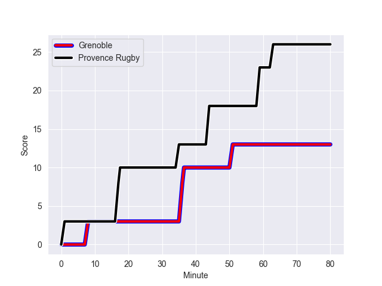
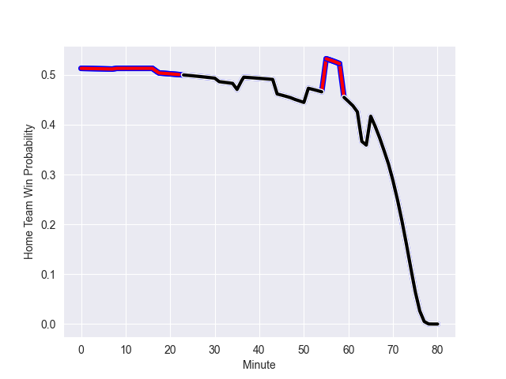

---  
layout: page  
title: Provence Rugby at Grenoble; 26-13  
date: 2022-10-14 19:30:00 18:00:00 -0500  
categories: match review  
---
# Provence Rugby (1348.13) at Grenoble (1332.65); 26-13

# Prediction: Grenoble by 3.5

Provence Rugby by 1.5 on a neutral field
## Scores over Time

## Win Probability over Time

# Pre-Match Prediction: Provence Rugby by 4.3

Provence Rugby by 0.7 on a neutral pitch

|   Away Minutes | Away Player       |   Away elo |   Away Percentile |   Number |   Home Percentile |   Home elo | Home Player                 |   Home Minutes |
|---------------:|:------------------|-----------:|------------------:|---------:|------------------:|-----------:|:----------------------------|---------------:|
|             48 | Julius Nostadt    |      86.39 |                54 |        1 |                 5 |      74.87 | Eli Eglaine                 |             64 |
|             48 | Loick Jammes      |      82.64 |                40 |        2 |                 3 |      75.02 | Enzo Camilleri              |             80 |
|             51 | Luke Tagi         |      80.44 |                29 |        3 |                93 |     111.1  | Sam Nixon                   |             31 |
|             48 | Jérôme Dufour     |      91.53 |                57 |        4 |                46 |      85.22 | Tanginoa Halaifonua         |             80 |
|             80 | Clément Chartier  |      86.43 |                46 |        5 |                63 |      93.48 | Levi Douglas                |             51 |
|             80 | Carl Axtens       |      95.55 |                62 |        6 |                73 |      97.06 | Marnus Schoeman             |             80 |
|             80 | Jessy Jegerlehner |      76.82 |                 9 |        7 |                78 |     100.24 | Steeve Blanc-Mappaz         |             80 |
|             65 | Lucas Martin      |      76.57 |                 5 |        8 |                79 |     103.23 | Talalelei Gray              |             62 |
|             55 | Joris Cazenave    |      79.77 |                26 |        9 |                82 |     103.7  | Eric Escande                |             55 |
|             55 | Enzo Selponi      |     107.4  |                83 |       10 |                64 |      95    | Romain Barthelemy           |             55 |
|             80 | Eroni Sau         |      88.42 |                60 |       11 |                 3 |      73.05 | Atunaisa Taulanga Vaka Manu |             80 |
|             80 | Louis Marrou      |     101.73 |                74 |       12 |                75 |     101.97 | Terrence Hepetema           |             80 |
|             80 | Peter Betham      |     114.54 |                93 |       13 |                35 |      81.96 | Romain Trouilloud           |             61 |
|             80 | Léo Drouet        |      80.01 |                28 |       14 |                15 |      77.94 | Wilfried Hulleu             |             80 |
|             69 | Florent Massip    |      90.74 |                57 |       15 |                16 |      77.97 | Hugo Trouilloud             |             80 |
|             32 | Federico Wegrzyn  |      83    |                44 |       16 |                27 |      80.01 | Regis Montagne              |             49 |
|             32 | German Kessler    |      95.92 |                65 |       17 |                35 |      81.66 | Pio Muarua                  |             29 |
|             32 | Hans N'kinsi      |      88.04 |                51 |       18 |                59 |      92.35 | Thomas Fortunel             |             25 |
|             29 | Thomas Vernet     |      74.84 |                 5 |       19 |                84 |     104.57 | Felipe Ezcurra              |             25 |
|             25 | Johnny McPhillips |      99.55 |                71 |       20 |                32 |      80.78 | Romain Fusier               |             19 |
|             25 | Jonathan Ruru     |     118.22 |                96 |       21 |                95 |     116.99 | Thomas Lainault             |             18 |
|             15 | Nicolas Mousties  |      79.94 |                30 |       22 |                49 |      84.5  | Zack Gauthier               |             16 |
|             11 | Hugo Navizet      |      79.17 |                20 |       23 |               nan |     nan    | nan                         |            nan |

