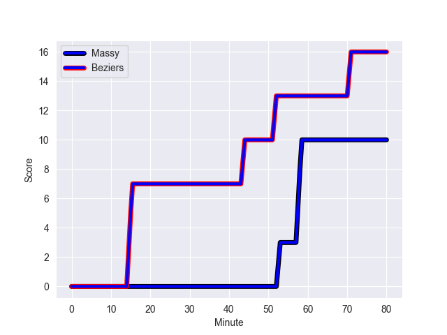
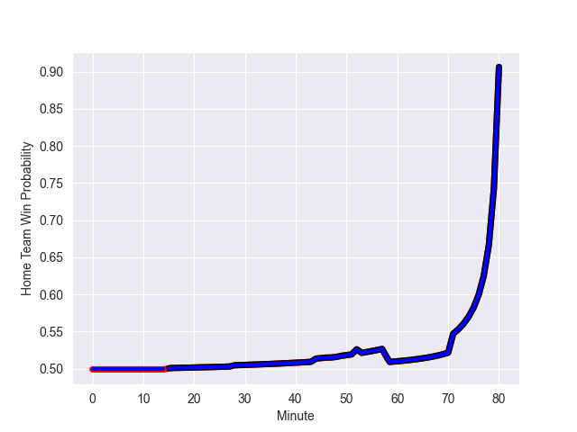

---  
layout: page  
title: Beziers at Massy; 16-10  
date: 2022-10-14 19:30:00 18:00:00 -0500  
categories: match review  
---
# Beziers (1340.78) at Massy (1304.76); 16-10

# Prediction: Massy by 1.4

Beziers by 3.6 on a neutral field
## Scores over Time

## Win Probability over Time

# Pre-Match Prediction: Beziers by 7.3

Massy by 2.3 on a neutral pitch

|   Away Minutes | Away Player           |   Away elo |   Away Percentile |   Number |   Home Percentile |   Home elo | Home Player           |   Home Minutes |
|---------------:|:----------------------|-----------:|------------------:|---------:|------------------:|-----------:|:----------------------|---------------:|
|             80 | Giorgi Akhaladze      |      84.13 |                47 |        1 |                58 |      90.13 | Fernandez Correa      |             49 |
|             80 | Clément Esteriola     |      91.38 |                56 |        2 |                32 |      81.32 | Randy Grelleaud       |             49 |
|             55 | Jon Zabala Arrieta    |      79.37 |                30 |        3 |               nan |      81.18 | Tijde Visser          |             80 |
|             80 | Clément Bitz          |      87.79 |                51 |        4 |                56 |      90.89 | Andrew Chauveau       |             80 |
|             50 | John Madigan          |     103.08 |                81 |        5 |                76 |     100.68 | Marco Fuser           |             47 |
|             80 | Jean-Baptiste Barrère |      89.54 |                62 |        6 |                76 |      98.83 | Jean Maurice Decubber |             50 |
|             28 | Éloi Massot           |      77.09 |                18 |        7 |               nan |      94.27 | Abongile Nonkontwana  |             49 |
|             68 | Sias Koen             |      91.39 |                65 |        8 |                36 |      81.01 | Alexandre Loubiere    |             80 |
|             71 | Jean Victor Goillot   |      99.79 |                73 |        9 |                87 |     108.63 | Benjamin Prier        |             47 |
|             80 | Romain Uruty          |      85.52 |                48 |       10 |                19 |      79.19 | Massimo Ortolan       |             80 |
|             80 | Raffaele Costa Storti |      79.88 |                30 |       11 |                39 |      81.43 | Nathan Farissier      |             80 |
|             80 | James Tofa            |      81.03 |                28 |       12 |                60 |      94.73 | Mathieu Guillomot     |             80 |
|             65 | Paul Recor            |      84.49 |                44 |       13 |                19 |      79.03 | Victorien Jacomme     |             80 |
|             80 | Nicolas Plazy         |     111.72 |                90 |       14 |                34 |      80.47 | Yanis Dit Robaglia    |             47 |
|             80 | Gabin Lorre           |      89.41 |                54 |       15 |                12 |      78.05 | Martin Carré          |             65 |
|             52 | Yvann Lalevee         |      80    |               nan |       16 |                49 |      85.51 | Gaetan Pichon         |             33 |
|             30 | Yassine Maamry        |      89.44 |                53 |       17 |                79 |     103.51 | Juan Kotze            |             33 |
|             25 | John-Hubert Meyer     |     102.16 |               nan |       18 |                46 |      84.95 | Dion Evrard Oulai     |             33 |
|             15 | Watisoni Votu         |     114.86 |                94 |       19 |                26 |      79.73 | Robin Poipy           |             31 |
|             12 | William van Bost      |      76.64 |                10 |       20 |                24 |      80.04 | Mamoudou Meite        |             31 |
|              9 | Mitchell Short        |      80.16 |               nan |       21 |                23 |      80.13 | Clement Lanen         |             31 |
|            nan | nan                   |     nan    |               nan |       22 |                62 |      90.23 | Kimani Sitauti        |             15 |
|            nan | nan                   |     nan    |               nan |       23 |                69 |      96.59 | Nicolas Ferrer        |             30 |

