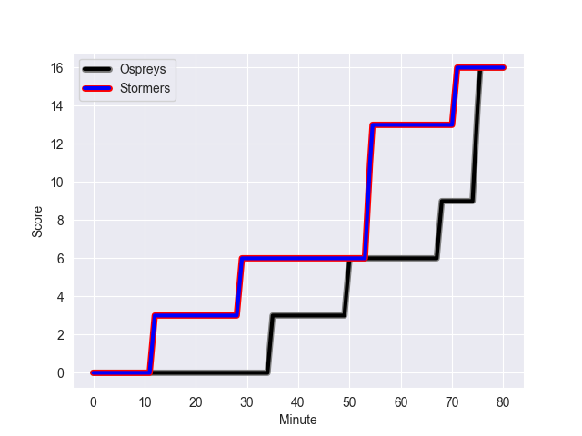
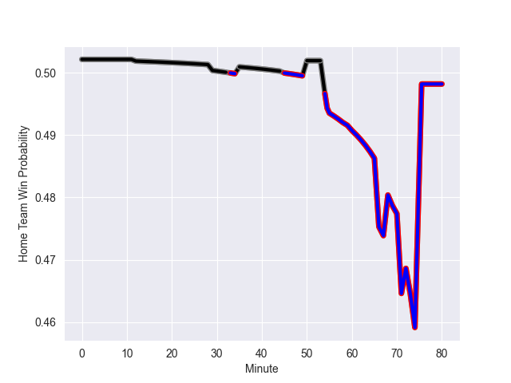

---  
layout: page  
title: Stormers at Ospreys; 16-16  
date: 2022-10-14 20:35:00 18:00:00 -0500  
categories: match review  
---
# Stormers (1123.7) at Ospreys (1064.66); 16-16

# Prediction: Stormers by 0.9

Stormers by 5.9 on a neutral field
## Scores over Time

## Win Probability over Time

# Pre-Match Prediction: Stormers by 0.2

Stormers by 5.2 on a neutral pitch

|   Away Minutes | Away Player                      |   Away elo |   Away Percentile |   Number |   Home Percentile |   Home elo | Home Player            |   Home Minutes |
|---------------:|:---------------------------------|-----------:|------------------:|---------:|------------------:|-----------:|:-----------------------|---------------:|
|             45 | Alistair Vermaak                 |      76.68 |                87 |        1 |                52 |      63.63 | Nicky Smith            |             68 |
|             45 | Andre-Hugo Venter                |      63.45 |                59 |        2 |                20 |      57.5  | Dewi Lake              |             60 |
|             45 | Neethling Fouche                 |      71.59 |                81 |        3 |                90 |      82.63 | Tomas Francis          |             60 |
|             66 | Salmaan Moerat                   |      61.73 |                49 |        4 |                65 |      65.32 | Adam Beard             |             80 |
|             80 | Marvin Orie                      |      59.9  |                39 |        5 |                92 |      85.59 | Alun Wyn Jones         |             66 |
|             59 | Kuyenzeka Kwenama Praisegod Xaba |      51.69 |                 6 |        6 |                19 |      55.48 | Ethan Roots            |             60 |
|             55 | Hacjivah Dayimani                |      83.65 |                90 |        7 |                75 |      68.86 | Jac Morgan             |             80 |
|             80 | Evan Roos                        |      72.81 |                78 |        8 |                 1 |      42.06 | Morgan Morris          |             80 |
|             72 | Albertus Paul de Wet             |      58.69 |                29 |        9 |                89 |      86.14 | Rhys Webb              |             60 |
|             80 | Manie Libbok                     |      81.9  |                83 |       10 |                94 |      97.21 | Stephen Myler          |             80 |
|             80 | Leolin Zas                       |      81.46 |                90 |       11 |                 0 |      39.11 | Keelan Giles           |             80 |
|             80 | Daniel du Plessis                |      83.96 |                88 |       12 |                79 |      74.28 | Michael Collins        |             69 |
|             59 | Alapati Leiua                    |      79.71 |                85 |       13 |                91 |      86.59 | Owen Watkin            |             80 |
|             80 | Angelo Davids                    |      73.07 |                83 |       14 |                98 |     104.31 | George North           |             80 |
|             80 | Clayton Blommetjies              |      79.84 |                84 |       15 |                47 |      62.39 | Max Nagy               |             80 |
|             35 | Joseph Dweba                     |      67.03 |                71 |       16 |                93 |      91.48 | Scott Baldwin          |             20 |
|             35 | Steven Kitshoff                  |     116.02 |                99 |       17 |                 2 |      46.47 | Tom Botha              |             20 |
|             35 | Brok Harris                      |     129    |               100 |       18 |                81 |      74.83 | Dan Lydiate            |             20 |
|             25 | Willie Engelbrecht               |      78.94 |                87 |       19 |                40 |      60.12 | Reuben Morgan-Williams |             20 |
|             21 | Sacha Mngomezulu                 |      63.17 |                52 |       20 |                89 |      81.13 | Bradley Davies         |             14 |
|             21 | Marcel Theunissen                |      59.05 |                32 |       21 |               nan |      60.81 | Rhys Henry             |             12 |
|             14 | Ernst van Rhyn                   |      81.49 |                87 |       22 |                 8 |      52.35 | Luke Morgan            |             11 |
|              8 | Godlen Masimla                   |      59.78 |                35 |       23 |               nan |     nan    | nan                    |            nan |

