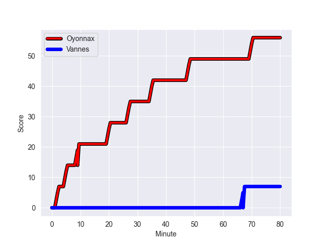
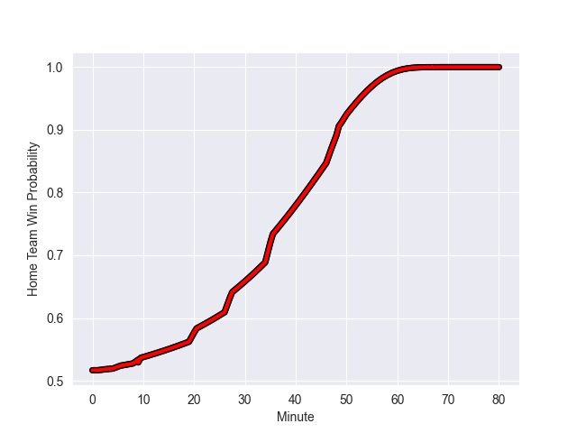

---  
layout: page  
title: Vannes at Oyonnax; 7-56  
date: 2022-10-14 19:00:00 18:00:00 -0500  
categories: match review  
---
# Vannes (1054.79) at Oyonnax (1083.92); 7-56

# Prediction: Oyonnax by 7.9

Oyonnax by 2.9 on a neutral field
## Scores over Time

## Win Probability over Time

# Pre-Match Prediction: Oyonnax by 7.2

Oyonnax by 2.2 on a neutral pitch

|   Away Minutes | Away Player             |   Away elo |   Away Percentile |   Number |   Home Percentile |   Home elo | Home Player             |   Home Minutes |
|---------------:|:------------------------|-----------:|------------------:|---------:|------------------:|-----------:|:------------------------|---------------:|
|             47 | Ximun Bessonart         |      62.13 |               nan |        1 |                 5 |      50.61 | Tommy Raynaud           |             48 |
|             62 | Théo Beziat             |      64.06 |                43 |        2 |                91 |      84.22 | Benjamin Geledan        |             56 |
|             47 | John Afoa               |      98.92 |                96 |        3 |                70 |      66.94 | Thomas Laclayat         |             48 |
|             80 | Edoardo Iachizzi        |      76.23 |                82 |        4 |                98 |     104.59 | Tom Murday              |             80 |
|             47 | Ewan Thomas Johnson     |      65.75 |                66 |        5 |                98 |     109.12 | Phoenix Battye          |             48 |
|             80 | Juan Bautista Pedemonte |      65.19 |                68 |        6 |                50 |      61.77 | Wandrille Picault       |             80 |
|             57 | Francisco Gorrissen     |      87.17 |                92 |        7 |                 6 |      50.83 | Loïc Credoz             |             56 |
|             80 | Léon Boulier            |      76.95 |                81 |        8 |                85 |      79.02 | Rory Grice              |             80 |
|             50 | Will Percillier         |      58.05 |                20 |        9 |                43 |      63.39 | Charlie Cassang         |             67 |
|             62 | Quentin Etienne Lecoq   |      86.73 |                88 |       10 |                75 |      74.22 | Jules Soulan            |             80 |
|             80 | Nicolas Freitas         |      67.7  |                74 |       11 |                80 |      71.81 | Aurelien Callandret     |             80 |
|             80 | Sacha Valleau           |      62.69 |                48 |       12 |                90 |      85.48 | Gaby Lovobalavu         |             59 |
|             80 | Branden Holder          |      70.74 |                71 |       13 |                31 |      59.06 | Pedro Bettencourt Avila |             80 |
|             80 | Nathanael Hulleu        |      66.37 |                71 |       14 |                71 |      66.57 | Joe Ravouvou            |             56 |
|             50 | Romaric Camou           |      74.11 |                77 |       15 |                88 |      78.79 | Darren Sweetnam         |             80 |
|             33 | Charles-Henri Berguet   |      60.13 |                40 |       16 |                 0 |      41.01 | Adrien Bordenave        |             32 |
|             23 | Joe Edwards             |      61.93 |                43 |       17 |                12 |      55.7  | Thibault Berthaud       |             32 |
|             33 | Paga Tafili             |      84.35 |                90 |       18 |                93 |      87.37 | Steve Mafi              |             32 |
|             30 | Alexandre Gouaux        |      59.65 |               nan |       19 |                92 |      86.01 | Manu Leiataua           |             24 |
|             30 | Kevin Burgaud           |      64.28 |                50 |       20 |                67 |      65.07 | Kevin Lebreton          |             24 |
|             18 | Pat Leafa               |      71.97 |                81 |       21 |                 6 |      51.5  | Tony Ensor              |             24 |
|             18 | Maxime Lafage           |      52.35 |                 8 |       22 |                57 |      64.6  | Florian Vialelle        |             21 |
|             33 | Myles Edwards           |      53.96 |                12 |       23 |                48 |      61.71 | Yvan David              |             13 |

