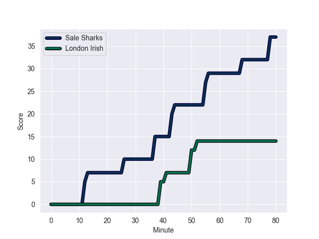
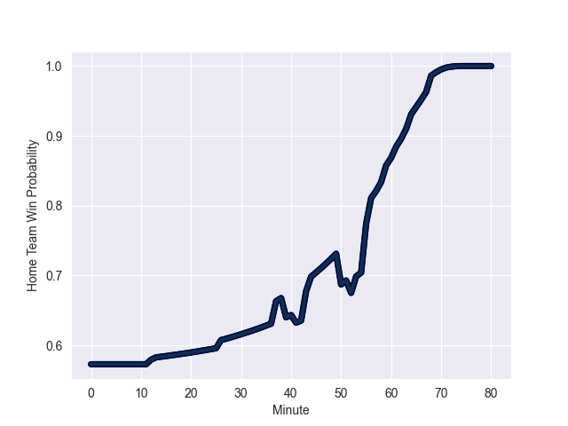

---  
layout: page  
title: London Irish at Sale Sharks; 14.0-37.0  
date: 2022-10-14 14:45:00 18:00:00 -0500  
categories: match review  
---
# London Irish (1484.04) at Sale Sharks (1553.9); 14.0-37.0

# Prediction: Sale Sharks by 12.0

Sale Sharks by 7.0 on a neutral field
## Scores over Time

## Win Probability over Time

# Pre-Match Prediction: Sale Sharks by 10.7

Sale Sharks by 5.7 on a neutral pitch

|   Away Minutes | Away Player                |   Away elo |   Away Percentile |   Number |   Home Percentile |   Home elo | Home Player         |   Home Minutes |
|---------------:|:---------------------------|-----------:|------------------:|---------:|------------------:|-----------:|:--------------------|---------------:|
|             58 | Will Goodrick-Clarke       |     107.43 |                87 |        1 |                64 |      94.6  | Bevan Rodd          |             56 |
|             64 | Agustin Creevy             |     130.5  |               100 |        2 |                 9 |      78.53 | Ewan Ashman         |             58 |
|             64 | Lovejoy Chawatama          |      97.93 |                71 |        3 |                70 |      97.36 | Nic Schonert        |             59 |
|             67 | Api Ratuniyarawa           |     101.54 |                77 |        4 |                99 |     130.36 | Jean-Luc du Preez   |             80 |
|             80 | Rob Simmons                |     125.29 |                98 |        5 |                84 |     105.49 | Jonny Hill          |             63 |
|             80 | Ben Donnell                |      99.92 |                77 |        6 |                81 |     102.92 | Tom Curry           |             72 |
|             80 | Juan Martin Gonzalez       |      77.42 |                12 |        7 |                85 |     106.66 | Ben Curry           |             69 |
|             56 | So'otala Fa'aso'o          |     107.54 |                85 |        8 |                96 |     121.21 | Daniel du Preez     |             80 |
|             71 | Ben White                  |      99.74 |                72 |        9 |                31 |      82.31 | Raffi Quirke        |             59 |
|             80 | Paddy Jackson              |     115.2  |                92 |       10 |                84 |     107.77 | Robert du Preez     |             69 |
|             80 | Ollie Hassell-Collins      |      87.6  |                58 |       11 |                96 |     118.54 | Tom O'Flaherty      |             61 |
|             80 | Benhard Janse van Rensburg |      92.06 |                57 |       12 |               nan |     110.53 | Sam Hill            |             80 |
|             67 | Will Joseph                |      83.25 |                40 |       13 |                92 |     113.92 | Sam James           |             80 |
|             80 | Ben Loader                 |     104.86 |                84 |       14 |                50 |      83.87 | Tom Roebuck         |             80 |
|             58 | James Stokes               |      84.41 |                45 |       15 |                38 |      82.01 | Joe Carpenter       |             80 |
|             16 | Isaac Miller               |      78.43 |                15 |       16 |                98 |     120.78 | Akker van der Merwe |             22 |
|             22 | Danilo Fischetti           |      77.37 |                10 |       17 |                86 |     106.78 | Simon McIntyre      |             24 |
|             16 | Ciaran Parker              |     100.11 |               nan |       18 |                98 |     119.89 | Coenie Oosthuizen   |             21 |
|             13 | Josh Caulfield             |      98.5  |               nan |       19 |               nan |     112.48 | Josh Beaumont       |             17 |
|             24 | Chandler Cunningham-South  |      81.19 |                26 |       20 |                94 |     115.72 | Jono Ross           |             19 |
|              9 | Caolan Englefield          |      80.64 |               nan |       21 |                29 |      80.24 | Gus Warr            |             21 |
|             13 | Lucio Cinti                |      79.31 |                26 |       22 |               nan |      78.38 | Tom Curtis          |             11 |
|             22 | Logan Trotter              |      80    |               nan |       23 |                85 |     106.66 | Arron Reed          |             19 |

