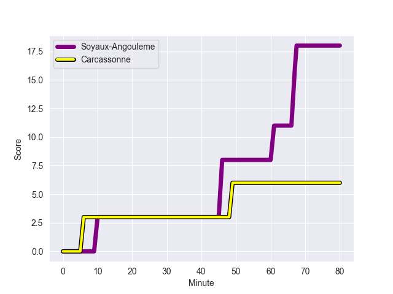
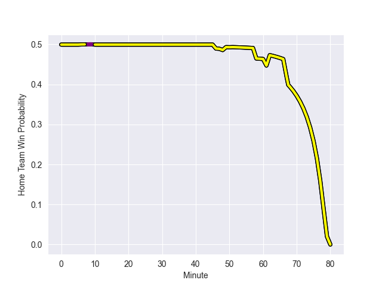

---  
layout: page  
title: Carcassonne at Soyaux-Angouleme; 6-18  
date: 2022-10-14 19:30:00 18:00:00 -0500  
categories: match review  
---
# Carcassonne (938.2) at Soyaux-Angouleme (941.63); 6-18

# Prediction: Soyaux-Angouleme by 5.3

Soyaux-Angouleme by 0.3 on a neutral field
## Scores over Time

## Win Probability over Time

# Pre-Match Prediction: Soyaux-Angouleme by 5.0

Soyaux-Angouleme by 0.0 on a neutral pitch

|   Away Minutes | Away Player              |   Away elo |   Away Percentile |   Number |   Home Percentile |   Home elo | Home Player            |   Home Minutes |
|---------------:|:-------------------------|-----------:|------------------:|---------:|------------------:|-----------:|:-----------------------|---------------:|
|             51 | Sami Mavinga             |      74.37 |                85 |        1 |                86 |      75.35 | Khatchik Vartanov      |             48 |
|             68 | Raphael Carbou           |      62.71 |                54 |        2 |                70 |      67.86 | Rayne Barka            |             58 |
|             51 | Vakhtangi Akhobadze      |      37.57 |                 0 |        3 |                 7 |      53.22 | Omar Dahir             |             48 |
|             61 | Rob Harley               |     108.07 |                98 |        4 |                44 |      60.66 | Janse Roux             |             60 |
|             80 | Rynard Ligtoring Landman |      66.08 |                67 |        5 |               nan |      60    | Saba Pesvianidze       |             80 |
|             58 | Simon Meka               |      62.63 |                57 |        6 |                12 |      56.2  | Matt Beukeboom         |             80 |
|             41 | Aaron Carroll            |      58.37 |                36 |        7 |                64 |      64.53 | Germain Burgaud        |             80 |
|             80 | Tim Agaba                |      56.96 |                21 |        8 |                78 |      73.95 | Clement Ancely         |             52 |
|             46 | Pierre Pages             |      71.19 |                80 |        9 |                68 |      67.75 | Manu Saubusse          |             68 |
|             80 | Damien Añon              |      58.8  |                41 |       10 |                62 |      66.15 | Jacob Botica           |             80 |
|             80 | Martin Dulon             |      76.64 |                86 |       11 |                 9 |      52.71 | Marvin Lestremau       |             80 |
|             80 | Nick Grigg               |      56.95 |                20 |       12 |                31 |      59.65 | Inaki Ayarza Saporta   |             68 |
|             80 | Brieuc Plessis-Couillaud |      47.6  |                 4 |       13 |                63 |      66.43 | Nasoni Naqiri Kunavore |             80 |
|             48 | Léo Darrelatour          |      57.79 |                26 |       14 |                73 |      67.58 | Maxime Laforgue        |             62 |
|             80 | Maxime Gianet            |      62.21 |                53 |       15 |                11 |      54.72 | Pierre Lafitte         |             80 |
|             39 | Gregory Annetta          |      54.82 |                21 |       16 |                64 |      66.91 | Omar Odishvili         |             32 |
|             34 | Samuel Marques           |      64.97 |                63 |       17 |                88 |      78.26 | Yassine Boutemane      |             32 |
|             32 | Baptiste Mouchous        |      53.01 |                 9 |       18 |                12 |      52.84 | Yassine Jarmouni       |             28 |
|             29 | Youssef Amrouni          |      54.46 |                14 |       19 |                40 |      59.83 | Patxi Bidart           |             22 |
|             29 | Soso Bekoshvili          |      55.87 |                15 |       20 |               nan |      60.54 | Nicolas Martins        |             20 |
|             22 | Etienne Herjean          |      59.21 |                34 |       21 |                28 |      57.99 | Rémi Brosset           |             18 |
|             19 | Come Clayver Joussain    |      59.61 |               nan |       22 |                54 |      62.37 | Adrien Bau             |             12 |
|             12 | Luka Petriashvili        |      60    |               nan |       23 |                59 |      65.14 | Mathis Lafon           |             12 |

