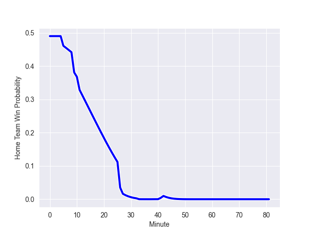

---  
layout: page  
title: Auckland at Wellington; 19.0-54.0  
date: 2022-10-14 02:05:00 18:00:00 -0500  
categories: match review  
---
# Auckland (1455.11) at Wellington (1437.63); 19.0-54.0

# Prediction: Wellington by 3.3

Auckland by 1.7 on a neutral field
## Scores over Time

## Win Probability over Time

# Pre-Match Prediction: Auckland by 5.5

Wellington by 0.5 on a neutral pitch

|   Away Minutes | Away Player       |   Away elo |   Away Percentile |   Number |   Home Percentile |   Home elo | Home Player           |   Home Minutes |
|---------------:|:------------------|-----------:|------------------:|---------:|------------------:|-----------:|:----------------------|---------------:|
|             56 | Alex Hodgman      |     103.41 |                82 |        1 |                53 |      86.43 | Xavier Numia          |             66 |
|             40 | Soane Vikena      |      78.69 |                17 |        2 |                95 |     113.95 | Asafo Aumua           |             69 |
|             64 | Marcel Renata     |      98.78 |                74 |        3 |                68 |      96.07 | Pek Cowan             |             35 |
|             81 | Patrick Tuipulotu |     116.67 |                95 |        4 |                67 |      96.07 | James Blackwell       |             81 |
|             69 | Hamish Dalzell    |     102.7  |                80 |        5 |                48 |      85.99 | Dominic Bird          |             61 |
|             81 | Blake Gibson      |     102.59 |                81 |        6 |                42 |      81.74 | Caleb Delany          |             81 |
|             57 | Niko Jones        |      76.92 |                11 |        7 |                89 |     109.19 | Du'Plessis Kirifi     |             81 |
|             81 | Jackson Pugh      |      78.07 |                12 |        8 |                37 |      82.78 | Peter Lakai           |             64 |
|             67 | Taufa Funaki      |      74.12 |                 1 |        9 |                97 |     119.86 | TJ Perenara           |             64 |
|             68 | Simon Hickey      |     114.65 |                91 |       10 |                71 |      99.15 | Jackson Garden-Bachop |             64 |
|             64 | Tomas Aoake       |      90.32 |                63 |       11 |                39 |      81.48 | Pepesana Patafilo     |             81 |
|             81 | Harry Plummer     |     112.99 |                92 |       12 |                45 |      85.18 | Riley Higgins         |             81 |
|             78 | Bryce Heem        |     126.79 |                99 |       13 |                80 |     104.33 | Billy Proctor         |             81 |
|             81 | AJ Lam            |      75.29 |                 5 |       14 |                99 |     131.5  | Julian Savea          |             66 |
|             81 | Jordan Trainor    |     112.43 |                92 |       15 |                59 |      91.87 | Ruben Love            |             81 |
|             41 | Leni Apisai       |      90.16 |                53 |       16 |               nan |      80    | Josh Southall         |             12 |
|             25 | Jordan Lay        |      95.85 |                69 |       17 |                39 |      82.04 | PJ Sheck              |             46 |
|             17 | Sione Ahio        |      79.97 |               nan |       18 |                55 |      88.49 | Tietie Tuimauga       |             15 |
|             12 | Josh Beehre       |      82.7  |                40 |       19 |                40 |      81.66 | Taine Plumtree        |             20 |
|             24 | Terrell Peita     |      84.8  |                50 |       20 |                24 |      80.81 | Keelan Whitman        |             17 |
|             14 | Manu Paea         |      80.48 |                35 |       21 |                92 |     112.68 | Richard Judd          |             17 |
|             16 | Corey Evans       |      81.32 |                22 |       22 |                41 |      83.19 | Aidan Morgan          |             17 |
|             17 | Joel Cobb         |      79.42 |                27 |       23 |                44 |      82.91 | Connor Garden-Bachop  |             15 |

