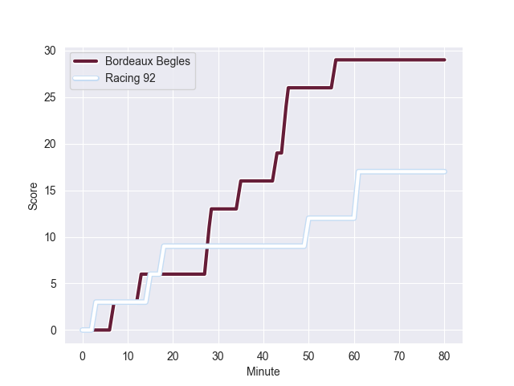
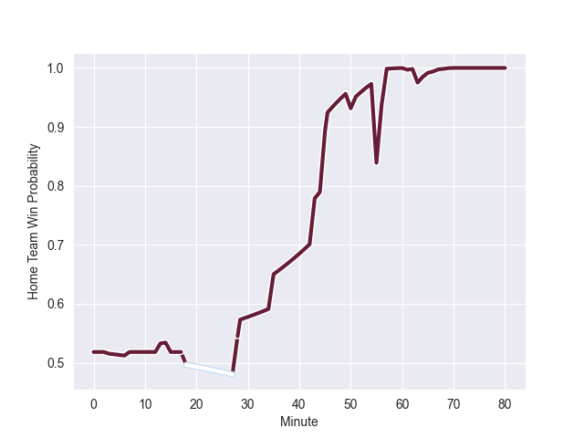

---  
layout: page  
title: Racing 92 at Bordeaux Begles; 17-29  
date: 2022-10-15 21:05:00 18:00:00 -0500  
categories: match review  
---
# Racing 92 (1512.39) at Bordeaux Begles (1544.25); 17-29

# Prediction: Bordeaux Begles by 8.2

Bordeaux Begles by 3.2 on a neutral field
## Scores over Time

## Win Probability over Time

# Pre-Match Prediction: Bordeaux Begles by 6.8

Bordeaux Begles by 1.8 on a neutral pitch

|   Away Minutes | Away Player         |   Away elo |   Away Percentile |   Number |   Home Percentile |   Home elo | Home Player               |   Home Minutes |
|---------------:|:--------------------|-----------:|------------------:|---------:|------------------:|-----------:|:--------------------------|---------------:|
|             51 | Eddy Ben Arous      |     112.62 |                94 |        1 |                61 |      92.36 | Jefferson Poirot          |             55 |
|             51 | Camille Chat        |     117.22 |                97 |        2 |                48 |      85.55 | Maxime Lamothe            |             63 |
|             51 | Trevor Nyakane      |     112.49 |                93 |        3 |                97 |     115.81 | Vadim Cobilas             |             55 |
|             80 | Cameron Woki        |     111.22 |                90 |        4 |                53 |      89.02 | Thomas Jolmes             |             63 |
|             80 | Fabien Sanconnie    |      88.16 |                50 |        5 |                88 |     109.33 | Cyril Cazeaux             |             80 |
|             80 | Ibrahim Diallo      |      84.62 |                54 |        6 |                96 |     118.71 | Jandré Marais             |             66 |
|             57 | Baptiste Chouzenoux |     101.73 |                77 |        7 |                86 |     107.01 | Mahamadou Diaby           |             80 |
|             51 | Anthime Hemery      |      86.23 |                44 |        8 |                32 |      80.35 | Bastien Vergnes Taillefer |             80 |
|             80 | Nolann Le Garrec    |      85.02 |                47 |        9 |                98 |     124.21 | Maxime Lucu               |             75 |
|             60 | Finn Russell        |     119.5  |                95 |       10 |                84 |     108.21 | Matthieu Jalibert         |             68 |
|             80 | Juan Imhoff         |     105.86 |                86 |       11 |                81 |     102.66 | Santiago Cordero          |             80 |
|             80 | Henry Chavancy      |     110.26 |                88 |       12 |                13 |      78.17 | Yoram Moefana             |             80 |
|             72 | Gael Fickou         |     130.59 |                99 |       13 |                75 |     102.19 | Pablo Uberti              |             66 |
|             80 | Donovan Taofifenua  |      87.18 |                58 |       14 |                96 |     118.74 | Madosh Tambwe             |             80 |
|             60 | Max Spring          |      83.02 |                41 |       15 |                91 |     110.61 | Romain Buros              |             80 |
|             29 | Cedate Gomes Sa     |     102.42 |                79 |       16 |                96 |     116.24 | Ben Tameifuna             |             25 |
|             29 | Wenceslas Lauret    |     120.05 |                96 |       17 |                80 |     101.26 | Sipili Falatea            |             25 |
|             29 | Hassane Kolingar    |      78.97 |                20 |       18 |                88 |     109.78 | Kane Douglas              |             17 |
|             29 | Janick Tarrit       |      70.75 |                 0 |       19 |                16 |      78.63 | Pablo Dimcheff            |             17 |
|             23 | Boris Palu          |     104.9  |                83 |       20 |                97 |     122.75 | Remi Lamerat              |             14 |
|             20 | Antoine Gibert      |     102.9  |                79 |       21 |                 9 |      76.58 | Tani Vili                 |             14 |
|             20 | Louis Dupichot      |     104.7  |                84 |       22 |                93 |     115.97 | Zack Holmes               |             12 |
|              8 | Inia Tabuavou       |      79.69 |                23 |       23 |                62 |      93.33 | Yann Lesgourgues          |              5 |

