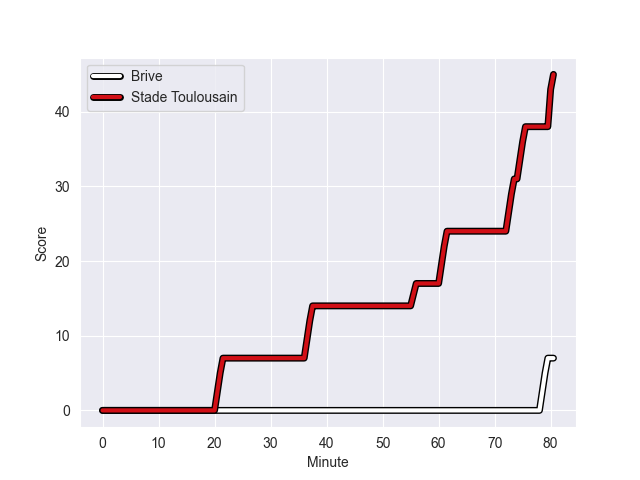
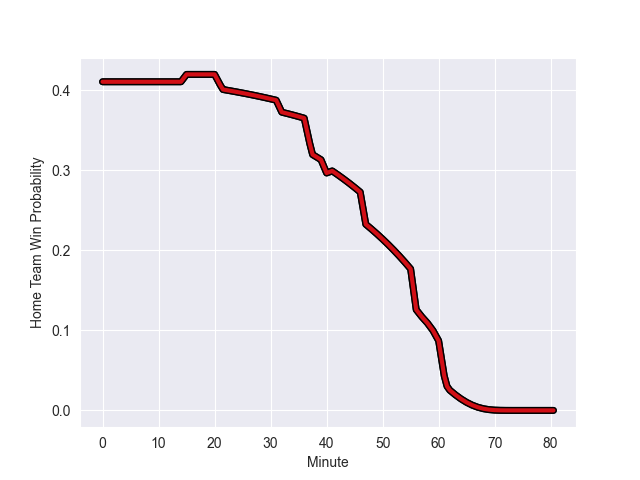

---  
layout: page  
title: Stade Toulousain at Brive; 45-7  
date: 2022-10-15 15:00:00 18:00:00 -0500  
categories: match review  
---
# Stade Toulousain (1138.81) at Brive (1004.74); 45-7

# Prediction: Stade Toulousain by 8.4

Stade Toulousain by 13.4 on a neutral field
## Scores over Time

## Win Probability over Time

# Pre-Match Prediction: Stade Toulousain by 5.5

Stade Toulousain by 10.5 on a neutral pitch

|   Away Minutes | Away Player          |   Away elo |   Away Percentile |   Number |   Home Percentile |   Home elo | Home Player           |   Home Minutes |
|---------------:|:---------------------|-----------:|------------------:|---------:|------------------:|-----------:|:----------------------|---------------:|
|             60 | David Ainu'u         |      50.91 |                 6 |        1 |                 8 |      52.43 | Daniel Brennan        |             32 |
|             47 | Peato Mauvaka        |      79.84 |                89 |        2 |                88 |      78.34 | Motu Matu'u           |             41 |
|             41 | Dorian Aldegheri     |      74.66 |                85 |        3 |                95 |      97.68 | Marcel van der Merwe  |             32 |
|             58 | Joshua Brennan       |      63.18 |                57 |        4 |                39 |      59.54 | Julien Delannoy       |             80 |
|             47 | Richie Arnold        |      54.1  |                15 |        5 |                77 |      70.01 | Lucas Paulos          |             80 |
|             80 | Anthony Jelonch      |      71.42 |                78 |        6 |                17 |      54.6  | Esteban Abadie        |             71 |
|             60 | Rynhardt Elstadt     |     104.7  |                98 |        7 |                37 |      59.24 | Sasha Gue             |             80 |
|             80 | Alexandre Roumat     |      82.32 |                89 |        8 |                68 |      68.51 | Abraham Papali'i      |             40 |
|             80 | Antoine Dupont       |      95.28 |                94 |        9 |                29 |      58.41 | Vaso Lobzhanidze      |             65 |
|             80 | Thomas Ramos         |      96.83 |                93 |       10 |                85 |      84    | Stuart Olding         |             56 |
|             80 | Matthis Lebel        |      86.01 |                92 |       11 |                91 |      83.68 | Axel Muller           |             80 |
|             80 | Sofiane Guitoune     |      73.84 |                78 |       12 |                35 |      60.05 | Guillaume Galletier   |             80 |
|             80 | Pierre-Louis Barassi |      62.49 |                47 |       13 |                77 |      73.21 | Sammy Arnold          |             80 |
|             62 | Arthur Bonneval      |      64.07 |                63 |       14 |                48 |      61.44 | Seta Tuicuvu          |             80 |
|             15 | Melvyn Jaminet       |      81    |                84 |       15 |                85 |      82.72 | Thomas Laranjeira     |             47 |
|             65 | Juan Cruz Mallia     |      67.65 |                62 |       16 |                75 |      69.99 | Pietro Ceccarelli     |             48 |
|             39 | Maxime Duprat        |      64.54 |                51 |       17 |                43 |      60.62 | Renger Van Eerten     |             48 |
|             33 | Julien Marchand      |      88.42 |                93 |       18 |                10 |      51.66 | Andres Zafra Tarazona |             40 |
|             33 | Thibaud Flament      |      81.78 |                89 |       19 |                58 |      63.37 | Lucas da Silva        |             39 |
|             22 | Yannick Youyoutte    |      61.27 |                46 |       20 |                67 |      69.94 | Joris Jurand          |             33 |
|             20 | Marco Trauth         |      60    |               nan |       21 |                36 |      59.96 | Tom Raffy             |             24 |
|             20 | Romain Ntamack       |      88.55 |                89 |       22 |                41 |      60.52 | Enzo Sanga            |             15 |
|             18 | Arthur Retiere       |      69.86 |                77 |       23 |                28 |      58.11 | Noe Bedou             |              9 |

