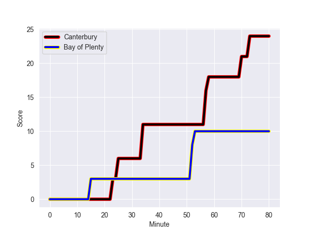
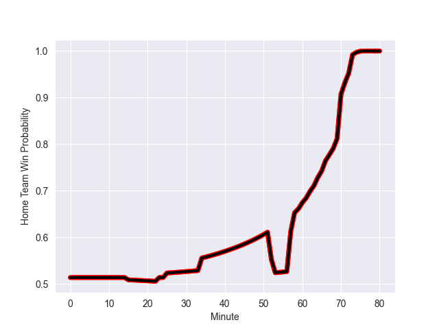

---  
layout: page  
title: Bay of Plenty at Canterbury; 10.0-24.0  
date: 2022-10-15 02:05:00 18:00:00 -0500  
categories: match review  
---
# Bay of Plenty (1320.3) at Canterbury (1344.79); 10.0-24.0

# Prediction: Canterbury by 7.4

Canterbury by 2.4 on a neutral field
## Scores over Time

## Win Probability over Time

# Pre-Match Prediction: Canterbury by 7.4

Canterbury by 2.4 on a neutral pitch

|   Away Minutes | Away Player            |   Away elo |   Away Percentile |   Number |   Home Percentile |   Home elo | Home Player        |   Home Minutes |
|---------------:|:-----------------------|-----------:|------------------:|---------:|------------------:|-----------:|:-------------------|---------------:|
|             59 | Aidan Ross             |      95.51 |                93 |        1 |                66 |      83.62 | Tamaiti Williams   |             62 |
|             66 | Kurt Eklund            |     106.34 |                98 |        2 |                87 |      90.9  | Brodie McAlister   |             66 |
|             64 | Tevita Mafileo         |      88.76 |                83 |        3 |                89 |      92.29 | Oli Jager          |             53 |
|             71 | Justin Sangster        |      91.14 |                84 |        4 |                79 |      88.56 | Luke Romano        |             59 |
|             80 | Manaaki Selby-Rickit   |      71.7  |                10 |        5 |                65 |      83.24 | Dom Gardiner       |             80 |
|             80 | Naitoa Ah Kuoi         |      92.19 |                86 |        6 |                75 |      84.59 | Corey Kellow       |             62 |
|             80 | Jacob Norris           |     102.27 |                94 |        7 |                90 |      96.03 | Tom Christie       |             80 |
|             73 | Zane Kapeli            |      78.11 |                28 |        8 |                71 |      86.22 | Billy Harmon       |             80 |
|             73 | Te Toiroa Tahuriorangi |      89.69 |                82 |        9 |                93 |     100.07 | Willi Heinz        |             80 |
|             68 | Wharenui Hawera        |      67.98 |                 3 |       10 |                45 |      80.44 | Fergus Burke       |             80 |
|             77 | Nigel Ah Wong          |     104.28 |                95 |       11 |                98 |     111.47 | George Bridge      |             80 |
|             56 | Lalamilo Lalamilo      |      75.19 |                13 |       12 |                32 |      78.54 | Rameka Poihipi     |             60 |
|             80 | Joey Walton            |      94.01 |                85 |       13 |                74 |      86.86 | Dallas McLeod      |             80 |
|             80 | Leroy Carter           |      80.24 |                46 |       14 |                84 |      91.85 | Manasa Mataele     |             67 |
|             80 | Emoni Narawa           |      89.98 |                76 |       15 |                80 |      92.18 | Chay Fihaki        |             80 |
|             14 | Anaru Rangi            |      87.38 |                79 |       16 |                66 |      83.44 | George Bell        |             14 |
|             21 | Haereiti Hetet         |      85.84 |                71 |       17 |                18 |      76.04 | Dan Lienert-Brown  |             18 |
|             16 | Jeff Thwaites          |      81.39 |                48 |       18 |                91 |      93.53 | Owen Franks        |             27 |
|              9 | Etonia Waqa            |      80    |               nan |       19 |                90 |      97.61 | Reed Prinsep       |             18 |
|              7 | Veveni Lasaqa          |      77.34 |                24 |       20 |                39 |      78.66 | Sam Darry          |             21 |
|             12 | Lucas Cashmore         |      78    |                28 |       21 |                52 |      80.96 | Joel Lam           |              0 |
|              7 | Taylor Haugh           |      79.7  |                41 |       22 |                62 |      84.37 | Isaiah Punivai     |             20 |
|             27 | Gillies Kaka           |      81.07 |                49 |       23 |                67 |      84.04 | Ngatungane Punivai |             13 |

