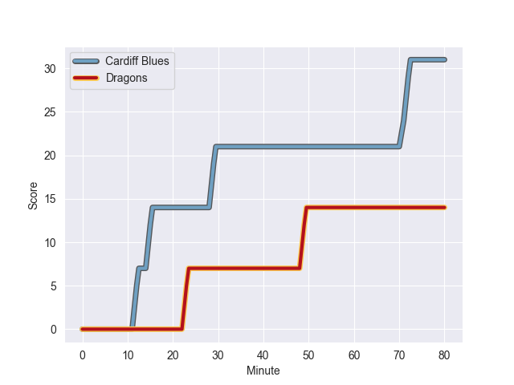
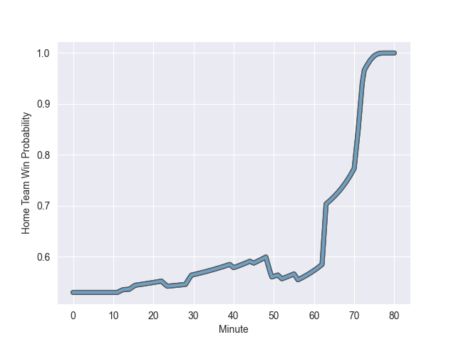

---  
layout: page  
title: Dragons at Cardiff Blues; 14-31  
date: 2022-10-15 18:15:00 18:00:00 -0500  
categories: match review  
---
# Dragons (999.95) at Cardiff Blues (1043.44); 14-31

# Prediction: Cardiff Blues by 9.3

Cardiff Blues by 4.3 on a neutral field
## Scores over Time

## Win Probability over Time

# Pre-Match Prediction: Cardiff Blues by 9.9

Cardiff Blues by 4.9 on a neutral pitch

|   Away Minutes | Away Player       |   Away elo |   Away Percentile |   Number |   Home Percentile |   Home elo | Home Player        |   Home Minutes |
|---------------:|:------------------|-----------:|------------------:|---------:|------------------:|-----------:|:-------------------|---------------:|
|             56 | Aki Seiuli        |      64.53 |                63 |        1 |                14 |      55.26 | Rhys Carré         |             63 |
|             56 | Bradley Roberts   |      58.54 |                31 |        2 |                92 |      86.55 | Kristian Dacey     |             59 |
|             56 | Lloyd Fairbrother |      72.59 |                83 |        3 |                49 |      62    | Dimitri Arhip      |             63 |
|             80 | Ben Carter        |      61.5  |                48 |        4 |                79 |      71.06 | Josh Turnbull      |             66 |
|             80 | Will Rowlands     |      55.52 |                18 |        5 |                35 |      58.77 | Seb Davies         |             40 |
|             52 | Sean Lonsdale     |      54.5  |                14 |        6 |                 6 |      51.33 | Shane Lewis-Hughes |             80 |
|             39 | Taine Basham      |      52.07 |                 7 |        7 |                92 |      86.63 | Thomas Young       |             80 |
|             80 | Ross Moriarty     |      68.96 |                69 |        8 |                79 |      74.56 | Taulupe Faletau    |             80 |
|             63 | Rhodri Williams   |      94.79 |                93 |        9 |                86 |      80.09 | Tomos Williams     |             74 |
|             80 | JJ Hanrahan       |      94.71 |                93 |       10 |                82 |      80.17 | Jarrod Evans       |             80 |
|             70 | Jared Rosser      |      62.27 |                52 |       11 |                50 |      61.86 | Josh Adams         |             45 |
|             80 | Jack Dixon        |      83.2  |                88 |       12 |                96 |      97.92 | Uilisi Halaholo    |             73 |
|             40 | Sio Tomkinson     |      63.7  |                54 |       13 |                 5 |      51.36 | Max Llewellyn      |             80 |
|             80 | Rio Dyer          |      52.09 |                 8 |       14 |                52 |      62.06 | Jason Harries      |             80 |
|             80 | Angus O'Brien     |      55.16 |                13 |       15 |                86 |      83.2  | Rhys Priestland    |             80 |
|             41 | Harrison Keddie   |      32.01 |                 0 |       16 |                 6 |      48.53 | Matthew Screech    |             40 |
|             40 | Steffan Hughes    |      74.05 |                79 |       17 |                 1 |      44.78 | Aled Summerhill    |             35 |
|             28 | Aaron Wainwright  |      76.47 |                81 |       18 |                77 |      70.23 | Kirby Myhill       |             21 |
|             24 | Lewis Jones       |      94.54 |               nan |       19 |                10 |      51.77 | Corey Domachowski  |             17 |
|             24 | Elliot Dee        |      71.86 |                81 |       20 |                84 |      73.17 | Dillon Lewis       |             17 |
|             24 | Chris Coleman     |      59.53 |                37 |       21 |                71 |      66.82 | James Botham       |             14 |
|             17 | Gonzalo Bertranou |      62.44 |                52 |       22 |                17 |      55.54 | Mason Grady        |              7 |
|             10 | Jordan Williams   |      70.55 |                69 |       23 |                88 |      84.19 | Lloyd Williams     |              6 |

