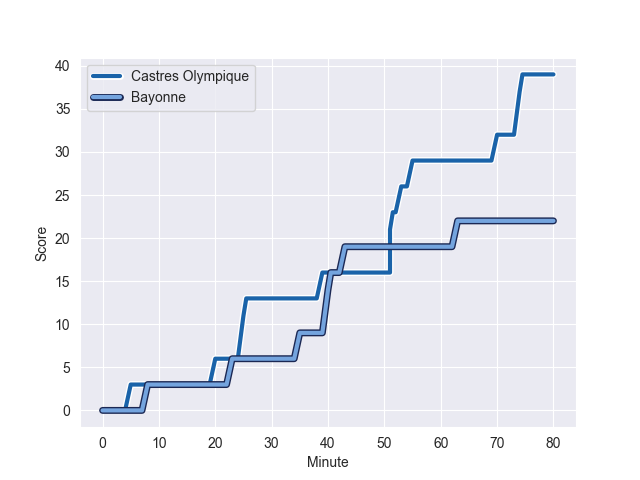
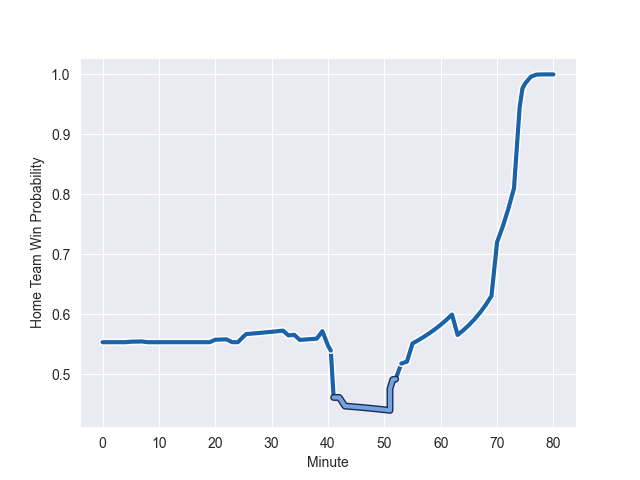

---  
layout: page  
title: Bayonne at Castres Olympique; 22-39  
date: 2022-10-15 17:00:00 18:00:00 -0500  
categories: match review  
---
# Bayonne (1302.55) at Castres Olympique (1355.1); 22-39

# Prediction: Castres Olympique by 10.3

Castres Olympique by 5.3 on a neutral field
## Scores over Time

## Win Probability over Time

# Pre-Match Prediction: Castres Olympique by 10.8

Castres Olympique by 5.8 on a neutral pitch

|   Away Minutes | Away Player       |   Away elo |   Away Percentile |   Number |   Home Percentile |   Home elo | Home Player          |   Home Minutes |
|---------------:|:------------------|-----------:|------------------:|---------:|------------------:|-----------:|:---------------------|---------------:|
|             40 | Swan Cormenier    |      86.43 |                78 |        1 |                92 |      95.45 | Antoine Tichit       |             41 |
|             61 | Facundo Bosch     |      87.71 |                81 |        2 |                91 |      94.73 | Gaetan Barlot        |             71 |
|             56 | Pieter Scholtz    |      84.94 |                68 |        3 |                76 |      86.25 | Wilfrid Hounkpatin   |             47 |
|             80 | Thomas Ceyte      |      90.36 |                83 |        4 |                15 |      73.75 | Ryno Pieterse        |             41 |
|             33 | Kote Mikautadze   |      68.77 |                 6 |        5 |                90 |      95.83 | Tom Staniforth       |             71 |
|             56 | Pierre Huguet     |      80.34 |                48 |        6 |                66 |      83.8  | Asier Usarraga       |             80 |
|             80 | Olajuwon Noah     |      82.52 |                60 |        7 |                18 |      76.06 | Baptiste Delaporte   |             61 |
|             80 | Uzair Cassiem     |      90.46 |                79 |        8 |                74 |      87.54 | Tyler Ardron         |             80 |
|             71 | Maxime Machenaud  |      91.23 |                86 |        9 |                82 |      89.13 | Gauthier Doubrere    |             45 |
|             80 | Jason Robertson   |      71.65 |                 8 |       10 |                98 |     120.7  | Benjamin Urdapilleta |             80 |
|             80 | Kaminieli Rasaku  |      80    |               nan |       11 |                92 |     100.09 | Filipo Nakosi        |             72 |
|             33 | Yann David        |      88.71 |                76 |       12 |                86 |      94.11 | Vilimoni Botitu      |             80 |
|             80 | Peyo Muscarditz   |      99.03 |                91 |       13 |                94 |     102.48 | Adrea Cocagi         |             80 |
|             80 | Victor Hannoun    |      81.49 |                55 |       14 |                88 |      94.07 | Geoffrey Palis       |             80 |
|             56 | Gaetan Germain    |      96.79 |                88 |       15 |                19 |      76.47 | Julien Dumora        |             80 |
|             47 | Denis Marchois    |     104.46 |                95 |       16 |                 9 |      71.55 | Gauthier Maravat     |             39 |
|             47 | Guillaume Martocq |      92.48 |                81 |       17 |                56 |      81.25 | Wayan de Benedittis  |             39 |
|             40 | Matis Perchaud    |      69.66 |                 4 |       18 |                32 |      78.72 | Julien Blanc         |             35 |
|             24 | Chris Talakai     |      81.74 |                55 |       19 |                68 |      88    | Levan Chilachava     |             33 |
|             24 | Camille Lopez     |     125.21 |                99 |       20 |                73 |      82.94 | Josaia Raisuqe       |             19 |
|             24 | Mateaki Kafatolu  |      71.53 |                 6 |       21 |                66 |      84.54 | Florent Vanverberghe |              9 |
|             19 | Thomas Acquier    |      98.16 |                93 |       22 |               nan |      80.06 | Pierre Colonna       |              9 |
|              9 | Michael Ruru      |      90.62 |               nan |       23 |                44 |      77.69 | Antoine Zeghdar      |              8 |

