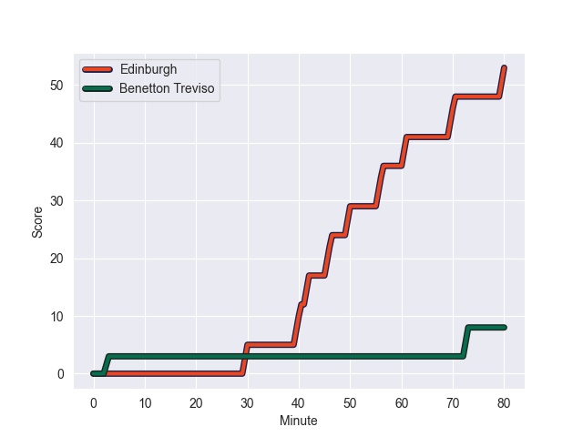
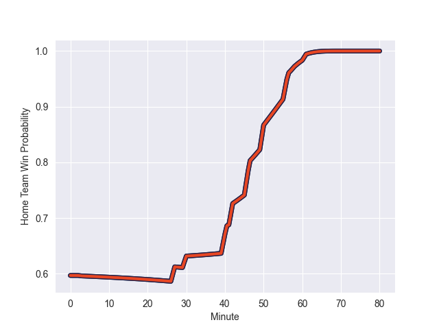

---  
layout: page  
title: Benetton Treviso at Edinburgh; 8-53  
date: 2022-10-15 18:15:00 18:00:00 -0500  
categories: match review  
---
# Benetton Treviso (1022.33) at Edinburgh (1192.76); 8-53

# Prediction: Edinburgh by 22.0

Edinburgh by 17.0 on a neutral field
## Scores over Time

## Win Probability over Time

# Pre-Match Prediction: Edinburgh by 4.7

Benetton Treviso by 0.3 on a neutral pitch

|   Away Minutes | Away Player            |   Away elo |   Away Percentile |   Number |   Home Percentile |   Home elo | Home Player         |   Home Minutes |
|---------------:|:-----------------------|-----------:|------------------:|---------:|------------------:|-----------:|:--------------------|---------------:|
|             51 | Thomas Gallo           |      63.92 |                59 |        1 |                10 |      53.2  | Pierre Schoeman     |             80 |
|             58 | Gianmarco Lucchesi     |      64.07 |                58 |        2 |                53 |      61.39 | Dave Cherry         |             80 |
|             51 | Nahuel Tetaz Chaparro  |     108.91 |                98 |        3 |                94 |      94.54 | WP Nel              |             80 |
|             71 | Marco Lazzaroni        |      55.33 |                16 |        4 |                87 |      81.72 | Sam Skinner         |             80 |
|             80 | Carl Wegner            |      68.98 |                72 |        5 |                97 |     105.11 | Grant Gilchrist     |             80 |
|             46 | Braam Steyn            |      47.9  |                 3 |        6 |                84 |      80.72 | Nick Haining        |             80 |
|             80 | Toa Halafihi           |      82.33 |                86 |        7 |                86 |      79.18 | Luke Crosbie        |             80 |
|             80 | Henry Time-Stowers     |      53.18 |                11 |        8 |                65 |      66.87 | Viliame Mata        |             80 |
|             80 | Manfredi Albanese      |      63.75 |                50 |        9 |                87 |      86.31 | Henry Pyrgos        |             80 |
|             66 | Tomas Albornoz         |      70.11 |                68 |       10 |                95 |     104.37 | Blair Kinghorn      |             80 |
|             58 | Iliesa Ratuva Tavuyara |      76.85 |                85 |       11 |                66 |      65.91 | Duhan van der Merwe |             80 |
|             80 | Marco Zanon            |      81.67 |                85 |       12 |                68 |      69.66 | James Lang          |             80 |
|             80 | Tommaso Menoncello     |      73.71 |                75 |       13 |                99 |     113.49 | Mark Bennett        |             80 |
|             80 | Mattia Bellini         |      57.12 |                20 |       14 |                85 |      76.96 | Darcy Graham        |             80 |
|             27 | Edoardo Padovani       |      96.12 |                94 |       15 |                 9 |      53.31 | Emiliano Boffelli   |             80 |
|             53 | Enzo Avaca             |      60    |               nan |       16 |               nan |     nan    | nan                 |            nan |
|             34 | Alessandro Izekor      |      53.65 |                 8 |       17 |               nan |     nan    | nan                 |            nan |
|             29 | Federico Zani          |      63.8  |                55 |       18 |               nan |     nan    | nan                 |            nan |
|             29 | Tiziano Pasquali       |      70.21 |                74 |       19 |               nan |     nan    | nan                 |            nan |
|             22 | Manuel Arroyo          |      60.14 |               nan |       20 |               nan |     nan    | nan                 |            nan |
|             22 | Filippo Drago          |      61.93 |                41 |       21 |               nan |     nan    | nan                 |            nan |
|             14 | Dewi Passarella        |      60    |               nan |       22 |               nan |     nan    | nan                 |            nan |
|              9 | Nicola Piantella       |      63.37 |                55 |       23 |               nan |     nan    | nan                 |            nan |

