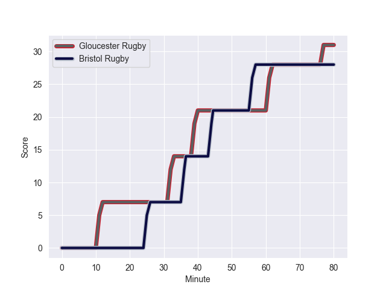
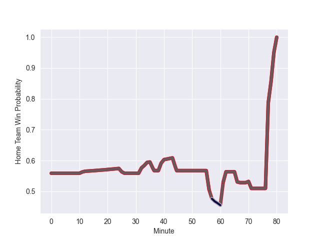

---  
layout: page  
title: Bristol Rugby at Gloucester Rugby; 28.0-31.0  
date: 2022-10-15 10:00:00 18:00:00 -0500  
categories: match review  
---
# Bristol Rugby (1502.05) at Gloucester Rugby (1569.5); 28.0-31.0

# Prediction: Gloucester Rugby by 11.7

Gloucester Rugby by 6.7 on a neutral field
## Scores over Time

## Win Probability over Time

# Pre-Match Prediction: Gloucester Rugby by 11.5

Gloucester Rugby by 6.5 on a neutral pitch

|   Away Minutes | Away Player    |   Away elo |   Away Percentile |   Number |   Home Percentile |   Home elo | Home Player       |   Home Minutes |
|---------------:|:---------------|-----------:|------------------:|---------:|------------------:|-----------:|:------------------|---------------:|
|             80 | Ellis Genge    |      98.56 |                73 |        1 |                82 |     102.98 | Val Rapava-Ruskin |             66 |
|             66 | Will Capon     |      70.31 |                 0 |        2 |                93 |     111.96 | Jack Singleton    |             56 |
|             70 | Kyle Sinckler  |     105.09 |                84 |        3 |                72 |      98.41 | Fraser Balmain    |             66 |
|             67 | Joe Batley     |      95.31 |                65 |        4 |                71 |      98.98 | Freddie Clarke    |             80 |
|             72 | Joe Joyce      |     106.07 |                84 |        5 |                92 |     113.24 | Matias Alemanno   |             71 |
|             80 | Chris Vui      |      90.46 |                64 |        6 |                89 |     108.66 | Jordy Reid        |             80 |
|             70 | Daniel Thomas  |     106.23 |                87 |        7 |                82 |     103.53 | Lewis Ludlow      |             80 |
|             80 | Fitz Harding   |      81.64 |                27 |        8 |                93 |     114.53 | Ruan Ackermann    |             58 |
|             34 | Tom Whiteley   |     100.48 |                76 |        9 |                78 |     102.41 | Ben Meehan        |             66 |
|             70 | Callum Sheedy  |     106.63 |                82 |       10 |                86 |     109.57 | Adam Hastings     |             80 |
|             80 | Henry Purdy    |     106.39 |                87 |       11 |                94 |     116.29 | Jonny May         |             80 |
|             80 | Sam Bedlow     |     102.78 |                77 |       12 |                96 |     120.89 | Giorgi Kveseladze |             71 |
|             80 | Piers O'Conor  |      86.93 |                48 |       13 |                79 |     104.25 | Chris Harris      |             80 |
|             80 | Luke Morahan   |     126.45 |                98 |       14 |                53 |      85.08 | Louis Rees-Zammit |             80 |
|             79 | Charles Piutau |     120.41 |                96 |       15 |                76 |      99.05 | Santiago Carreras |             66 |
|             14 | Harry Thacker  |     113.13 |                95 |       16 |                86 |     104.68 | Santiago Socino   |             24 |
|              0 | Jake Woolmore  |     103.04 |                82 |       17 |                74 |      99.47 | Harry Elrington   |             14 |
|             10 | Max Lahiff     |      89.56 |                60 |       18 |                58 |      89.42 | Ciaran Knight     |             14 |
|             13 | John Hawkins   |      99.45 |                73 |       19 |               nan |      78.35 | Cameron Jordan    |              9 |
|             18 | Samuel Lewis   |      95.18 |               nan |       20 |                76 |     101.81 | Albert Tuisue     |             22 |
|             46 | Andy Uren      |      91.33 |                59 |       21 |                15 |      78.61 | Stephen Varney    |             14 |
|             10 | AJ MacGinty    |     109.92 |                87 |       22 |               nan |      79.9  | Jack Reeves       |              9 |
|              1 | Jack Bates     |      73.57 |                 4 |       23 |                75 |     100.52 | Lloyd Evans       |             14 |

