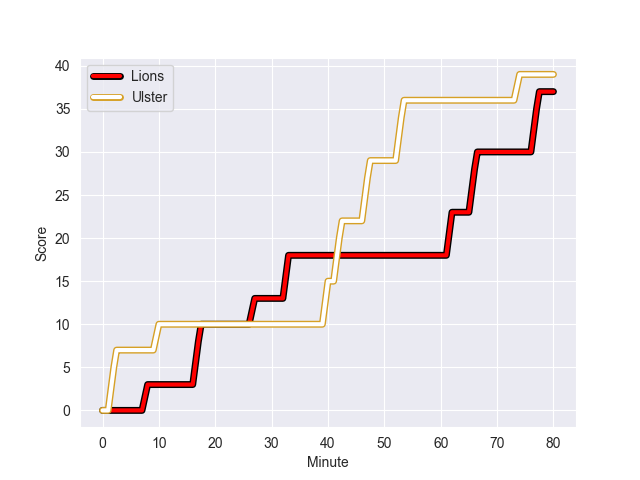
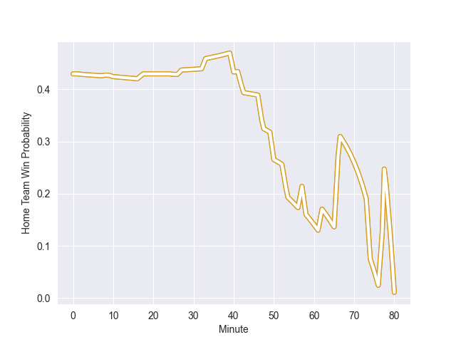

---  
layout: page  
title: Ulster at Lions; 39-37  
date: 2022-10-15 14:00:00 18:00:00 -0500  
categories: match review  
---
# Ulster (1205.96) at Lions (1082.88); 39-37

# Prediction: Ulster by 7.3

Ulster by 12.3 on a neutral field
## Scores over Time

## Win Probability over Time

# Pre-Match Prediction: Ulster by 7.3

Ulster by 12.3 on a neutral pitch

|   Away Minutes | Away Player         |   Away elo |   Away Percentile |   Number |   Home Percentile |   Home elo | Home Player              |   Home Minutes |
|---------------:|:--------------------|-----------:|------------------:|---------:|------------------:|-----------:|:-------------------------|---------------:|
|             56 | Eric O'Sullivan     |      69.78 |                74 |        1 |                71 |      69.45 | Jean-Pierre Smith        |             47 |
|             57 | Rob Herring         |      80.15 |                87 |        2 |                74 |      73.55 | Jaco Visagie             |             57 |
|             25 | Gareth Milasinovich |      62.56 |                53 |        3 |                89 |      84.92 | Ruan Dreyer              |             57 |
|             80 | Alan O'Connor       |      78.73 |                84 |        4 |                93 |      93    | Willem Alberts           |             40 |
|             66 | Sam Carter          |     114.27 |                99 |        5 |                71 |      68.66 | Reinhard Nothnagel       |             80 |
|             50 | David McCann        |      63.78 |                55 |        6 |                10 |      53.69 | Emmanuel Tshituka        |             80 |
|             80 | Marcus Rea          |      74.83 |                82 |        7 |                86 |      79.95 | Ruan Venter              |             57 |
|             80 | Duane Vermeulen     |     118.19 |                99 |        8 |                83 |      77.96 | Francke Horn             |             80 |
|             50 | John Cooney         |     105.85 |                98 |        9 |                82 |      76.23 | Sanele Nohamba           |             47 |
|             80 | Billy Burns         |      85.31 |                84 |       10 |                65 |      68.43 | Gianni Dean Lombard      |             58 |
|             80 | Rob Lyttle          |      60.18 |                38 |       11 |                81 |      73.39 | Quan Horn                |             80 |
|             80 | Stuart McCloskey    |      95.07 |                94 |       12 |                75 |      73.59 | Marius Louw              |             80 |
|             75 | Luke Marshall       |      94.19 |                94 |       13 |                65 |      68.12 | Henco van Wyk            |             80 |
|             57 | Robert Baloucoune   |      76.95 |                85 |       14 |                76 |      70.63 | Edwill van der Merwe     |             80 |
|             80 | Michael Lowry       |      63.19 |                49 |       15 |                86 |      83.94 | Andries Coetzee          |             80 |
|             55 | Tom O'Toole         |      64.28 |                63 |       16 |                53 |      64.24 | Jordan Hendrikse         |             22 |
|             30 | Nick Timoney        |      84.44 |                89 |       17 |                27 |      58.84 | PJ Botha                 |             23 |
|             30 | Nathan Doak         |      53.53 |                 8 |       18 |                76 |      71.29 | Ruan Smith               |             23 |
|             24 | Callum Reid         |      60.69 |               nan |       19 |                66 |      65.4  | Sibusiso Sangweni        |             23 |
|             23 | Ethan McIlroy       |      63.05 |                55 |       20 |                74 |      69.78 | Sti Sithole              |             33 |
|             23 | John Andrew         |      49.7  |                 2 |       21 |                 6 |      54.71 | Morne Van den Berg       |             33 |
|             14 | Cormac Izuchukwu    |      60.69 |               nan |       22 |                77 |      72.17 | Pieter Jansen van Vuuren |             40 |
|              5 | Stewart Moore       |      70.03 |                66 |       23 |               nan |     nan    | nan                      |            nan |

