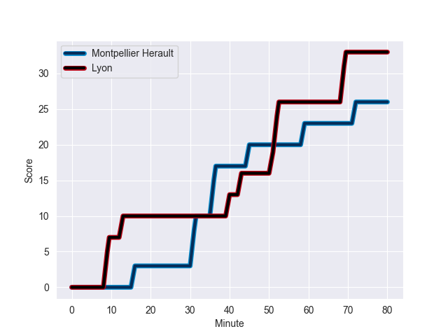
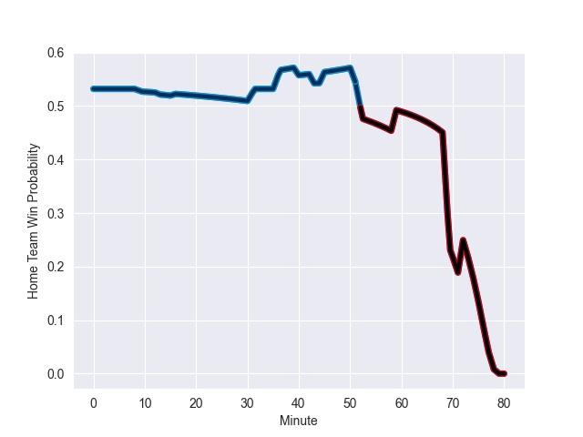

---  
layout: page  
title: Lyon at Montpellier Herault; 33-26  
date: 2022-10-15 17:00:00 18:00:00 -0500  
categories: match review  
---
# Lyon (955.68) at Montpellier Herault (1119.35); 33-26

# Prediction: Montpellier Herault by 21.4

Montpellier Herault by 16.4 on a neutral field
## Scores over Time

## Win Probability over Time

# Pre-Match Prediction: Montpellier Herault by 21.1

Montpellier Herault by 16.1 on a neutral pitch

|   Away Minutes | Away Player        |   Away elo |   Away Percentile |   Number |   Home Percentile |   Home elo | Home Player          |   Home Minutes |
|---------------:|:-------------------|-----------:|------------------:|---------:|------------------:|-----------:|:---------------------|---------------:|
|             45 | Jerome Rey         |      36.95 |                 0 |        1 |                85 |      74.34 | Enzo Forletta        |             80 |
|             45 | Yanis Charcosset   |      58.44 |                37 |        2 |                83 |      73.29 | Brandon Paenga-Amosa |             64 |
|             36 | Feao Fotuaika      |      62.52 |                54 |        3 |                81 |      71.36 | Titi Lamositele      |             50 |
|             45 | Joel Kpoku         |      62.09 |                51 |        4 |                89 |      82.89 | Florian Verhaeghe    |             80 |
|             80 | Temo Mayanavanua   |      62.77 |                53 |        5 |                96 |      98.34 | Paul Willemse        |             68 |
|             45 | Patrick Sobela     |      70.58 |                77 |        6 |                80 |      73.2  | Yacouba Camara       |             80 |
|             80 | Beka Saghinadze    |      72.64 |                81 |        7 |                90 |      84.6  | Clément Doumenc      |             44 |
|             45 | Jordan Taufua      |      79.87 |                86 |        8 |                56 |      63.36 | Zach Mercer          |             80 |
|             80 | Jean-Marc Doussain |      99.61 |                96 |        9 |                85 |      77.76 | Léo Coly             |             55 |
|             80 | Leo Berdeu         |      60.12 |                37 |       10 |                76 |      74.68 | Louis Carbonel       |             80 |
|             80 | Ethan Dumortier    |      66.7  |                71 |       11 |                97 |      97.59 | Vincent Rattez       |             55 |
|             63 | Kyle Godwin        |      64.01 |                55 |       12 |                69 |      68.51 | Paolo Garbisi        |             80 |
|             80 | Thibault Regard    |      41.93 |                 1 |       13 |                 5 |      48.51 | Thomas Darmon        |             80 |
|             80 | Xavier Mignot      |      54.17 |                11 |       14 |                55 |      62.63 | Gabriel Ngandebe     |             80 |
|             48 | Davit Niniashvili  |      62.9  |                50 |       15 |                91 |      87.65 | Anthony Bouthier     |             68 |
|             44 | Paulo Tafili       |      60.51 |                41 |       16 |                67 |      65.12 | Alexandre Becognee   |             36 |
|             35 | Hamza Kaabeche     |      45.92 |                 2 |       17 |                77 |      69.63 | Mohamed Haouas       |             30 |
|             35 | Killian Geraci     |      66.32 |                68 |       18 |                81 |      78.31 | Julien Tisseron      |             25 |
|             35 | Maxime Gouzou      |      56.84 |                23 |       19 |                98 |     103.18 | Cobus Reinach        |             25 |
|             32 | Jonathan Pelissie  |      83.27 |                89 |       20 |                63 |      64.6  | Vincent Giudicelli   |             16 |
|             35 | Dylan Cretin       |      71.35 |                73 |       21 |                59 |      65.18 | Pierre Lucas         |             12 |
|             17 | Tavite Veredamu    |      61.05 |                51 |       22 |                13 |      53.27 | Tyler Duguid         |             12 |
|             35 | Guillaume Marchand |      53.72 |                12 |       23 |               nan |     nan    | nan                  |            nan |

