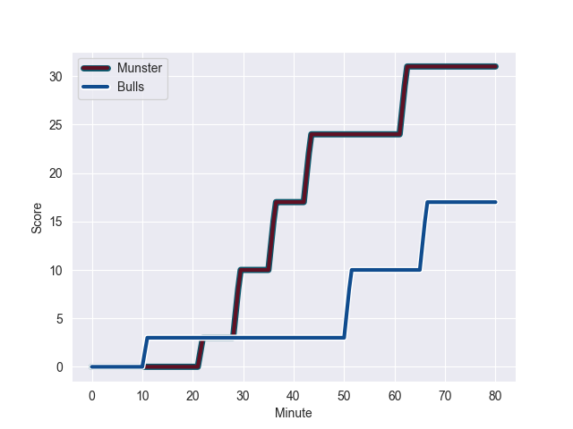
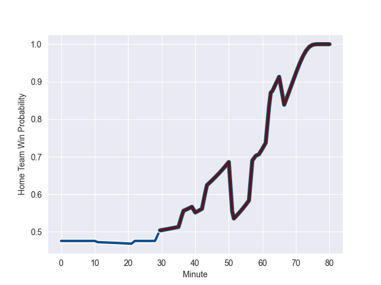

---  
layout: page  
title: Bulls at Munster; 17-31  
date: 2022-10-15 20:35:00 18:00:00 -0500  
categories: match review  
---
# Bulls (1131.92) at Munster (1089.88); 17-31

# Prediction: Munster by 0.8

Bulls by 4.2 on a neutral field
## Scores over Time

## Win Probability over Time

# Pre-Match Prediction: Bulls by 2.3

Bulls by 2.7 on a neutral pitch

|   Away Minutes | Away Player         |   Away elo |   Away Percentile |   Number |   Home Percentile |   Home elo | Home Player     |   Home Minutes |
|---------------:|:--------------------|-----------:|------------------:|---------:|------------------:|-----------:|:----------------|---------------:|
|             57 | Simphiwe Matanzima  |      62.79 |                53 |        1 |                84 |      73.61 | Jeremy Loughman |             51 |
|             57 | Jan Hendrik Wessels |      52.35 |                 5 |        2 |                50 |      62.68 | Niall Scannell  |             51 |
|             57 | Mornay Smith        |      69.38 |                76 |        3 |                95 |      98.65 | Stephen Archer  |             51 |
|             66 | Walt Steenkamp      |      78.82 |                84 |        4 |                58 |      64.21 | Jean Kleyn      |             80 |
|             80 | Ruan Nortje         |      69.3  |                72 |        5 |               nan |      57.16 | Edwin Edogbo    |             51 |
|             59 | Marcell Coetzee     |     100.16 |                96 |        6 |                92 |      88.84 | Tadhg Beirne    |             70 |
|             80 | WJ Steenkamp        |      64.71 |                62 |        7 |                85 |      78.66 | Peter O'Mahony  |             63 |
|             80 | Elrigh Louw         |      71.22 |                74 |        8 |                69 |      68.9  | Gavin Coombes   |             80 |
|             68 | Embrose Papier      |      67.12 |                68 |        9 |                79 |      72.62 | Craig Casey     |             57 |
|             40 | Johan Goosen        |      80.01 |                77 |       10 |                47 |      62.87 | Joey Carbery    |             80 |
|             80 | Wandisile Simelane  |      72.62 |                71 |       11 |                40 |      60.34 | Liam Coombes    |             80 |
|             80 | Harold Vorster      |      78.8  |                81 |       12 |                69 |      70.11 | Dan Goggin      |             80 |
|             80 | Lionel Mapoe        |     107.51 |                98 |       13 |                76 |      74.28 | Malakai Fekitoa |             80 |
|             40 | Cornal Hendricks    |      74.37 |                82 |       14 |                89 |      83.32 | Calvin Nash     |             40 |
|             80 | Kurt-Lee Arendse    |      79.49 |                80 |       15 |                78 |      77.9  | Shane Daly      |             80 |
|             40 | Chris Smith         |      78.63 |                76 |       16 |                32 |      59.22 | Jack Crowley    |             40 |
|             40 | David Kriel         |      72.18 |                73 |       17 |                79 |      71.44 | Diarmuid Barron |             29 |
|             23 | Bismarck du Plessis |     115.39 |                99 |       18 |                70 |      67.59 | Thomas Ahern    |             29 |
|             23 | Dylan Smith         |      57.89 |                18 |       19 |               nan |      59.49 | Roman Salanoa   |             29 |
|             23 | Jacques van Rooyen  |      71.27 |                78 |       20 |                96 |     102.63 | Dave Kilcoyne   |             29 |
|             21 | Marco van Staden    |      62.9  |                55 |       21 |                97 |     104.21 | Conor Murray    |             23 |
|             12 | Zak Burger          |      72.84 |                79 |       22 |                66 |      65.09 | John Hodnett    |             17 |
|             14 | Ruan Vermaak        |      60    |                39 |       23 |                81 |      75.32 | Jack O'Donoghue |             10 |

