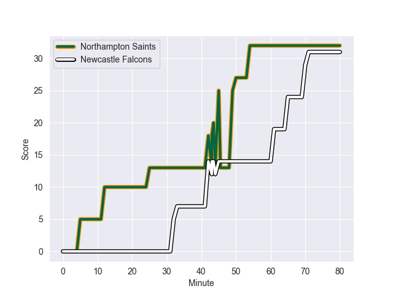

---  
layout: page  
title: Newcastle Falcons at Northampton Saints; 31.0-32.0  
date: 2022-10-15 10:00:00 18:00:00 -0500  
categories: match review  
---
# Newcastle Falcons (950.5) at Northampton Saints (1142.0); 31.0-32.0

# Prediction: Northampton Saints by 24.1

Northampton Saints by 19.1 on a neutral field
## Scores over Time

## Win Probability over Time

# Pre-Match Prediction: Northampton Saints by 24.6

Northampton Saints by 19.6 on a neutral pitch

|   Away Minutes | Away Player         |   Away elo |   Away Percentile |   Number |   Home Percentile |   Home elo | Home Player          |   Home Minutes |
|---------------:|:--------------------|-----------:|------------------:|---------:|------------------:|-----------:|:---------------------|---------------:|
|             63 | Adam Brocklebank    |      62.92 |                55 |        1 |                99 |     113.61 | Alex Waller          |             52 |
|             63 | George McGuigan     |      63.12 |                57 |        2 |                82 |      72.33 | Sam Matavesi         |             55 |
|             56 | Richard Palframan   |      56.24 |                16 |        3 |                85 |      73.73 | Paul Hill            |             60 |
|             76 | Matthew Dalton      |      59.42 |               nan |        4 |                86 |      79.85 | David Ribbans        |             62 |
|             80 | Sebastian de Chaves |      69.55 |                77 |        5 |                83 |      76.45 | Alex Moon            |             80 |
|             80 | Sean Robinson       |      63.86 |                60 |        6 |                42 |      60.33 | Alex Coles           |             80 |
|             80 | Connor Collett      |      75.41 |                84 |        7 |                57 |      62.85 | Aaron Hinkley        |             80 |
|             56 | Freddie Lockwood    |      62.8  |                66 |        8 |                37 |      60.41 | Juarno Augustus      |             62 |
|             53 | Sam Stuart          |      52.73 |                 8 |        9 |                88 |      84.7  | Alex Mitchell        |             55 |
|             80 | Brett Connon        |      52.36 |                 7 |       10 |                84 |      82.67 | James Grayson        |             80 |
|             80 | Mateo Carreras      |      57.86 |                27 |       11 |                87 |      77.99 | Ollie Sleightholme   |             80 |
|             80 | Pete Lucock         |      52.89 |                11 |       12 |                82 |      77.45 | Rory Hutchinson      |             51 |
|             80 | Ben Stevenson       |      50.9  |                10 |       13 |                76 |      72.94 | Fraser Dingwall      |             80 |
|             80 | Adam Radwan         |      85.71 |                92 |       14 |                98 |     101.1  | Tom Collins          |             80 |
|             58 | Tom Penny           |      71.58 |                71 |       15 |                85 |      82.45 | George Furbank       |             80 |
|             17 | Jamie Blamire       |      60.77 |                47 |       16 |               nan |      57.39 | Robbie Smith         |             25 |
|             17 | Logovi'i Mulipola   |      83.74 |               nan |       17 |                75 |      68.53 | Ethan Waller         |             28 |
|             24 | Mark Tampin         |      57.24 |                31 |       18 |                 5 |      51.09 | Alfie Petch          |             20 |
|              4 | George Merrick      |      80.83 |                90 |       19 |                43 |      60.65 | Lukhan Salakaia-Loto |             18 |
|             24 | Guy Pepper          |      60    |               nan |       20 |                87 |      78.18 | Lewis Ludlam         |             18 |
|             27 | Michael Young       |     100.43 |                97 |       21 |                57 |      63.29 | Callum Braley        |             25 |
|              0 | Tian Schoeman       |      83.23 |                84 |       22 |                65 |      67.2  | Matt Proctor         |             29 |
|             22 | George Wacokecoke   |      44.57 |                 2 |       23 |               nan |      60.24 | George Hendy         |              0 |

