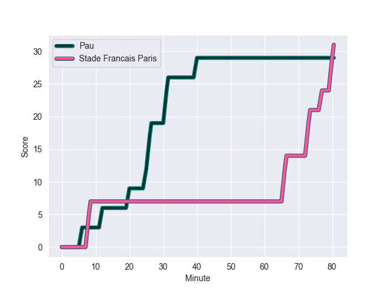
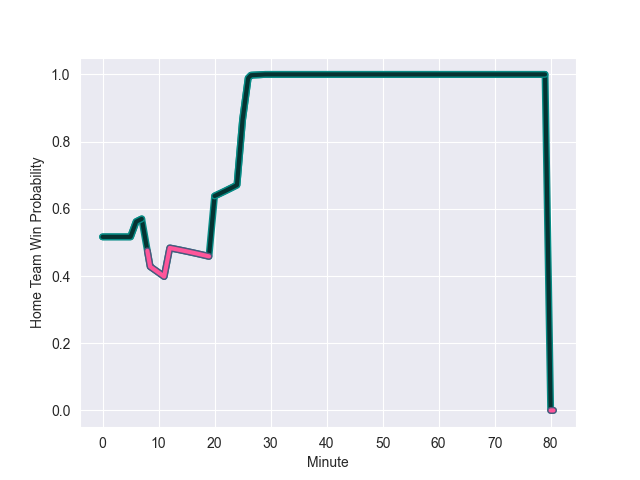

---  
layout: page  
title: Stade Francais Paris at Pau; 31-29  
date: 2022-10-15 17:00:00 18:00:00 -0500  
categories: match review  
---
# Stade Francais Paris (1056.75) at Pau (1076.0); 31-29

# Prediction: Pau by 6.9

Pau by 1.9 on a neutral field
## Scores over Time

## Win Probability over Time

# Pre-Match Prediction: Pau by 7.0

Pau by 2.0 on a neutral pitch

|   Away Minutes | Away Player             |   Away elo |   Away Percentile |   Number |   Home Percentile |   Home elo | Home Player         |   Home Minutes |
|---------------:|:------------------------|-----------:|------------------:|---------:|------------------:|-----------:|:--------------------|---------------:|
|             43 | Clement Castets         |      63.52 |                58 |        1 |                86 |      75.38 | Siegfried Fisi'ihoi |             41 |
|             55 | Mickael Ivaldi          |      93.06 |                94 |        2 |                54 |      62.81 | Youri Delhommel     |             54 |
|             52 | Giorgi Melikidze        |      69.37 |                76 |        3 |                36 |      59.37 | Nicolas Corato      |             29 |
|             80 | Paul Gabrillagues       |      63.91 |                61 |        4 |                58 |      63.26 | Guillaume Ducat     |             80 |
|             43 | Baptiste Pesenti        |      66.07 |                67 |        5 |                90 |      83.41 | Fabrice Metz        |             49 |
|             80 | Ryan Chapuis            |      48.2  |                 3 |        6 |                30 |      58.13 | Sacha Zegueur       |             54 |
|             80 | Marcos Kremer           |      62.47 |                50 |        7 |                95 |      93.15 | Luke Whitelock      |             80 |
|             52 | Giovanni Habel-Kueffner |     105.1  |                97 |        8 |                79 |      71.51 | Beka Gorgadze       |             60 |
|             52 | Arthur Coville          |      54.09 |                10 |        9 |                86 |      79    | Thibault Daubagna   |             57 |
|             47 | Leo Barre               |      66.89 |                64 |       10 |                89 |      87.23 | Zack Henry          |             58 |
|             80 | Harry Glover            |      84    |                89 |       11 |                75 |      68.65 | Jack Maddocks       |             80 |
|             60 | Jeremy Ward             |      61.89 |                34 |       12 |                77 |      73.15 | Jale Vatubua        |             80 |
|             80 | Sefa Naivalu            |      91    |                94 |       13 |                79 |      73.71 | Émilien Gailleton   |             80 |
|             80 | Nadir Megdoud           |      59.05 |                35 |       14 |                68 |      65.35 | Daniel Ikpefan      |             80 |
|             80 | Kylan Hamdaoui          |      78.82 |                81 |       15 |                85 |      82.6  | Clement Laporte     |             80 |
|             37 | JJ van der Mescht       |      61.12 |                34 |       16 |                 5 |      50.24 | Guram Papidze       |             51 |
|             37 | Moses Alo-Emile         |      63.75 |                54 |       17 |                70 |      66.26 | Remi Seneca         |             39 |
|             33 | Joris Segonds           |      86.43 |                87 |       18 |                78 |      70.66 | Lekima Tagitagivalu |             31 |
|             28 | James Hall              |      69.75 |                73 |       19 |                19 |      55.97 | Jordan Joseph       |             26 |
|             28 | Julien Ory              |      61.9  |                50 |       20 |                79 |      71.93 | Ignacio Calles      |             26 |
|             28 | Nemo Roelofse           |      61.52 |                41 |       21 |                74 |      68.92 | Clovis Le bail      |             23 |
|             25 | Lucas Peyresblanques    |      71.39 |                77 |       22 |                58 |      64.43 | Thibault Debaes     |             22 |
|             20 | Julien Delbouis         |      72.24 |                75 |       23 |                86 |      77.08 | Martin Puech        |             20 |

