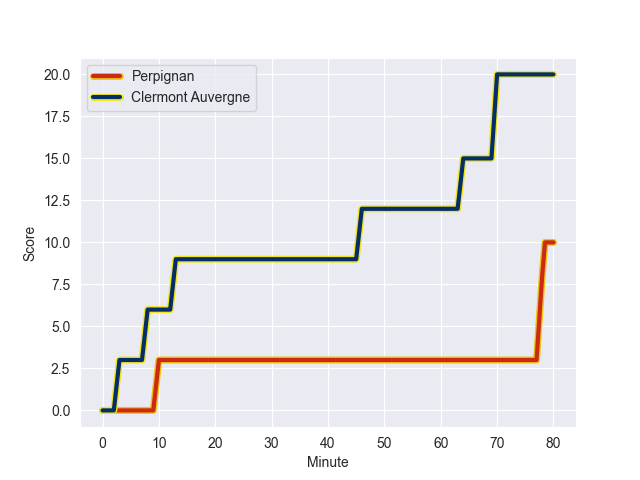
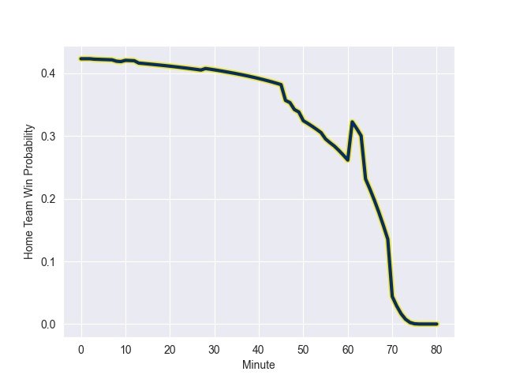

---  
layout: page  
title: Clermont Auvergne at Perpignan; 20-10  
date: 2022-10-15 17:00:00 18:00:00 -0500  
categories: match review  
---
# Clermont Auvergne (1160.33) at Perpignan (1025.9); 20-10

# Prediction: Clermont Auvergne by 8.4

Clermont Auvergne by 13.4 on a neutral field
## Scores over Time

## Win Probability over Time

# Pre-Match Prediction: Clermont Auvergne by 6.8

Clermont Auvergne by 11.8 on a neutral pitch

|   Away Minutes | Away Player           |   Away elo |   Away Percentile |   Number |   Home Percentile |   Home elo | Home Player           |   Home Minutes |
|---------------:|:----------------------|-----------:|------------------:|---------:|------------------:|-----------:|:----------------------|---------------:|
|             57 | Etienne Falgoux       |      68.79 |                72 |        1 |                87 |      78.71 | Xavier Chiocci        |             50 |
|             59 | Yohan Beheregaray     |      63.4  |                54 |        2 |                21 |      57.56 | Seilala Lam           |             65 |
|             66 | Cristian Ojovan       |      68.92 |                73 |        3 |                84 |      74.77 | Siua Halanukonuka     |             28 |
|             66 | Paul Jedrasiak        |      57.98 |                27 |        4 |                16 |      55.31 | Will Witty            |             48 |
|             80 | Sebastien Vahaamahina |      95.88 |                95 |        5 |                92 |      88.75 | Piula Faasalele       |             80 |
|             80 | Arthur Iturria        |      74.41 |                81 |        6 |                72 |      68.81 | Lucas Bachelier       |             61 |
|             55 | Jacobus van Tonder    |      56.04 |                18 |        7 |                81 |      75.1  | Kelian Galletier      |             80 |
|             80 | Fritz Lee             |     111.51 |                98 |        8 |                54 |      63.63 | Genesis Mamea Lemalu  |             80 |
|             76 | Sebastien Bezy        |      88.49 |                90 |        9 |                 3 |      47.85 | Sadek Deghmache       |             59 |
|             79 | Anthony Belleau       |      77.64 |                75 |       10 |                 5 |      50.43 | Tristan Tedder        |             80 |
|             80 | Alivereti Raka        |      84.54 |                90 |       11 |                96 |      99.06 | Mathieu Acebes        |             80 |
|             80 | Irae Simone           |      73.31 |                74 |       12 |                84 |      80.99 | Jeronimo de la Fuente |             80 |
|             80 | Damian Penaud         |      89.63 |                92 |       13 |                81 |      78.3  | Afusipa Taumoepeau    |             65 |
|             74 | Bautista Delguy       |      75.93 |                84 |       14 |                10 |      53.05 | Alivereti Duguivalu   |             80 |
|             80 | Cheikh Tiberghien     |      67.98 |                60 |       15 |                16 |      56.58 | Lucas Dubois          |             65 |
|             25 | Killian Tixeront      |      64.42 |                62 |       16 |                87 |      80.61 | Ma'afu Fia            |             52 |
|             23 | Giorgi Beria          |      67.14 |                68 |       17 |                 1 |      42.33 | Tristan Labouteley    |             32 |
|             21 | Adrien Pelissie       |      68.93 |                71 |       18 |                43 |      61.3  | Giorgi Tetrashvili    |             30 |
|             14 | Giorgi Dzmanashvili   |      58.91 |                29 |       19 |                17 |      57.07 | Matteo Rodor          |             21 |
|             14 | Tomas Lavanini        |      85.32 |                89 |       20 |                46 |      60.04 | Shahn Eru             |             19 |
|              6 | Marvin O'Connor       |      88.62 |                92 |       21 |                53 |      63.2  | Mike Tadjer Barbosa   |             15 |
|              4 | Baptiste Jauneau      |      59.12 |                31 |       22 |                83 |      80    | George Tilsley        |             15 |
|              1 | Gabin Michet          |      59.09 |                29 |       23 |                72 |      73.75 | Jake McIntyre         |             15 |

