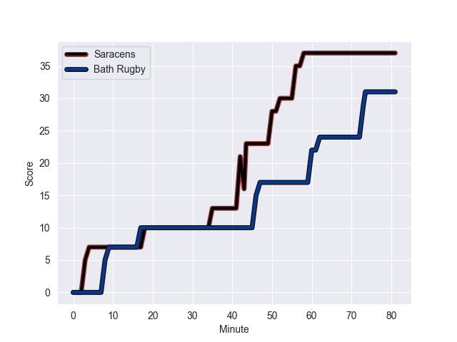
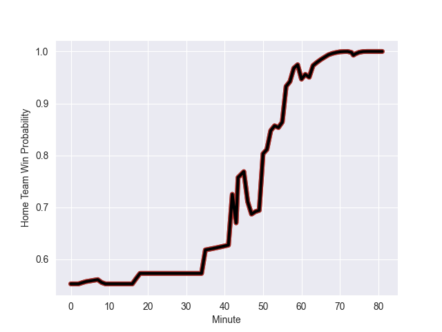

---  
layout: page  
title: Bath Rugby at Saracens; 31.0-37.0  
date: 2022-10-15 10:00:00 18:00:00 -0500  
categories: match review  
---
# Bath Rugby (1251.4) at Saracens (1383.64); 31.0-37.0

# Prediction: Saracens by 18.2

Saracens by 13.2 on a neutral field
## Scores over Time

## Win Probability over Time

# Pre-Match Prediction: Saracens by 16.1

Saracens by 11.1 on a neutral pitch

|   Away Minutes | Away Player           |   Away elo |   Away Percentile |   Number |   Home Percentile |   Home elo | Home Player     |   Home Minutes |
|---------------:|:----------------------|-----------:|------------------:|---------:|------------------:|-----------:|:----------------|---------------:|
|             62 | Juan Schoeman         |      73.38 |                10 |        1 |                29 |      79.28 | Eroni Mawi      |             35 |
|             58 | Tom Dunn              |      92.86 |                89 |        2 |                18 |      75.54 | Kapeli Pifeleti |             81 |
|             17 | Will Stuart           |      73.4  |                11 |        3 |                41 |      79.56 | Marco Riccioni  |             58 |
|             63 | Dave Attwood          |     119.58 |                99 |        4 |                96 |     104.11 | Maro Itoje      |             81 |
|             81 | Quinn Roux            |      97.41 |                91 |        5 |                65 |      83.98 | Hugh Tizard     |             62 |
|             81 | Josh Bayliss          |      72.97 |                14 |        6 |                74 |      86.68 | Theo McFarland  |             81 |
|             81 | Miles Reid            |      83.87 |                69 |        7 |                98 |     110.09 | Jackson Wray    |             49 |
|             67 | Richard de Carpentier |      76.3  |                23 |        8 |                98 |     115.88 | Billy Vunipola  |             81 |
|             70 | Louis Schreuder       |      88.03 |                78 |        9 |                74 |      86.16 | Ivan van Zyl    |             81 |
|             81 | Orlando Bailey        |      71.37 |                 6 |       10 |               100 |     126.59 | Owen Farrell    |             81 |
|             81 | Ruaridh McConnochie   |      81.92 |                57 |       11 |                76 |      87.41 | Alex Lewington  |             81 |
|             81 | Cameron Redpath       |      83.59 |                60 |       12 |                56 |      82.76 | Alex Lozowski   |             81 |
|             81 | Ollie Lawrence        |      78.43 |                30 |       13 |                44 |      80.13 | Elliot Daly     |             81 |
|             50 | Joe Cokanasiga        |      89.24 |                80 |       14 |                73 |      86.02 | Max Malins      |             54 |
|             81 | Matt Gallagher        |      96.6  |               nan |       15 |                95 |     103.75 | Alex Goode      |             81 |
|             23 | Niall Annett          |      74.67 |                12 |       16 |               nan |      80.4  | Theo Dan        |              0 |
|             19 | Arthur Cordwell       |      77.64 |                42 |       17 |               nan |      77.14 | James Flynn     |             46 |
|             64 | D'Arcy Rae            |      66.07 |                 2 |       18 |                73 |      85.53 | Christian Judge |             23 |
|             18 | Fergus Lee-Warner     |      69.67 |                 5 |       19 |                65 |      84.45 | Andy Christie   |             19 |
|             14 | Wesley White          |      82.88 |                57 |       20 |                95 |     103.22 | Ben Earl        |             32 |
|             11 | Tom Carr-Smith        |      80    |               nan |       21 |               nan |      73.84 | Ruben de Haas   |              0 |
|              0 | George Worboys        |      80    |               nan |       22 |                64 |      83.95 | Manu Vunipola   |              0 |
|             31 | Max Ojomoh            |      72.12 |                10 |       23 |               nan |      79.53 | Josh Hallett    |             27 |

