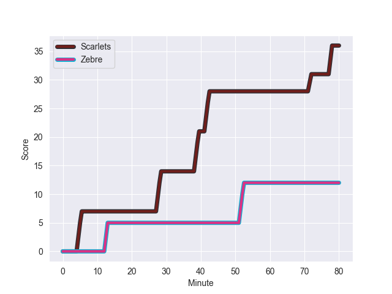
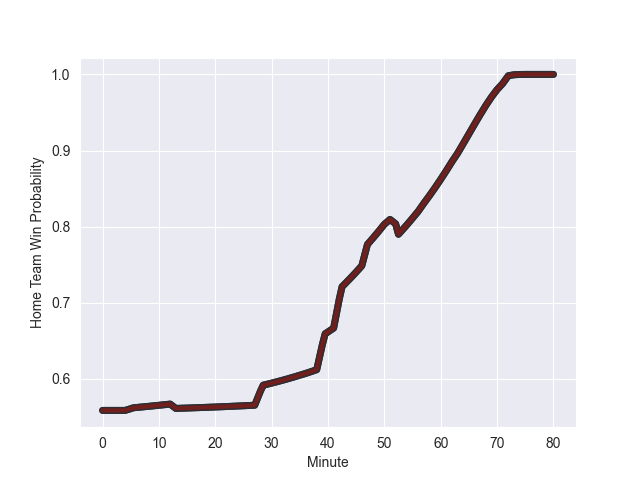

---  
layout: page  
title: Zebre at Scarlets; 12-36  
date: 2022-10-15 20:35:00 18:00:00 -0500  
categories: match review  
---
# Zebre (932.7) at Scarlets (1009.92); 12-36

# Prediction: Scarlets by 12.7

Scarlets by 7.7 on a neutral field
## Scores over Time

## Win Probability over Time

# Pre-Match Prediction: Scarlets by 10.7

Scarlets by 5.7 on a neutral pitch

|   Away Minutes | Away Player            |   Away elo |   Away Percentile |   Number |   Home Percentile |   Home elo | Home Player      |   Home Minutes |
|---------------:|:-----------------------|-----------:|------------------:|---------:|------------------:|-----------:|:-----------------|---------------:|
|             57 | Luca Rizzoli           |      60.39 |               nan |        1 |                84 |      72.59 | Wyn Jones        |             51 |
|             47 | Marco Manfredi         |      50.75 |               nan |        2 |                93 |      92.07 | Ken Owens        |             51 |
|             36 | Matteo Nocera          |      62.49 |                50 |        3 |               nan |      59.96 | Sam O'Connor     |             51 |
|             80 | David Sisi             |      75.06 |                81 |        4 |                25 |      56.76 | Jac Price        |             80 |
|             56 | Leonard Krumov         |      58.42 |                29 |        5 |                 1 |      40.84 | Tom Price        |             52 |
|             80 | Iacopo Bianchi         |      53.59 |                10 |        6 |                17 |      55.54 | Sam Lousi        |             80 |
|             80 | MJ Pelser              |      55.02 |                14 |        7 |                30 |      58.3  | Josh MacLeod     |             80 |
|             63 | Davide Ruggeri         |      62.03 |                50 |        8 |                83 |      78.16 | Sione Kalamafoni |             76 |
|             47 | Chris Cook             |     108.6  |                98 |        9 |                56 |      63.47 | Kieran Hardy     |             72 |
|             80 | Geronimo Prisciantelli |      62.29 |                44 |       10 |                 0 |      47.31 | Sam Costelow     |             52 |
|             80 | Latu Latunipulu        |      44.6  |                 1 |       11 |                18 |      56.49 | Ryan Conbeer     |             80 |
|             57 | Tommaso Boni           |      63.87 |                52 |       12 |                90 |      86.67 | Scott Williams   |             52 |
|             80 | Franco Smith           |      61.85 |                35 |       13 |                98 |     106.03 | Jonathan Davies  |             80 |
|             71 | Pierre Bruno           |      64.66 |                61 |       14 |                71 |      67.65 | Johnny McNicholl |             80 |
|             80 | Lorenzo Pani           |      65.61 |                53 |       15 |                53 |      64.79 | Leigh Halfpenny  |             80 |
|             44 | Muhamed Hasa           |      62.05 |                45 |       16 |                14 |      55.71 | Steffan Thomas   |             29 |
|             33 | Jacques du Toit        |      62.19 |                47 |       17 |                12 |      55.1  | Javan Sebastian  |             29 |
|             33 | Nicolo Casilio         |      62.42 |                45 |       18 |                78 |      72.72 | Ryan Elias       |             29 |
|             24 | Andrea Zambonin        |      55.6  |                17 |       19 |                 4 |      46.4  | Morgan Jones     |             28 |
|             23 | Alessio Sanavia        |      60    |               nan |       20 |                84 |      75.91 | Steffan Evans    |             28 |
|             23 | Joey Caputo            |      59.7  |               nan |       21 |                98 |     112.53 | Rhys Patchell    |             28 |
|             17 | Guido Volpi            |      65.38 |                62 |       22 |                 4 |      49.11 | Dane Blacker     |              8 |
|              9 | Nicolò Teneggi         |      60    |               nan |       23 |                 3 |      50.56 | Shaun Evans      |              4 |

