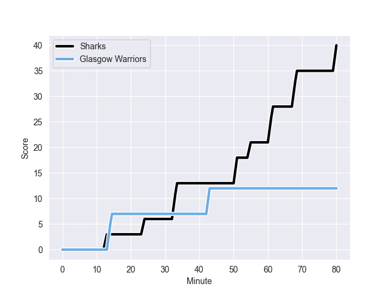
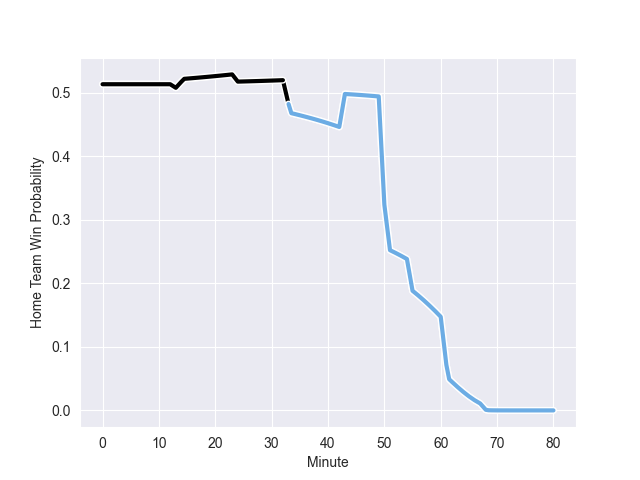

---  
layout: page  
title: Glasgow Warriors at Sharks; 12-40  
date: 2022-10-15 16:00:00 18:00:00 -0500  
categories: match review  
---
# Glasgow Warriors (1083.41) at Sharks (1102.53); 12-40

# Prediction: Sharks by 6.9

Sharks by 1.9 on a neutral field
## Scores over Time

## Win Probability over Time

# Pre-Match Prediction: Sharks by 5.2

Sharks by 0.2 on a neutral pitch

|   Away Minutes | Away Player     |   Away elo |   Away Percentile |   Number |   Home Percentile |   Home elo | Home Player       |   Home Minutes |
|---------------:|:----------------|-----------:|------------------:|---------:|------------------:|-----------:|:------------------|---------------:|
|             58 | Jamie Bhatti    |      74.97 |                84 |        1 |                60 |      64.45 | Ntuthuko Mchunu   |             50 |
|             33 | George Turner   |      86.21 |                90 |        2 |                63 |      65.16 | Kerron van Vuuren |             50 |
|             69 | Zander Fagerson |      98.79 |                95 |        3 |                80 |      72.19 | Thomas du Toit    |             50 |
|             55 | Sintu Manjezi   |      58.96 |                26 |        4 |                91 |      87.82 | Eben Etzebeth     |             80 |
|             45 | Richie Gray     |      83.36 |                88 |        5 |                72 |      69.65 | Hyron Andrews     |             58 |
|             80 | Scott Cummings  |     103.24 |                97 |        6 |                60 |      64.27 | Dylan Richardson  |             69 |
|             62 | Tom Gordon      |      75.55 |                82 |        7 |                85 |      77.78 | Vincent Tshituka  |             50 |
|             80 | Ryan Wilson     |      76.54 |                84 |        8 |                72 |      69.99 | Phepsi Buthelezi  |             80 |
|             58 | Ali Price       |      72.37 |                76 |        9 |               nan |      64.61 | Jaden Hendrikse   |             70 |
|             80 | Tom Jordan      |      60.27 |                35 |       10 |                57 |      65.49 | Boeta Chamberlain |             80 |
|             80 | Josh McKay      |      59.66 |                34 |       11 |                83 |      81.41 | Anthony Volmink   |             60 |
|             59 | Sam Johnson     |      70.61 |                70 |       12 |                93 |      91.74 | Ben Tapuai        |             80 |
|             80 | Sione Tuipulotu |      51.91 |                 8 |       13 |                58 |      63.86 | Marnus Potgieter  |             80 |
|             80 | Cole Forbes     |      69.35 |                74 |       14 |                34 |      59.16 | Werner Kok        |             80 |
|             80 | Ollie Smith     |      60.11 |                37 |       15 |                84 |      82.34 | Aphelele Fassi    |             80 |
|             47 | Fraser Brown    |      79.95 |                86 |       16 |                74 |      69.94 | Ox Nche           |             30 |
|             35 | JP du Preez     |      57.07 |                22 |       17 |                87 |      80.75 | Bongi Mbonambi    |             30 |
|             25 | Gregor Brown    |      59.94 |                39 |       18 |                49 |      62.23 | Carlu Sadie       |             30 |
|             22 | Oli Kebble      |      90.94 |                92 |       19 |                97 |     102.66 | Siya Kolisi       |             30 |
|             22 | George Horne    |      89.88 |                91 |       20 |                88 |      83.71 | Reniel Hugo       |             22 |
|             21 | Ross Thompson   |      63.39 |                40 |       21 |                92 |      88.73 | Makazole Mapimpi  |             20 |
|             18 | Sione Vailanu   |      50.23 |                 7 |       22 |                93 |      89.59 | Sikhumbuzo Notshe |             11 |
|             11 | Murphy Walker   |      60.81 |               nan |       23 |                59 |      64.01 | Cameron Wright    |             10 |

