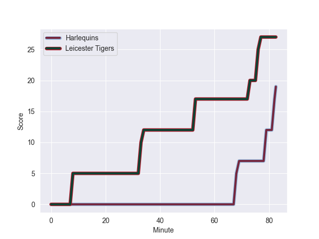
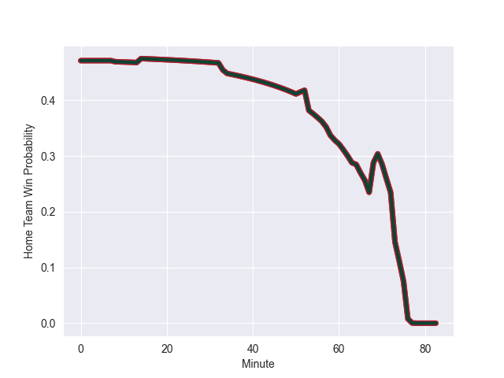

---  
layout: page  
title: Leicester Tigers at Harlequins; 27.0-19.0  
date: 2022-10-16 10:00:00 18:00:00 -0500  
categories: match review  
---
# Leicester Tigers (1187.77) at Harlequins (1137.44); 27.0-19.0

# Prediction: Leicester Tigers by 0.0

Leicester Tigers by 5.0 on a neutral field
## Scores over Time

## Win Probability over Time

# Pre-Match Prediction: Leicester Tigers by 2.9

Leicester Tigers by 7.9 on a neutral pitch

|   Away Minutes | Away Player         |   Away elo |   Away Percentile |   Number |   Home Percentile |   Home elo | Home Player           |   Home Minutes |
|---------------:|:--------------------|-----------:|------------------:|---------:|------------------:|-----------:|:----------------------|---------------:|
|             51 | James Cronin        |      72.21 |                83 |        1 |                95 |      96.17 | Joe Marler            |             78 |
|             73 | Julian Montoya      |      68.08 |                72 |        2 |                74 |      69.11 | Jack Musk             |             67 |
|             60 | Dan Cole            |      76.44 |                87 |        3 |                92 |      88.32 | Wilco Louw            |             58 |
|             82 | Harry Wells         |      78.77 |                85 |        4 |                80 |      72.63 | Dino Lamb             |             82 |
|             52 | Calum Green         |      89.19 |                94 |        5 |                82 |      75.14 | Irne Herbst           |             71 |
|             82 | Hanro Liebenberg    |      86.7  |                92 |        6 |                87 |      78.01 | Jack Kenningham       |             82 |
|             82 | Tommy Reffell       |      83.21 |                89 |        7 |                56 |      62.47 | Will Evans            |             82 |
|             64 | Jasper Wiese        |      67.46 |                68 |        8 |                60 |      64.8  | Archie White          |             57 |
|             51 | Ben Youngs          |      92.28 |                92 |        9 |                99 |     120.55 | Danny Care            |             82 |
|             78 | Freddie Burns       |      97.45 |                94 |       10 |                87 |      86.18 | Marcus Smith          |             82 |
|             82 | Anthony Watson      |      81.13 |                90 |       11 |                69 |      65.66 | Cadan Murley          |             82 |
|             82 | Matt Scott          |      80.3  |                86 |       12 |                62 |      66.08 | Andre Esterhuizen     |             82 |
|             82 | Harry Potter        |      65.11 |                67 |       13 |                71 |      69.83 | Luke Northmore        |             66 |
|             14 | Chris Ashton        |     112.6  |                99 |       14 |                88 |      78.96 | Joe Marchant          |             82 |
|             82 | Freddie Steward     |      77.87 |                81 |       15 |                19 |      56.7  | Tyrone Green          |             57 |
|              9 | Charlie Clare       |      57.59 |                24 |       16 |                15 |      56.97 | Sam Riley             |             15 |
|             31 | Francois van Wyk    |      69.72 |                79 |       17 |                81 |      71.41 | Santiago Garcia Botta |              4 |
|             22 | Joe Heyes           |      71.02 |                81 |       18 |                69 |      68.16 | Simon Kerrod          |             24 |
|             30 | Cameron Henderson   |      72.88 |                80 |       19 |                28 |      57.98 | George Hammond        |             11 |
|             18 | Olly Cracknell      |      33.48 |                 0 |       20 |                 6 |      48.91 | Matas Jurevicius      |             25 |
|             31 | Jack van Poortvliet |      73.93 |                82 |       21 |                55 |      63.12 | Lewis Gjaltema        |              0 |
|              4 | Jimmy Gopperth      |      78.91 |                85 |       22 |                78 |      76.39 | Tommaso Allan         |             16 |
|             68 | Nemani Nadolo       |      93.05 |                96 |       23 |                59 |      63.34 | Nick David            |             25 |

