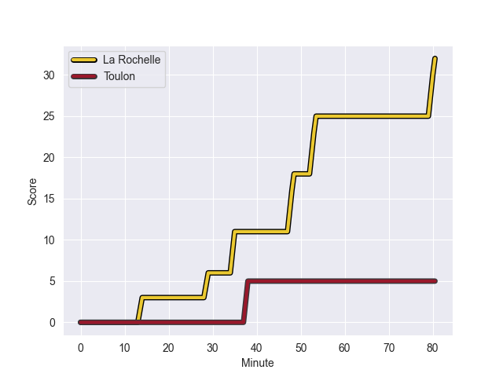
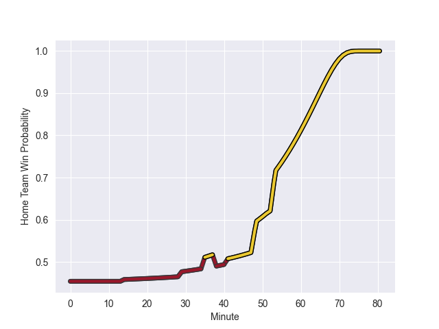

---  
layout: page  
title: Toulon at La Rochelle; 5-32  
date: 2022-10-16 21:05:00 18:00:00 -0500  
categories: match review  
---
# Toulon (1664.61) at La Rochelle (1544.83); 5-32

# Prediction: Toulon by 7.0

Toulon by 12.0 on a neutral field
## Scores over Time

## Win Probability over Time

# Pre-Match Prediction: Toulon by 4.1

Toulon by 9.1 on a neutral pitch

|   Away Minutes | Away Player                    |   Away elo |   Away Percentile |   Number |   Home Percentile |   Home elo | Home Player          |   Home Minutes |
|---------------:|:-------------------------------|-----------:|------------------:|---------:|------------------:|-----------:|:---------------------|---------------:|
|             52 | Dany Priso                     |     102.03 |                78 |        1 |                84 |     104.16 | Reda Wardi           |             61 |
|             52 | Teddy Baubigny                 |     101    |                77 |        2 |                70 |      97.27 | Pierre Bourgarit     |             64 |
|             52 | Beka Gigashvili                |     106.7  |                87 |        3 |                96 |     116.29 | Uini Atonio          |             61 |
|             52 | Mathieu Tanguy                 |      96.02 |                65 |        4 |                51 |      87.81 | Romain Sazy          |             52 |
|             80 | Brian Alainu'uese              |     115.31 |                94 |        5 |                84 |     105.74 | Will Skelton         |             80 |
|             56 | Cornell du Preez               |     104.9  |                84 |        6 |                63 |      96.16 | Yoan Tanga           |             80 |
|             80 | Charles Ollivon                |     123.64 |                98 |        7 |                 4 |      74.3  | Paul Boudehent       |             41 |
|             80 | Mathieu Bastareaud             |     132.34 |                99 |        8 |                95 |     117.64 | Gregory Alldritt     |             80 |
|             56 | Baptiste Serin                 |     111.33 |                87 |        9 |                86 |     106.51 | Tawera Kerr-Barlow   |             80 |
|             80 | Ihaia West                     |      99.08 |                71 |       10 |                67 |      96.44 | Ulupano Seuteni      |             73 |
|             80 | Jiuta Wainiqolo                |      83.72 |                50 |       11 |                49 |      83.61 | Jules Favre          |             80 |
|             52 | Jérémy Sinzelle                |      93.58 |                59 |       12 |                94 |     116.96 | Jonathan Danty       |             61 |
|             80 | Waisea Nayacalevu Vuidravuwalu |     126.59 |                99 |       13 |                62 |      95.03 | Raymond Rhule        |             66 |
|             80 | Cheslin Kolbe                  |     154.82 |               100 |       14 |                95 |     118.34 | Teddy Thomas         |             80 |
|             80 | Aymeric Luc                    |      92.32 |                59 |       15 |                88 |     109.05 | Brice Dulin          |             80 |
|             28 | Swan Rebbadj                   |     102.8  |                80 |       16 |                88 |     108.46 | Ultan Dillane        |             39 |
|             28 | Anthony Etrillard              |     105.28 |                88 |       17 |                84 |     103.06 | Remi Picquette       |             28 |
|             28 | Emerick Setiano                |     108.63 |                91 |       18 |                65 |      93.32 | Joel Sclavi          |             19 |
|             28 | Duncan Paia'aua                |     111.51 |                90 |       19 |                77 |      99.8  | Thierry Paiva        |             19 |
|             28 | Jean-Baptiste Gros             |     115.79 |                96 |       20 |               100 |     134.86 | Levani Botia Veivuke |             19 |
|             24 | Benoit Paillaugue              |     112.51 |                92 |       21 |                67 |      96.45 | Quentin Lespiaucq    |             16 |
|             24 | Raphael Lakafia                |     122.3  |                97 |       22 |                56 |      92.01 | Pierre Boudehent     |             14 |
|            nan | nan                            |     nan    |               nan |       23 |                77 |     101.75 | Jules Le Bail        |              7 |

