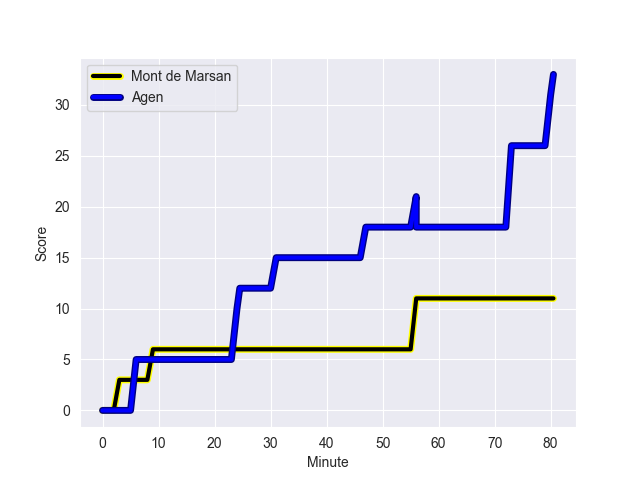
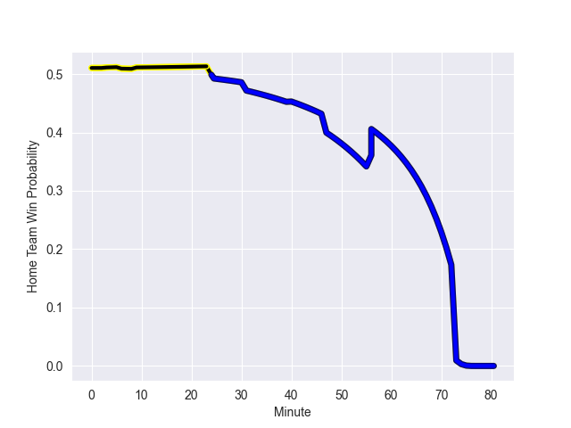

---  
layout: page  
title: Agen at Mont de Marsan; 33-11  
date: 2022-10-20 21:00:00 18:00:00 -0500  
categories: match review  
---
# Agen (1012.07) at Mont de Marsan (1028.77); 33-11

# Prediction: Mont de Marsan by 6.7

Mont de Marsan by 1.7 on a neutral field
## Scores over Time

## Win Probability over Time

# Pre-Match Prediction: Mont de Marsan by 6.1

Mont de Marsan by 1.1 on a neutral pitch

|   Away Minutes | Away Player          |   Away elo |   Away Percentile |   Number |   Home Percentile |   Home elo | Home Player           |   Home Minutes |
|---------------:|:---------------------|-----------:|------------------:|---------:|------------------:|-----------:|:----------------------|---------------:|
|             56 | Florent Guion        |      48.05 |                 3 |        1 |                64 |      63.74 | Jean-Luc Innocente    |             66 |
|             56 | Clement Martinez     |      70.92 |                77 |        2 |                83 |      73.1  | Romain Laterrade      |             66 |
|             56 | Walter Desmaison     |      88.12 |                92 |        3 |                74 |      68.71 | Anthony Alves         |             56 |
|             80 | Antoine Erbani       |      83.4  |                89 |        4 |                11 |      52.47 | Aston Fortuin         |             33 |
|             56 | William Demotte      |      63.81 |                60 |        5 |                77 |      70.52 | Leandro Cedaro        |             66 |
|             80 | Arnaud Duputs        |      67.54 |                72 |        6 |                85 |      76.38 | Yann Brethous         |             80 |
|             66 | Vincent Farre        |      74.27 |                82 |        7 |                90 |      82.61 | Nicolas Garrault      |             80 |
|             80 | Fotu Lokotui         |      62.46 |                50 |        8 |                55 |      62.68 | Mike Faleafa          |             80 |
|             56 | Dorian Bellot        |      60.6  |                41 |        9 |                59 |      63.3  | Martin Doan           |             56 |
|             80 | Raphael Lagarde      |      61.08 |                41 |       10 |                76 |      74.08 | Willie du Plessis     |             56 |
|             80 | Tevita Railevu       |      57.56 |                25 |       11 |                42 |      60.33 | Wame Naituvi          |             40 |
|             80 | Kolinio Ramoka       |      62.23 |                44 |       12 |                82 |      76.52 | Jeronimo de la Fuente |             80 |
|             80 | Theo Belan           |      62.53 |                47 |       13 |                69 |      68.41 | Jules Even            |             80 |
|             80 | Iban Etcheverry      |      66.77 |                71 |       14 |                72 |      70.17 | Ambrose Curtis        |             80 |
|             63 | Mathieu Lamoulie     |      89.55 |                93 |       15 |                42 |      60.18 | Simao Broeiro Bento   |             80 |
|             24 | Alex Burin           |      67.13 |                71 |       16 |                41 |      59.98 | Léo Banos             |             47 |
|             24 | Evan Olmstead        |      48.37 |                 3 |       17 |                93 |      89.21 | Yoann Laousse Azpiazu |             40 |
|             24 | Mike Sosene-Feagai   |      62.88 |                55 |       18 |                75 |      67.87 | Lasha Macharashvili   |             24 |
|             24 | Richard Barrington   |      70.65 |                79 |       19 |                29 |      58.69 | Joris Pialot          |             24 |
|             24 | Theo Idjellidaine    |      55.68 |                12 |       20 |                12 |      55.31 | Christophe Loustalot  |             24 |
|             17 | Jean-Marcelin Buttin |      92.18 |                94 |       21 |                30 |      58.17 | Romain Durand         |             14 |
|             14 | Martin Devergie      |      78.16 |                84 |       22 |                 2 |      48.4  | Simon Labouyrie       |             14 |
|            nan | nan                  |     nan    |               nan |       23 |                70 |      66.44 | Thomas Bultel         |             14 |

